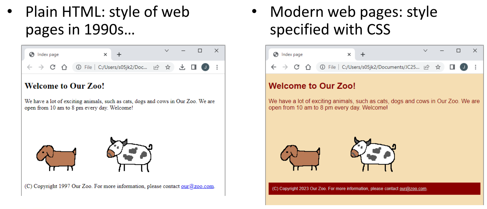
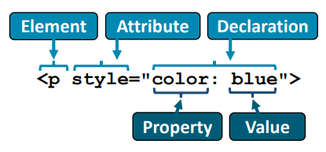
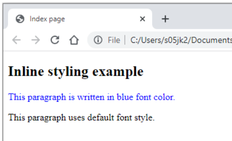
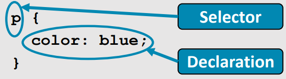
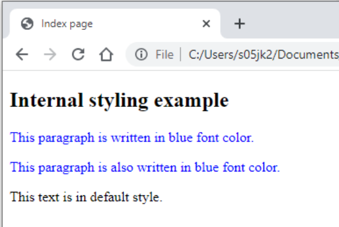

# Day 3: CSS  

## Lecture 3.1: CSS 语法和常用声明  

### CSS：内容与表现形式分离  
  

#### CSS 是什么？  
- CSS 表示***层叠样式表（Cascading Style Sheets）***  
    - 用于描述 HTML 显示方式的样式表语言  
    - 允许重新定义 HTML 元素的外观  
- CSS 有助于保持内容与表现形式的分离  
    - 更改 HTML 会改变内容，但不会改变展示风格  
    - 更改 CSS 将改变呈现样式，但不会改变内容  

### 如何应用 CSS？  
- 有三种方式可以将 CSS 应用到 HTML  
    - **内联（Inline）**：为指定元素指定样式属性  
        - 仅适用于指定的特定元素  
    - **内部（Internal）**：在 HTML 文档中指定 `<style>` 标记  
        - 重新定义整个 HTML 文档中的元素  
    - **外部（External）**：在单独文件中指定 CSS 定义（推荐方式）  
        - CSS 文件可以从 HTML 文档中引用  
- 请注意，内联样式将覆盖内部或外部样式  

#### 内联样式  
- 给定元素的 `style` 属性包含属性和值  
    - 
    - 仅适用于使用该属性和声明的元素  
- ```html
  ...
  <p style="color: blue">
      This paragraph is written in blue front color.
  </p>

  <p>
      This paragraph uses default font style.
  </p>
  ...
  ```
-  

#### 内部样式  
- 可在 HTML 代码中使用 `<style>` 标签定义 CSS 样式  
    - 选择器定义了要重新定义的 HTML 元素，声明位于大括号中  
- 内部样式优先于外部样式  
- 
- ```html
  ...
  <style>
      p {
          color: blue;
      }
  </style>

  <p>This paragraph is written in blue font color.</p>
  <p>This paragraph is also written in blue font color.</p>
  This text is in default style.
  ...
  ```
-   

#### 外部样式  
- 在外部样式设计中，CSS 代码位于单独的 `.css` 文件中，并使用 `<link>` 标签链接到 HTML 文档中  
    - 属性 `rel` 指定关系（必须包含）  
    - 属性 `type` 指定链接资源的媒体/格式  
    - 属性 `href` 指定资源的位置  
- ```html
  ...
  <link rel="stylesheet" type="text/css" href="myStyle.css">

  <p>This paragraph is written in style defined in myStyle.css.</p>
  ...
  ```
  ```css
  /* myStyle.css */
  p {
      color: blue;
  }
  ```

### CSS 语法  
- 在 CSS 中，HTML 标记的表现形式是通过选择器和声明来定义的  
    - 选择器指定要修改的 HTML 元素  
    - 声明包含属性和值对  
    - 可为多个元素指定多个声明  
- CSS 中的注释写在 `/*` 和 `*/` 之间
- ```css
  p {
      color: blue;
      margin-left: 50px;
  }

  h1 {
      color: red;
  }

  h2 {
      color: green;
  }

  /* This is a comment */
  ```

#### CSS 选择器类型  
- 元素 - 当选择器指向一个元素时，该类型的所有元素都将被修改  
    - ```css
      p {
          color: blue;
      }
      ```
- ID - 如果选择器以 `#` 开头，则指定要修改的元素 ID  
    - 例如 `<h1 id="blueText">...<h1>`
    - 用于为单个元素设置样式  
    - ```css
      #blueText {
          color: blue;
      }
      ```
- 类 - 如果选择符以 `.` 开头，则表示要修改的元素的类别  
    - 例如 `<h1 class="blueText">...</h1>`  
    - 用于为多个元素设置样式  
    - ```css
      .blueText {
          color: blue;
      }
      ```
- 特定元素类 - 还可以定义只影响仅影响特定元素（本例中为 `<p>`）  
    - ```css
      p.blueText {
          color: blue;
      }
- 通用 - 通用选择器 (`*`) 选择页面上的所有 HTML 元素  
    - ```css
      * {
          color: blue;
      }
      ```
- 分组选择器 - 还可以对 CSS 选择器进行分组，使相同的声明影响不同的元素  
    - ```css
      h1, h2, #blueClass {
          color: blue;
      }
      ```

### CSS 颜色  
- `color` 属性用于指定文字的颜色  
- `background-color` 用于设置元素的背景色  
    - 预设的 `color` 有 red、blue、green 等  
    - 以十进制（0-255）或十六进制（00-FF）数字表示的自定义 RGB 颜色  