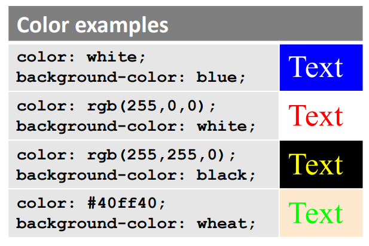
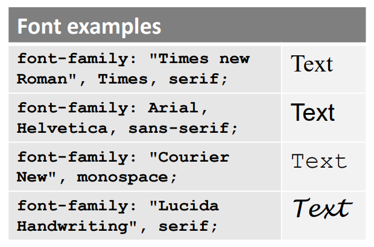
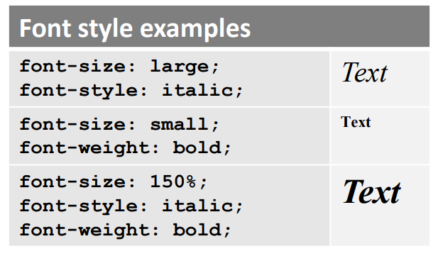
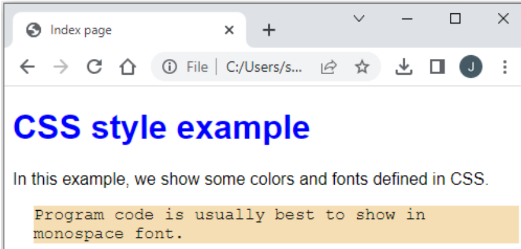
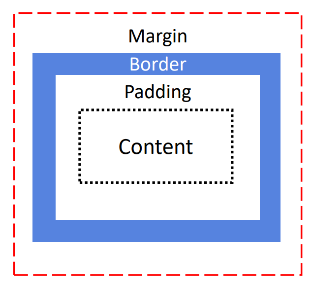
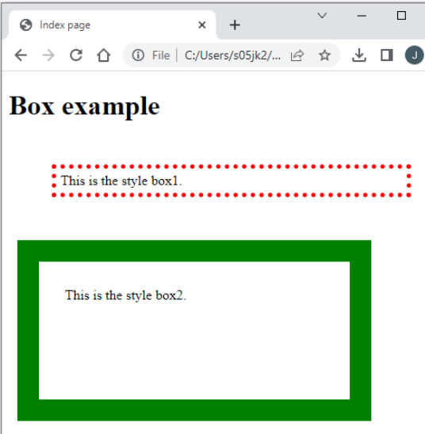
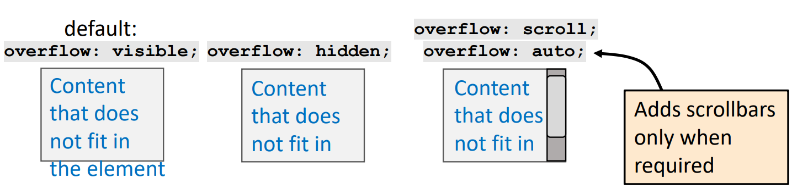

# Day 3: CSS  

## Lecture 3.1: CSS 语法和常用声明  

### CSS：内容与表现形式分离  
  

#### CSS 是什么？  
- CSS 表示***层叠样式表（Cascading Style Sheets）***  
    - 用于描述 HTML 显示方式的样式表语言  
    - 允许重新定义 HTML 元素的外观  
- CSS 有助于保持内容与表现形式的分离  
    - 更改 HTML 会改变内容，但不会改变展示风格  
    - 更改 CSS 将改变呈现样式，但不会改变内容  

### 如何应用 CSS？  
- 有三种方式可以将 CSS 应用到 HTML  
    - **内联（Inline）**：为指定元素指定样式属性  
        - 仅适用于指定的特定元素  
    - **内部（Internal）**：在 HTML 文档中指定 `<style>` 标记  
        - 重新定义整个 HTML 文档中的元素  
    - **外部（External）**：在单独文件中指定 CSS 定义（推荐方式）  
        - CSS 文件可以从 HTML 文档中引用  
- 请注意，内联样式将覆盖内部或外部样式  

#### 内联样式  
- 给定元素的 `style` 属性包含属性和值  
    - 
    - 仅适用于使用该属性和声明的元素  
- ```html
  ...
  <p style="color: blue">
      This paragraph is written in blue front color.
  </p>

  <p>
      This paragraph uses default font style.
  </p>
  ...
  ```
-  

#### 内部样式  
- 可在 HTML 代码中使用 `<style>` 标签定义 CSS 样式  
    - 选择器定义了要重新定义的 HTML 元素，声明位于大括号中  
- 内部样式优先于外部样式  
- 
- ```html
  ...
  <style>
      p {
          color: blue;
      }
  </style>

  <p>This paragraph is written in blue font color.</p>
  <p>This paragraph is also written in blue font color.</p>
  This text is in default style.
  ...
  ```
-   

#### 外部样式  
- 在外部样式设计中，CSS 代码位于单独的 `.css` 文件中，并使用 `<link>` 标签链接到 HTML 文档中  
    - 属性 `rel` 指定关系（必须包含）  
    - 属性 `type` 指定链接资源的媒体/格式  
    - 属性 `href` 指定资源的位置  
- ```html
  ...
  <link rel="stylesheet" type="text/css" href="myStyle.css">

  <p>This paragraph is written in style defined in myStyle.css.</p>
  ...
  ```
  ```css
  /* myStyle.css */
  p {
      color: blue;
  }
  ```

### CSS 语法  
- 在 CSS 中，HTML 标记的表现形式是通过选择器和声明来定义的  
    - 选择器指定要修改的 HTML 元素  
    - 声明包含属性和值对  
    - 可为多个元素指定多个声明  
- CSS 中的注释写在 `/*` 和 `*/` 之间
- ```css
  p {
      color: blue;
      margin-left: 50px;
  }

  h1 {
      color: red;
  }

  h2 {
      color: green;
  }

  /* This is a comment */
  ```

#### 选择器类型  
- 元素 - 当选择器指向一个元素时，该类型的所有元素都将被修改  
    - ```css
      p {
          color: blue;
      }
      ```
- ID - 如果选择器以 `#` 开头，则指定要修改的元素 ID  
    - 例如 `<h1 id="blueText">...<h1>`
    - 用于为单个元素设置样式  
    - ```css
      #blueText {
          color: blue;
      }
      ```
- 类 - 如果选择符以 `.` 开头，则表示要修改的元素的类别  
    - 例如 `<h1 class="blueText">...</h1>`  
    - 用于为多个元素设置样式  
    - ```css
      .blueText {
          color: blue;
      }
      ```
- 特定元素类 - 还可以定义只影响仅影响特定元素（本例中为 `<p>`）  
    - ```css
      p.blueText {
          color: blue;
      }
- 通用 - 通用选择器 (`*`) 选择页面上的所有 HTML 元素  
    - ```css
      * {
          color: blue;
      }
      ```
- 分组选择器 - 还可以对 CSS 选择器进行分组，使相同的声明影响不同的元素  
    - ```css
      h1, h2, #blueClass {
          color: blue;
      }
      ```

#### 颜色  
- `color` 属性用于指定文字的颜色  
- `background-color` 用于设置元素的背景色  
    - 预设的 `color` 有 red、blue、green 等  
    - 以十进制（0-255）或十六进制（00-FF）数字表示的自定义 RGB 颜色  
-   

#### 字体  
- `font-family` 属性可用于设置文本的字体  
- 应按偏好顺序列出几种字体名称  
    - 并非所有浏览器和平台都支持外来字体  
    - 从想要的字体开始，到更通用的字体名称和系列  
-   

#### 字号和格式  
- `font-size` 属性可用于设置字体大小  
    - 可使用 `px` 和 `%`（百分比）等单位  
    - 还可使用预定义的尺寸，例如 `small`、`large`、`x-large`  
- `font-style` 和 `font-weight` 等属性可用于调整字体样式  
-   

#### 颜色和字体例  
```html
<style>
    h1 {
        font-family: Arial, Helvetica, sans-serif;
        color: blue;
    }

    p {
        font-family: Arial, Helvetica, sans-serif;
    }

    #code {
        font-family: Courier, monospace;
        background-color: wheat;
        margin-left: 20px;
    }
</style>

...

<h1>CSS style example</h1>
<p>In this example, we show some colors and fonts defined in CSS.</p>
<p id="code">Program code is usually best to show in monospace font.</p>
```
  

### CSS 框盒模型（box model）  
- CSS 框模型将每个 HTML 元素视为一个框，其区域定义如下  
    - margin - 外边框  
    - border - 边框  
    - padding - 内边距  
    - content - 内容  
-   
- 元素包括外边框以外的所有内容  

#### CSS 外边框  
- `margin` 属性可用来定义元素边框外的空间  
    - 如果 `margin` 只有一个值，则所有边的边距都相同  
    - 四个值分别代表上边距、右边距、下边距和左边距  
    - 也可以为每一边分别设置边距  
    - 可以使用不同的单位，例如 px, pt, cm 等  
- ```css
  #myMargin {
      margin: 25px 50px 75px 50px;
  }

  #alsoMyMargin {
      margin-top: 25px;
      margin-right: 50px;
      margin-bottom: 75px;
      margin-left: 50px;
  }
  ```

#### CSS 边框  
- `border` 属性可用于定义边框的宽度、样式和颜色  
    - 也可使用 `border-width`、`border-style` 和 `border-color` 属性分别设置宽度、样式和颜色  
    - 此外，还可以为每一边分别设置不同的宽度、样式和颜色  
- ```css
  #myBorder {
      border: 5px solid green;
  }

  #alsoMyBorder {
      border-width: 5px;
      border-style: solid;
      border-color: green;
  }
  ```

#### CSS 内边距、宽和高  
- `padding` 属性可以定义边框内的空间  
    - 与外边框和边框已于，可以分别设置每个边  
- `height` 和 `width` 属性可以定义元素的大小  
    - 大小定义，例如 `px` 或 `%`（占容器的百分比）  
    - `auto`：默认，由浏览器计算  
    - `inherited`：当元素嵌套时，继承父元素的内容  
- ```css
  #myElement {
      padding: 10px;
      height: 100px;
      width: 75%;
  }

  #myOtherElement {
      padding: 5px 10px 5px 10px;
      height: inherited;
      width: auto;
  }
  ```

#### CSS 最大和最小宽高  
- 如果我们使用固定的高度和宽度，浏览器窗口中可能没有足够的空间容纳元素  
    - 我们可以使用 `max-height` 和 `max-width` 属性定义最大高度和宽度，以便在窗口小于最大值时调整元素大小  
    - 我们还可以使用 `min-height` 和 `min-width` 定义最小高度和最小宽度  
- ```css
  #fixedSizedElement {
      padding: 10px;
      width: 550px;
  }

  #maximumSizedElement {
      padding: 10px;
      max-width: 550px;
  }

  #minimumSizedElement {
      padding: 10px;
      min-width: 400px;
  }
  ```

#### CSS 框盒例  
```html
...

<style>
    #box1 {
        margin: 50px;
        border: 5px dotted red;
        padding: 5px;
    }

    #box2 {
        margin: 10px;
        border: 25px solid green;
        padding: 30px;
        width: 300px;
        height: 100px
    }
</style>

<h1>Box example</h1>
<p id="box1">This is the style box1.</p>
<p id="box2">This is the style box2.</p>

...
```
  

### CSS 溢出  
- 默认情况下，即使元素尺寸过小，CSS 也会显示内容  
- `overflow` 属性让我们可以控制如何处理溢出  
    - 可通过 `overflow-x`、`overflow-y` 分别为 x 轴和 y 轴进行设置  
-   