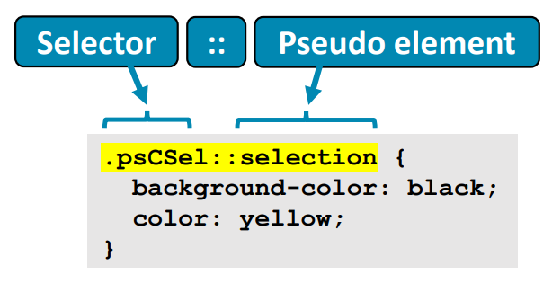

## Lecture 3.2: CSS 位置和伪类  

### 位置属性  
- `position` 属性可用于控制元素的布局  
    - 可能的值：`static`、`relative`、`fixed`、`absolute`、`sticky`  
    - 如果设置了 `position`，我们可以使用 `top`、`bottom`、`left` 和 `right` 属性来调整元素的位置  
-   

#### 静态位置  
-   
- 默认选项是 `static`  
    - 根据页面中元素的顺序对元素进行定位  
- 不受 `top`、`bottom`、`left`、`right` 属性的影响  

#### 相对位置  
-   
- 位置 `relative` 将元素置于其默认位置的相对位置  
- 可以使用 `top`、`bottom`、`left`、`right` 属性来定位元素  
- 通过调整元素的相对位置，其他元素不会占用任何剩余空间  

#### 固定位置  
-   
- 位置 `fixed` 将元素相对于视点放置  
    - 即使页面滚动，也会保留相同的位置  
- 可以使用 `top`、`bottom`、`left`、`right` 属性来定位元素  
- 不会给正常位置留下任何空间  

#### 绝对位置  
-   
- 位置 `absolute` 指定准确位置，以父元素或包含元素作为位置参考  
- 可以使用 `top`、`bottom`、`left`、`right` 属性来定位元素  

#### 绝对位置（相对父级）  
-   
- 如果有父元素（即元素嵌套在另一个元素内），绝对位置就是相对于父元素的位置  
    - 注意，父元素也必须定义 `position`，否则位置仍是相对于正文的  

#### 位置属性例  
```css
...
#parent {
    border: 5px solid red;
    position: fixed;
    top: 0px;
    right: 0px;
    width: 300px;
    height: 200px;
}

#child {
    border: 5px solid green;
    position: absolute;
    bottom: 50px;
    left: 0px;
    width: 70px;
    height: 70px;
}
...
```
```html
...
<h1>Position Example</h1>
<div id="parent">
    This is the parent element.
    <p id="child">
        This is the child.
    </p>
</div>
```
  

### 浮动属性  
- `float` 属性可用来指定容器中元素的位置和格式，选项有 `left`、`right`、`none`（默认）、`inherit`  
- 还可以使用明确的声明来指定元素不能浮动  
-   

#### 浮动属性例  
- `left`  
    
- `right`  
    
- `clear`  
    

### 显示属性  
- HTML 元素的有默认显示方式  
    - 块（block）元素，开始新行并使用页面全宽  
    - 内联（inline）元素，不另起一行，只使用所需的空格  
- `display` 属性可用于覆盖默认的显示方式  
    - `none` - 不显示元素  
    - `block` - 将元素视为块元素显示  
    - `inline` - 将元素视为内联元素显示  
    - `inline-block` - 内联显示，可使用 `height` 和 `weight` 属性  
    - 更多选项，参见 https://www.w3schools.com/cssref/pr_class_display.asp  

#### 显示例  
  

### 文本对齐  
- 使用 `text-align` 声明来将文本在元素内对齐  
    - `text-align: center;`（居中）  
    - `text-align: left;`（左对齐）  
    - `text-align: right;`（右对齐）  
    - `text-align: justify;`（两端对齐）  
-   

### 图像对齐  
- 要将图像居中对齐  
  ```css
  display: block;
  margin: auto;
  ```
    
- 要将图像左对齐或右对齐
  ```css
  position: absolute;
  left: 0px;
  ```
  ```css
  position: absolute;
  right: 0px;
  ```
    

### 垂直对齐  
- 要对齐顶部或底部的元素，可以使用 `position:absolute;` 和 `top:0px;` 或 `bottom:0px;`  
- 对于块元素，我们可以使用填充声明来近似中央对齐  
  ```css
  width: 250px;
  height: 50px;
  padding: 25px 0;
  ```
    

### CSS 伪类  
- 通过伪类（pseudo class），我们可以根据元素的状态为其应用样式，例如  
    - 当链接被访问时  
    - 当用户将鼠标悬停在元素上时  
    - 当用户点击元素时  
    - 当表单元素被启用或禁用时  
- 有很多种伪类可供选用  
-   

#### 伪类例  
```html
<style>
    .psDiv {
        background-color: lightgray;
        color: black;
        padding: 30px;
        width: 150px;
    }

    .psDiv:hover {
        background-color: black;
        color: yellow;
    }
</style>

<div class="psDiv">
    <p>I will change color when hovered.</p>
</div>
```
效果：  
<style>
    .psDiv {
        background-color: lightgray;
        color: black;
        padding: 30px;
        width: 150px;
    }

    .psDiv:hover {
        background-color: black;
        color: yellow;
    }
</style>

<div class="psDiv">
    <p>I will change color when hovered.</p>
</div>

### 链接伪类  
- 链接的样式通常使用链接伪类  
    - `:link` - 默认，未选择的链接  
    - `:visited` - 访问过的链接  
    - `:hover` - 鼠标停留在链接上时  
    - `:active` - 链接被选择时  
- 顺序对样式之间的关系很重要  
    - 选择链接的步骤：鼠标停留、激活，最终访问  

#### 链接伪类例  
```html
<style>
    #myLink:link {
        color: blue;
    }

    #myLink:hover {
        background: black;
        color: yellow;
    }

    #myLink:active {
        background-color: gray;
        color: red;
    }

    #myLink:visited {
        color: red;
    }
</style>

<a id="myLink" herf="http://www.abdn.ac.uk">
    This is a link styled with pseudo classes.
</a>
```
  

### 伪元素  
- 通过伪元素（pseudo element），我们可以对元素的个别部分应用样式  
-   
- 例如  
    - `::first-line` - 元素的第一行  
    - `::first-letter`  
    - `::before`  
    - `::after`  
    - `::selected`  
- 伪元素可以组合  

### CSS 验证  
- 与 HTML 一样，也可以使用验证器检查 CSS 代码  
- CSS 验证器：https://jigsaw.w3.org/css-validator/  

### 小结  
- CSS 声明可用于定义 HTML 元素的样式  
    - 颜色、字体、边界等  
    - 元素的布局和排列  
- CSS 可在指定元素的***内联（inline）***、HTML 文档的***内部（internal）*** 或***外部（external）*** 单独的 CSS 文件中使用（建议）  
    - CSS 允许内容（HTML）和样式（CSS）分离  
- CSS 是一个大标准  
    - 在本讲座中，我们只介绍了 CSS 中最重要的一些功能；可以在 https://www.w3schools.com/css/ 中阅读更多内容  