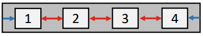
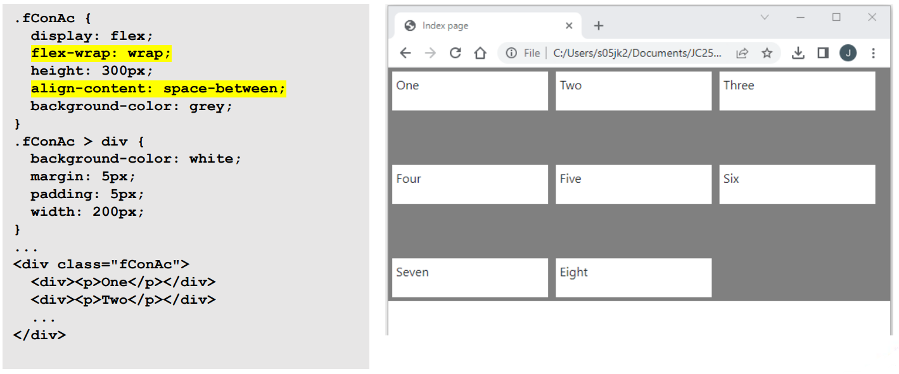

# Day 4: 更多 CSS 和 Bootstrap  

## Lecture 4.1: 更多 CSS  

### 更多 CSS 选择器
#### 后代选择器（descendant selector）  
- 后代选择器将样式应用于所有后代元素  
    - 后代是嵌套在其他元素中的元素  
    - 在本例中，将选择从 `dSel` 类元素后裔的所有 `<p>` 元素  
- ```html
  <style>
      .dSel p {
          color: blue;
      }
  </style>

  <div class="dSel">
      <p>
          This is in blue.
      </p>
      But this is not in blue.
  </div>

  <p>And this is not in blue either</p>
  ```
    

#### 子选择器（child selector）  
- 子选择器（`>`）适用于所有直系后代（子代）  
    - 在本例中，将选择从 `cSel` 类元素直接派生出来的所有 `<p>` 元素  
- ```html
  <style>
      .cSel > p {
        color: blue;
      }
  </style>

  <div class="cSel">
      <p>This is in blue.</p>

      <div>
          <p>But this is not in blue.</p>
      </div>
  </div>
  ```
    

#### 相邻兄弟选择器（adjacent sibling selector）  
- 相邻兄弟选择器（`+`）适用于所有相邻兄弟（同辈）  
    - 在本例中，将选择直接位于 `adj` 类元素之后的所有 `<p>` 元素  
- ```html
  <style>
      .adj + p {
          color: blue;
      }
  </style>

  <div class="adj">
      <p>This is not in blue.</p>
  </div>
  <p>This is in blue.</p>
  <p>But this is not in blue.</p>
  ```
    

#### 一般兄弟选择器（general sibling selector）  
- 一般兄弟选择器（`~`）适用于所有兄弟（同辈）  
- ```html
  <style>
      .gen ~ p {
          color: blue;
      }
  </style>

  <div class="gen">
      <p>This is not in blue.</p>
  </div>
  <p>This is in blue.</p>
  <p>This is also in blue.</p>
  ```
    

### 柔性框  
- 有了柔性框/弹性盒子（flexbox），我们无需使用 `float` 或 `position` 即可创建自定义的灵活响应式布局  
- 柔性框允许容器调整宽度、高度和容器内项目的顺序  
    - 柔性框力求最有效地利用可用空间  
- 多用于小规模布局，如应用界面  
- 柔性框布局由柔性容器和柔性项组成  
    - 大量可用于自定义布局的属性  

#### 柔性容器  
- 使用 `display: flex` 来创建柔性容器  
- 柔性容器的子元素是柔性项目  
- 使用属性 `flex-direction` 设置组件的方向  
    - `row`：从左到右（默认）  
    - `row-reverse`：从右到左  
    - `column`：从上到下  
    - `column-reverse`：从下到上  
    -   
- ```html
  <style>
      .fConR {
          display: flex;
          flex-direction: row;
          background-color: grey;
      }

      .fConR > div {
          background-color: white;
          margin: 5px;
          padding: 5px;
          width: 70px;
      }
  </style>

  <div class="fConR"> <!--柔性容器-->
      <!--柔性容器的子元素为柔性项目-->
      <div></p>One</p></div>
      <div></p>Two</p></div>
      <div></p>Three</p></div>
      <div></p>Four</p></div>
  </div>
  ```
    

#### 多行显示（wrap）  
- 属性 `flex-wrap` 指定了柔性项目是否会以多行显示已经多行显示的方式  
    - `nowrap`：柔性项目会在单行中显示  
    - `wrap`：柔性项目会拆分为多行，从上到下显示  
    - `wrap-reverse`：柔性项目会拆分为多行，从下到上显示  
- 会在调整浏览器窗口大小时应用  
-   
- `nowrap` 例  
    
  `wrap` 例  
    
- `flex-flow` 属性结合了 `flex-direction` 和 `flex-wrap`  
  ```css
  display: flex;
  flex-flow: row wrap-reverse;
  ```
    

#### 主轴和横轴  
- 可以使用以下柔性容器属性对齐柔性项  
    - `justify-content`：使用主轴（main axis）  
    - `align-items`：使用横轴（cross axis）  
- 主轴和横轴由 `flex-direction` 属性决定  
    - `row`：主轴在水平方向  
        
    - `column`：主轴在垂直方向  
        

#### Justify item  
- 使用 `justify-content` 属性可使柔性项目跨主轴对齐  
    - `flex-start`：在容器开头对齐  
      
    - `flex-end`：在容器结尾对齐  
        
    - `center`：居中对齐  
        
    - `space-around`：在行前、行间和行后分配空间  
        
    - `space-between`：在行间分配空间  
        
    - `space-evenly`：在行前、行间和行后分配相同大小的空间  
        

#### Align item  
- 可使用 `align-item` 属性将柔性项目在横轴上对齐  
    - `stretch`：默认，填充可用的柔性容器空间  
        
    - `flex-start`：将项目对齐到柔性容器的顶部  
        
    - `flex-end`：将项目对齐到柔性容器的底部  
        
    - `center`：将项目对齐到柔性容器的中央  
        
    - `baseline`：使用文本基线对齐每个项目  
        

#### Align content  
- 可以使用 `align-content` 属性来控制柔性容器中柔性线条的分布方式  
    - 假定使用多行柔性框容器：将 `flex-wrap` 或 `flex-flow` 设置为 `wrap` 或 `wrap-reverse`  
    - 横轴上必须留有空间  
    - 对单行柔性容器或设置 `nowrap` 时无影响  
- 与之前类似的可能值：`stretch`、`flex-start`、`flex-end`、`flex-center`、`space-between`、`space-around`、`space-evenly`  
    
  `stretch` 例  
    
  `center` 例  
    
  `space-between` 例  
    

#### 柔性项目属性  
- 我们可以使用以下属性来控制作为柔性容器中直接子元素的柔性项目  
    - `order`：改变柔性项目的顺序  
    - `flex-grow`：指定相对于其他柔性项目，柔性项目的尺寸增长幅度  
    - `flex-shrink`：指定相对于其他柔性项目，柔性项目的尺寸应缩小多少  
    - `flex-basis`：柔性项目的初始长度  
    - `flex`：同时设置 `flex-grow`、`flex-shrink` 和 `flex-basis`  
    - `align-self`：覆盖特定柔性项目的对齐方式  
- `flex-grow` 例  
    
  `flex-basis` 例  
    
  `align-self` 例  
    

### 网格  
- CSS 网格布局（grid layout）是柔性框和定位（positioning）的替代方案  
- 与柔性框一样，网格容器和网格项也有很多属性，我们可以用它们来控制页面的外观和布局  
- 与柔性框类似，我们也可以使用 `display` 属性来设置网格容器  
    - `grid`：块级（block-level）  
    - `inline-grid`：内联网格  
-   
- 网格例  
    
  内联网格例  
    
  网格列（grid column）例  
    