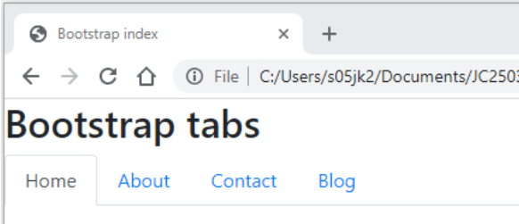

## Lecture 4.2: Bootstrap  

### Bootstrap 简介  
- Bootstrap 是一个免费的开源 CSS 框架  
- Bootstrap 设计为“移动优先”（mobile first）和响应式（responsive）  
    - 可根据不同屏幕尺寸（如台式机和智能手机）自动调整网页设计，非常实用  
- 提供大量可自定义的预定义 CSS 类  
    - 某些类依赖 JavaScript（Bootstrap JavaScript、JQuery）  
    - 可以用自己的 CSS 覆盖 Bootstrap 类  
- 不同浏览器对 Bootstrap 类的良好支持  
    - 本讲中的示例基于 Bootstrap 4  

#### 示例  
- 无 Bootstrap 的简单页面  
    
- 有 Bootstrap 的简单页面  
  使用预定义的 CSS 样式和来自内容分发网络（content delivery network，CDN）的脚本
    

### Bootstrap 容器  
- Bootstrap 使用不同类型的容器来存储页面内容  
    - `.container`：固定宽度  
    - `.container-fluid`：展开以使用可用页面的全部宽度  
    - 响应式容器，最大宽度可根据不同的屏幕尺寸而改变：`container-sm`、`container-md`、`container-lg`、`container-xl`  

#### 实用工具  
- Bootstrap 提供了几个实用类来调整各种 CSS 属性  
- 本例中，额外属性有  
    - `p-3`：内边距（padding）设为 3  
    - `my-3`：外边框（margin）设为 3（上下方向）  
    - `border`：向所有边添加边框（border）  
    - ```html
      <div class="container-fluid p-3 my-3 border">
          <p>
              Fluid container with some extras.
          </p>
      </div>

      <div class="container p-3 my-3 border">
          <p>
              Fixed width container with some extras.
          </p>
      </div>
      ```
        

### 网格基础  
- 可使用 Bootstrap 网格系统（grid system）设计页面布局  
- Bootstrap 网格具有响应性，可根据屏幕尺寸自动调整大小和排列方式  
- 使用 `row` 和 `col` 类来指定布局  
    - 行必须位于容器内  
    - 行用于分组列，内容随列放置  
- 每页最多 12 列（column）  
    - 并不需要全部 12 列  
    - 列可以有相等或不相等的宽度  

#### 网格示例  
```html
<div class="row">
    <div class="col-md-6 my-3 border">1</div>
    <div class="col-md-6 my-3 border">2</div>
</div>
<div class="row">
    <div class="col-md-4 my-3 border">1</div>
    <div class="col-md-4 my-3 border">2</div>
    <div class="col-md-4 my-3 border">3</div>
</div>
<div class="row">
    <div class="col-md-2 my-3 border">1</div>
    <div class="col-md-2 my-3 border">2</div>
    <div class="col-md-2 my-3 border">3</div>
    <div class="col-md-6 my-3 border">4</div>  <!--注意：这里是 col-md-6 -->
</div>
```
  

### 预定义文本颜色  
```html
<h2>Text Colors</h2>
<p class="text-muted">Muted text.</p>
<p class="text-primary">Important text.</p>
<p class="text-success">Success text.</p>
<p class="text-info">Information text.</p>
<p class="text-warning">Warning text.</p>
<p class="text-danger">Danger text.</p>
<p class="text-secondary">Secondary text.</p>
```
  

### 预定义背景颜色  
```html
<h2>Background Colours</h2>
<p class="bg-primary text-white">Important text.</p>
<p class="bg-success text-white">Success text.</p>
<p class="bg-info text-white">Information text.</p>
<p class="bg-warning text-white">Warning text.</p>
<p class="bg-danger text-white">Danger text.</p>
<p class="bg-secondary text-white">Secondary text.</p>
```
  

### 按钮样式  
```html
<button type="button" class="btn">Basic</button>
<button type="button" class="btn btn-primary">Primary</button>
<button type="button" class="btn btn-secondary">Secondary</button>
<button type="button" class="btn btn-success">Success</button>
<button type="button" class="btn btn-info">Info</button>
<button type="button" class="btn btn-warning">Warning</button>
<button type="button" class="btn btn-danger">Danger</button>
<button type="button" class="btn btn-dark">Dark</button>
<button type="button" class="btn btn-light">Light</button>
<button type="button" class="btn btn-link">Link</button>
```
  

### 按钮轮廓（outline）  
```html
<button type="button" class="btn btn-outline-primary">Primary</button>
<button type="button" class="btn btn-outline-secondary">Secondary</button>
<button type="button" class="btn btn-outline-success">Success</button>
<button type="button" class="btn btn-outline-info">Info</button>
<button type="button" class="btn btn-outline-warning">Warning</button>
<button type="button" class="btn btn-outline-danger">Danger</button>
<button type="button" class="btn btn-outline-dark">Dark</button>
<button type="button" class="btn btn-outline-light text-dark">Light</button>
```
  

### 按钮尺寸  
小按钮、大按钮和块级按钮可以使用 `btn-sm`、`btn-lg` 和 `btn-block` 属性指定  
```html
<button type="button" class="btn btn-primary btn-sm my-1">small</button><br>
<button type="button" class="btn btn-primary btn-lg my-1">large</button><br>
<button type="button" class="btn btn-primary btn-block my-1">Block</button>
```
  

### 启用（active）和禁用（disabled）按钮  
- `disabled` 属性可用于指定禁用（非活动）按钮  
    - 注意，`disabled` 是一个**属性**，不是类！  
- ```html
  <button type="button" class="btn btn-primary active">
      ActivePrimary
  </button>
  <button type="button"class="btn btn-primary" disabled>
      DisabledPrimary
  </button>
  ```
    

### Jumbotron  
Bootstrap `jumbotron` 类可用于指定一个区域，以吸引注意力  
```html
<div class="jumbotron">
    <h1>Bootstrap Basics</h1>
    <p>The jumbotron class can be used get attention to some content.</p>
</div>
```
  

### 标签  
- 标签（tab）有助于组织和导航内容  
    - Bootstrap `nav` 类为创建标签提供了多种选择  
- ```html
  <h2>Bootstrap tabs</h2>

  <ul class="nav nav-tabs">
      <li class="nav-item">
          <a class="nav-link active" href="#">Home</a>
      </li>
      <li class="nav-item">
          <a class="nav-link" href="#">About</a>
      </li>
      <li class="nav-item">
          <a class="nav-link" href="#">Contact</a>
      </li>
      <li class="nav-item">
          <a class="nav-link" href="#">Blog</a>
      </li>
  </ul>
  ```
    

### 卡片页眉和页脚（card headers and footers）  
Bootstrap `card` 类为页眉、正文和页脚等提供了有用的容器  
```html
<h2>Card Header and Footer</h2>
<div class="card">
    <div class="card-header">Header</div>
    <div class="card-body">Content</div>
    <div class="card-footer">Footer</div>
</div>
```
  

### 卡片标题、文本和链接  
提供多种样式选项，包括文本、链接和图片等内容类型的 `card`  
```html
<h2>Card titles, texts and links</h2>
<div class="card">
    <div class="card-body">
        <h4 class="card-title">Card title</h4>
        <p class="card-text">Some example text. Some example text.</p>
        <a href="#" class="card-link">Card link</a>
        <a href="#" class="card-link">Another link</a>
    </div>
</div>
```
  

### 模态  
- 模态（modal）可用于显示补充信息，而无需移动到其他页面  
    - 包括页眉、正文和页脚  
    - 常用于提示用户操作、确认、错误和警告等  
- ```html
  <!--按钮-->
  <button type="button" class="btn btn-primary" data-toggle="modal" data-target="#myModal">
      Launch modal
  </button>

  <!--模态（此处为弹窗）-->
  <div class="modal" id="myModal">
      <div class="modal-dialog">
          <div class="modal-content">
              <div class="modal-header">
                  <h4 class="modal-title">Modal title</h4>
                  <button type="button" class="close" data-dismiss="modal">&times;</button>
              </div>
              <div class="modal-body">
                  <p>Content of the modal</p>
              </div>
              <div class="modal-footer">
                  <button type="button" class="btn btn-danger" data-dismiss="modal">Close</button>
              </div>
          </div>
      </div>
  </div>
  ```
    

### 覆盖 Bootstrap  
- 在某些情况下，我们可能希望使用 Bootstrap，但用自定义样式覆盖某些默认的 Bootstrap 样式  
- 要覆盖 Bootstrap，我们需要在 Bootstrap CSS 文件的链接之后添加一个指向我们自己的 CSS 文件的链接  
    - 我们也可以在 HTML 文件的 `<style>` 元素中定义覆盖 CSS 样式，但建议使用 CSS 文件来代替  
- 要使用自定义样式，可在 Bootstrap 类之后添加自定义样式类  
- ```html
  <style>
      .override {
          background-color: blue;
          color: white;
      }
  </style>

  <div class="jumbotron">
      <h1>Bootstrap Basics</h1>
  </div>
  ```
    

### 小结  
- CSS 柔性框（flexbox）和网格布局（grid layout）具有相似的功能，可用于设计布局  
    - 如果需要有列**或**行的布局，使用柔性框  
    - 如果需要有列**和**行的布局，使用网格  
- Bootstrap 是“移动优先”的 CSS 框架  
    - 使用 CDN 链接将 Bootstrap 应用于页面  
    - 所有内容都必须放在容器内，可以使用网格系统来组织布局  
    - 为各种组件提供大量预定义类  