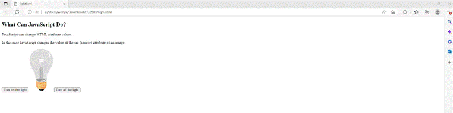
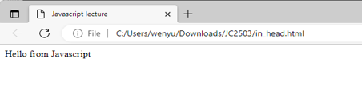
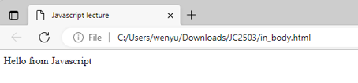
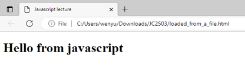
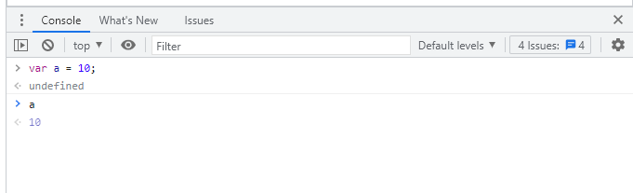
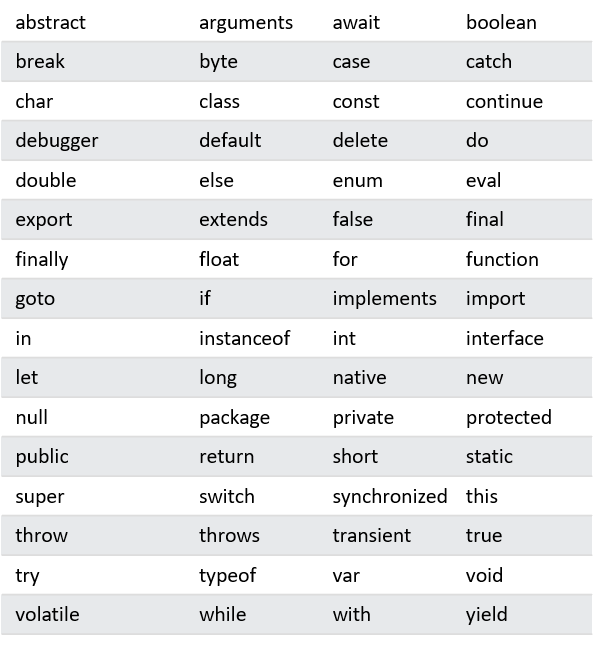
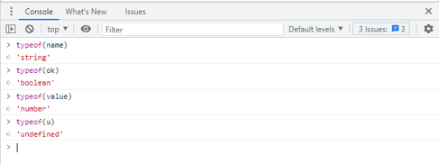
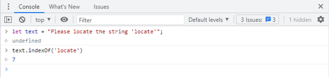
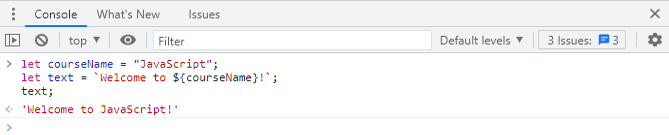

# Day 5: JavaScript  

## Lecture 5.1：简介和 JavaScript 基础（第 1 部分）  

### JavaScript 简介  
- JavaScript 是一种高级编程语言，通常用于在网页上创建交互效果和动态功能  
- 它是一种客户端脚本语言，即在客户端或用户设备上执行，而不是在服务器上执行  
- JavaScript 的一些常见用途包括表单验证、创建动画和特效、操作 DOM（Document Object Model，文档对象模型）以及向服务器发出异步请求  
- 它通常与 HTML 和 CSS 结合使用，以创建功能齐全的网络应用程序  

### JavaScript 的应用  
- JavaScript 可以通过多种方式与用户交互  
    - 处理来自表单、按钮和其他 HTML 元素的用户输入。然后，它可以通过更新页面、触发动画或执行其他操作来响应这些输入  
    - 响应用户事件，如点击、悬停和滚动  
    - 验证表单上的用户输入，以确保其符合特定要求  
    - 修改网页的文档对象模型（DOM）  
- 来自 W3School.com 的例子  
    

### 可放置 JavaScript 代码的地方  
- JavaScript 代码放在 `<script>` 和 `</script>` 标记之间  
- 在网页或应用程序中，有几个地方可以放置 JavaScript 代码，包括  
    - `<head>` 部分内  
    - `<body>` 部分内  
    - 在外部文件中  

#### 在 `<head>` 中编写
```html
<!DOCTYPE html>
<html lang="en">
    <head>
        <meta charset="UTF-8">
        <title>Javascript lecture</title>
        <script>document.write("Hello from Javascript");</script>
    </head>
    <body></body>
</html>
```
">  

#### 在 `<body>` 中编写  
```html
<!DOCTYPE html>
<html lang="en">
    <head>
        <meta charset="UTF-8">
        <title>Javascript lecture</title>
    </head>
    <body>
        <script>document.write("Hello from Javascript");</script>
    </body>
</html>
```
">  

#### 在外部文件中编写  
```html
<!DOCTYPE html>
<html lang="en">
    <head>
        <meta charset="UTF-8">
        <title>Javascript lecture</title>
    </head>
    <body>
        <h1 id="example">Hello</h1>
        <!--外部文件是扩展名为 .js 的文件，可使用带有 src 属性的 <script> 标签链接到该文件。-->
        <script src="theJavascript.js"></script>
    </body>
</html>
```
```js
// theJavascript.js
document.getElementById("example").innerHTML = "Hello from javascript">
```
  

### 在网页浏览器中开发 JavaScript  
- 要使用网络浏览器开发和调试 JavaScript 程序，可以按照以下步骤进行  
    1. 打开网络浏览器，如 Google Chrome、Mozilla Firefox 或 Safari  
    2. 打开开发者工具
    3. 导航至“控制台”（Console）选项卡。在这里可以输入和执行 JavaScript 代码  
-   

### JavaScript 基础  
#### 大纲  
- Keywords 关键字  
- Statements 语句  
- Variables 变量  
- Comments 注释  
- Operators
- Data types
- Strings
- Array
- If-else
- Switch
- Loop 

#### Keywords 关键字  
- JavaScript 中的关键字是保留字，在语言中具有特定的含义和用途。它们用于定义语言的语法和结构，不能用作代码中的变量名或其他标识符  
    
- 关键字的一些主要用途  
    - 声明  
    - 控制流（flow）  
    - 函数  
    - 面向对象编程  
    - 错误处理  
    - ……  

#### Statements 语句  
- 语句是一段执行特定操作的代码。语句是 JavaScript 程序的组成部分，它们按照在程序中出现的顺序一个接一个地执行  
- 语句可以执行多种任务，包括  
    - 为变量赋值  
    - 声明函数  
    - 循环代码  
    - 根据条件作出决定  
    - 抛出和处理异常  
- 需要注意的是，在 JavaScript 中，语句必须以分号（;）结束  
  这就告诉 JavaScript 引擎，语句已经结束，是时候进入下一条语句了  
- 一些语句例子  
    - 变量声明和赋值语句  
      ```js
      var variableName = value;
      ```
    - 函数声明语句  
      ```js
      function functionName(parameter1, parameter2) {

          // 函数体
      }
      ```
    - `if` 语句  
      ```js
      if (condition) {

          // 条件为真时要执行的语句
      } else {

          // 条件为假时要执行的语句
      }
- 一个 JavaScript 例子  
  ```js
  var x, y, z;
  x = 10;
  y = 33.1;

  // Calculate sum
  function sum(a, b) {
      return a + b;
  }

  z = sum(x, y);
  ```

#### Variables 变量  
- 变量存储数据值  
    - 将变量视为类似于代数中的变量  
    - 即 `x = 3;`、`y = 2;`、`z = x - y;`  
- 所有变量必须使用唯一的名称标识  
- 给变量命名时要遵循一些规则  
    - 可包含字母、数字、下划线和美元符号（`$`）  
    - 以字母或 `_` 开头  
    - 不得使用任何保留字（reserved words）或关键字  
    - 唯一  
- 四种声明变量的方式  
    - 使用 `var`  
      ```js
      var x = 5;
      var y = 10.5;
      var z = x + y;
      ```
    - 使用 `let`  
      ```js
      let x = 5;
      let y = 10.5;
      let z = x + y;
      ```
    - 使用 `const`  
      ```js
      const student1_id = 25;
      const student2_id = 33;
      ```
    - 直接声明  
      ```js
      price = 13.5;
      area = 22;
      ```
- `var` 和 `let` 声明的区别  
    - 由 `var` 声明的变量的作用域为直接函数体  
    - `let` 变量的作用域为用 `{}` 表示的直接包围块  
    - ```js
      function run() {
          var foo = "Foo";
          let bar = "Bar";

          console.log(foo, bar); // Foo Bar
      
          {
            var moo = "Mooo"
            let baz = "Bazz";
            console.log(moo, baz); // Mooo Bazz
          }

          console.log(moo); // Mooo
          console.log(baz); // ReferenceError
      }
      ```
- 块语句（block statements）- JavaScript 语句用 `{}` 包含在一起  
- 全局范围 - 可在任何地方使用和访问，可在任何块之外声明  
- 局部范围  
    - 仅在函数范围内访问和使用  
    - 同名的局部变量可在函数之外重新声明  
    - 局部变量在声明它的函数之外不能被访问  

#### Comments 注释  
- 注释可用于解释代码或在测试时防止代码执行  
- `//` 注释单行 - `//` 之后的代码会被忽略  
- `/* */` 注释多行 - `/*` 和 `*/` 之间的代码会被忽略  

### Operators 运算符  
- JavaScript 运算符包括  
    - 算术运算符（arithmetic operator）  
    - 赋值运算符（assignment operator）  
    - 比较运算符（comparison operator）  
    - 逻辑运算符（logical operator） 
    - 条件运算符（conditional operator）  
    - 类型运算符（type operator）  
    - 位运算符（bitwise operator）  
- JavaScript 的运算符很容易理解  
    - 运算符将其操作数强制转换为适当的类型  
    - 大多数运算符只对基元值（primitive value）起作用  

#### 算术运算符  
- 算术运算符用于对数值进行数学计算  
- 两个操作数都应是数值，如整数、浮点数等  
  ```
  operator
     ↓
   x + y
   ↑   ↑
  operand
  ```
- | 运算符 | 描述 | 例子 | x | y | 结果 |
  | --- | --- | --- | --- | --- | --- |
  | `+` | 加 | `x + y` | 2 | 5 | 7 |
  | `-` | 减 | `x - y` | 3 | 1 | 2 |
  | `*` | 乘 | `x * y` | 5 | 7 | 35 |
  | `**` | 指数运算 | `x ** y` | 2 | 3 | 8 |
  | `/` | 除以 | `x / y` | 4 | 3 | 1.333... |
  | `%` | 模数（取余） | `x % y` | 4 | 3 | 1 |
  | `++` | 增加 | `x++` / `++x` | 2 |  | 2 / 3 |
  | `--` | 减少 | `x--` / `--x` | 2 |  | 2 / 1 |


#### 赋值运算符  
- 赋值运算符用于为变量赋值  
- 它们将赋值运算与算术运算结合在一起，以执行算术运算，并将运算结果赋值给变量  
    - 赋值（`=`）：将右边的值赋给左边的变量  
    - 加法赋值 (`+=`)：将右边的值添加到左边的变量中  
    - ……
- | 运算符 | 例子 | 等效于 | x | y | x 的结果 |
  | --- | --- | --- | --- | --- | --- |
  | `=` | `x = y` |  | 3 | 5 | 3 |
  | `+=` | `x += y` | `x = x + y` | 2 | 3 | 5 |
  | `-=` | `x -= y` | `x = x - y` | 7 | 9 | -2 |
  | `*=` | `x *= y` | `x = x * y` | 2 | 2 | 4 |
  | `/=` | `x /= y` | `x = x / y` | 3 | 2 | 1.5 |
  | `%=` | `x %= y` | `x = x % y` | 5 | 3 | 2 |
  | `**=` | `x **= y` | `x = x ** y` | 3 | 2 | 9 |

#### 比较运算符  
- 比较运算符用于比较两个值，并根据比较结果返回布尔值（真或假）  
- | 运算符 | 描述 | 例子 |
  | --- | --- | --- |
  | `==` | 等于 | `x == y`|
  | `===` | 值和类型均等于 | `x === y` |
  | `!=` | 不等于 | `x != y` |
  | `!==` | 值或类型不等于 | `x !== y` |
  | `>` | 大于 | `x > y` |
  | `<` | 小于 | `x < y` |
  | `>=` | 大于等于 | `x >= y` |
  | `<=` | 小于等于 | `x <= y` |
  | `?` | 三元运算 | `age >= 18 ? "adult" : "minor"` |
- ```js
  console.log(5 == 5);      // true
  console.log(5 == "5");    // true（JS 会将字符串转为数字）
  console.log(5 == 6);      // false
  console.log(5 === 5);     // true
  console.log(5 === "5");   // false
  console.log(true === 1);  // false（布尔值和数字不是同一类型）

#### 逻辑运算符  
- 逻辑运算符是用于组合或操作布尔值的运算符  
- Tips: 逻辑运算符可用于在 if 语句或 while 循环中组合多个条件  
- 假设 `x = 10; y = 5;`  
  | 运算符 | 描述 | 例子 | 结果 |
  | --- | --- | --- | --- |
  | `&&` | 逻辑与（AND），前后均为真时返回真 | `x > 5 && y > 3` | true |
  | `\|\|` | 逻辑或（OR），前后有任何一个为真/两个均为真时返回真 | `x > 15 \|\| y > 3` | true
  | `!` | 逻辑非（NOT），条件为真时返回假，条件为假时返回真 | `!(x > 15)` | true |

#### 类型运算符  
- 类型运算符用于确定值的数据类型  
- | 运算符 | 描述 |
  | `typeof` | 返回一个变量的类型 |
  | `instanceof` | 如果对象是对象类型的实例，则返回 true |
- ```js
  typeof 42;            // number
  typeof "hello";       // string
  typeof true;          // boolean
  typeof undefined;     // undefined
  typeof null;          // object

  var d = new Date();
  d instanceof Date;    // true
  d instanceof Object;  // true，因为所有对象都是 Object 的实例  

#### 位运算符  
- 位运算符用于对数字的二进制表示进行运算。它们的工作原理是将十进制数转换为二进制数，对二进制值执行运算，然后将结果转换回十进制数  
- | 运算符 | 描述 | 例子 | 等效于 | 结果 | 二进制结果 |
  | --- | --- | --- | --- | --- | --- |
  | `&` | AND 与 | `5 & 1` | `0101 & 0001` | 0001 | 1 |
  | `\|` | OR 或 | `5 \| 1` | `0101 \| 0001` | 0101 | 5 |
  | `~` | NOT 非 | `~5` | `~0101` | 1010 | 10 |
  | `^` | XOR 异或 | `5 ^ 1` | `0101 ^ 0001` | 0100 | 4 |
  | `<<` | 左移位 | `5 << 1` | `0101 << 1` | 1010 | 10 |
  | `>>` | 右移位 | `5 >> 1` | `0101 >> 1` | 1010 | 2 |
  | `>>>` | 无符号右移位 | `5 >>> 1` | 0010 | 2 |

#### 运算符优先级  
- 运算符优先级是 JavaScript 对表达式中的运算符进行求值的顺序  
-   1. 分组 `()`  
    2. 一元（unary）运算符 `+` `-` `!`  
    3. 乘法和除法 `*` `/` `%`  
    4. 加法和减法 `+` `-`  
    5. 移位运算 `<<` `>>` `>>>`   
    6. 关系运算 `<` `<=` `>` `>=`  
    7. 等式运算 `==` `!=` `===` `!==`  
    8. 位运算 AND `&`  
    9. 位运算 XOR `^`  
    10. 逻辑与 AND `&&`  
    11. 逻辑或 OR `||`  
    12. 条件（三元）运算 `condition ? value1 : value2`  
    13. 赋值运算 `=` `+=` `-=` `/=` `%=` `<<=` `>>=` `>>>=` `&=` `^=` `|=`  
- 例子  
    - ```js
      // Step    2   1
      //         ↓   ↓
      var a = 10 + 5 * 2;
      ```
      a 的值是 20，而不是 30，因为乘法的优先级高于加法  
    - ```js
      // Step     1    2
      //          ↓    ↓
      var a = (10 + 5) * 2
      ```
      a 的值为 30，因为加法先被求值，因为用括号分组  

### 数据类型  
- JavaScript 数据类型  
    - String 字符串  
    - Number 数字  
    - Boolean 布尔值  
    - Undefined 未定义  
    - Object 对象  
    - Array 数组  
    - ……
- 使用 `typeof()` 函数检查数据类型  
- ```js
  const name = 'someone’; 
  const ok = true; 
  const value = 3479.1; 
  let u; 
  ```
    

#### 字符串  
- 字符串是用单引号或双引号括起来的字符序列  
  ```js
  let mobileName1 = "iPhone 14";    // 双引号
  let mobileName2 = 'Galaxy S23';   // 单引号
  ```
- 可以在字符串内使用引号，只要引号与字符串周围的引号不匹配即可  
  ```js
  let greeting1 = "Hello 'James'";
  let greeting2 = "Hello 'Jane'";
  ```
- | 字符串方法 | 描述 | 例子 | 返回值 |
  | --- | --- | --- | --- |
  | `length` | 返回字符串的长度 | `mobileName1.length` | 9 |
  | `slice()` | 返回字符串的一部分 | `mobileName1.slice(3, 8)` | 'one 1' |
  | `replace()` | 用另一个值替换字符串中的指定值 | `mobileName1.replace('14', '13');` | 'iPhone 13' |
  | `toUpperCase()` | 将字符串中的字母转为大写 | `mobileName1.toUpperCase()` | 'IPHONE 14' |
  | ... | ... | ... | ... |
- 更多字符串方法  
    - `indexOf()` - 返回匹配字符串的首次出现的索引  
        
    - `lastIndexOf()`  
    - `search()`  
    - `match()`  
    - `matchAll()`  
    - `includes()`  
    - `startsWith()`  
    - `endsWith()`  

#### 字符串模板  
- 字符串模板（template）是用反斜线括起来的字符串，允许使用 `${}` 语法嵌入表达式和变量  
- 模板字面（template literal）使用反斜线 (``)，而不是引号 ("")来定义字符串  
  ```js
  let courseName = "JavaScript";
  let text = `Welcome to ${courseName}!`;
  ```
    