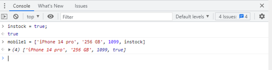
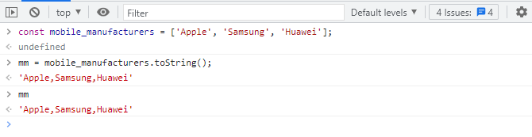
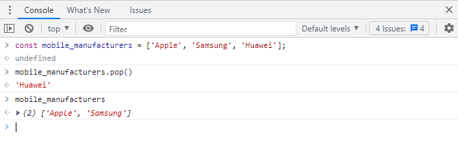
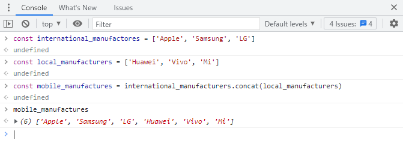
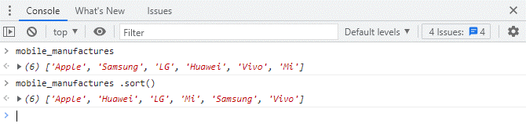
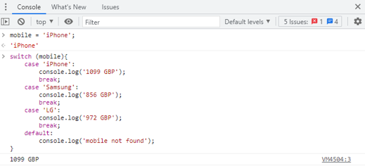

## Lecture 5.2：JavaScript 基础（第 2 部分）  

### 数组  
- 数组是一种特殊变量，可以保存多个值
  ```js
  const mobile_manufacturers = ['Apple', 'Samsung', 'Huawei'];
  ```
- 创建数组的语法  
  ```js
  array_name = [item1, item2, ...];
  ```
  或
  ```js
  array_name = new Array(item1, item2, ...);
  ```
- 数组中的项目可以是不同类型的  
    

#### 索引  
```js
const mobile_manufacturers = ['Apple', 'Samsung', 'Huawei'];

// 通过索引（index）访问数值
mobile_manufacturers[0];    // Apple
mobile_manufacturers[1];    // Samsung
mobile_manufacturers[2];    // Huawei

// 通过索引修改数值
mobile_manufacturers[1] = 'LG';     // ['Apple', 'LG', 'Huawei']

// 向数组添加项目
mobile_manufacturers.push('vivo')   // ['Apple', 'LG', 'Huawei', 'vivo']
```

#### 数组方法  
- `toString()` - 将数组转换为字符串  
    
- `pop()` - 移除数组中的最后一个项目  
    
- `concat()` - 连接两个数组  
    
- `sort()` - 以字母顺序排序数组  
    

### If-Else  
- if-else 语句用于根据条件执行不同的代码块  
- 还可以将多个 if-else 语句串联起来，创建更复杂的逻辑  
- 语法  
  ```js
  if (condition1) {
      // condition1 为真时要执行的语句
  }
  else if (condition2) {
      // condition2 为真时要执行的语句
  }
  else {
      // condition1 和 condition2 均为假时要执行的语句
  }
  ```

### Switch  
- 在 JavaScript 中，switch 语句是根据条件执行不同代码块的另一种方法。switch 语句通常用来替代多个 if-else 语句，尤其是在有许多可能的条件需要测试时  
- 语法  
  ```js
  switch (expression) {
      case x:
          // 代码块
          break;
      case y:
          // 代码块
          break;
      default:
          // 代码块
  }
  ```
-   

### 循环  
- 用于多次重复代码块  
- 不同种类的循环  
    - `for` - 遍历一系列值  
    - `while` - 只要条件为真，就重复代码块  
    - `do while` - 类似于 while 循环，但总是至少执行一次代码块，即使条件为假  
    - `for...in` - 用于遍历对象的属性  
    - `for...of` - 用于遍历可遍历对象（如数组或字符串）的值  

#### for 循环  
- 语法  
  ```js
  for (initialization; condition; increment/decrement) {
      // Code block to be executed
  }
  ```
    - `nitialization`：初始化循环变量的语句。仅在循环开始前执行一次  
    - `condition`：循环每次迭代前要检查的表达式。如果条件为真，循环继续；否则，循环结束  
    - `increment/decrement`：循环每次迭代后执行的语句。它用于修改循环变量  
    - `code block`：循环每次迭代时执行的代码块  
- 从 0 到 4 输出数字的例子  
  ```js
  for (let i = 0; i < 5; i++) {
      console.log(i);
  }
  ```
- 使用 for 循环的 Tips  
    - 确保条件最终变为 false，否则循环将永远运行下去  
    - 在循环块内修改循环变量时要小心。如果更改循环变量的值，可能会改变循环的行为  
    - 使用描述性的变量名，使代码更易读  

#### while 循环  
- 语法  
  ```js
  while (condition) {
      // Code block to be executed
  }
  ```
    - `condition`：循环每次迭代前要检查的表达式。如果条件为真，循环继续；如果条件为假，循环结束  
    - `code block`：循环的每次迭代中执行的代码块  
- 例子  
  ```js
  let i = 0;
  while (i < 5) {
      console.log(i);
      i++;
  }
  ```
- Tips  
    - 确保条件最终变为 false，否则循环将永远运行  
    - 在循环块内修改循环变量时要小心  
    - 使用描述性变量名使代码更易读  
    - 确保在任何可能导致无限循环的代码之前检查条件  

#### do-while 循环  
- 语法  
  ```js
  do {
      // code block to be executed
  } while (condition);
  ```
    - `code block`：循环的每次迭代中执行的代码块  
    - `condition`：循环每次迭代后要检查的表达式。如果条件为真，循环继续；如果条件为假，循环结束  
- 例子  
  ```js
  let i = 0;
  do {
      console.log(i);
      i++;
  } while (i < 5);
  ```
- Tips  
    - 即使条件为假，循环块总是至少执行一次  
    - 确保条件最终变为 false，否则循环将永远运行下去  
    - 在循环块内修改循环变量时要小心  
    - 使用描述性变量名，使代码更易读  
    - 确保在任何可能导致无限循环的代码之后检查条件  

#### for-in 循环  
- 语法  
  ```js
  for (variable in object) {
      // code block to be executed
  }
  ```
    - `variable`：会被设置为对象中每个属性的名称的变量  
    - `object`：属性将被遍历的对象  
    - `code block`：针对对象中每个属性执行的代码块  
- 例子  
  ```js
  const person = {firstName: "John", lastName: "Doe", age: 30};

  for (const key in person) {
      console.log(`${key}: ${person[key]}`);
  }
  ```
- Tips  
    - 不保证属性的顺序，因此如果顺序很重要，可能需要使用另一种方法遍历属性  
    - 如果顺序很重要，最好使用 for 循环、for-of 循环或 `Array.forEach()`  

#### for-of 循环  
- 语法  
  ```js
  for (variable of iterable) {
      // code block to be executed
  }
  ```
    - `variable`：会被设置为可迭代对象中的每个值的变量  
    - `iterable`：将被遍历的可遍历对象  
    - `code block`：针对可迭代对象中的每个值执行的代码块  
- 例子  
  ```js
  const colors = ["red", "green", "blue"];
  for (const color of colors) {
      console.log(color);
  }
  ```
- Tips  
    - `for-of` 循环只适用于可迭代对象。如果需要遍历对象的属性，应使用 `for-in` 循环  
    - 循环按照可迭代对象值出现的顺序进行迭代  