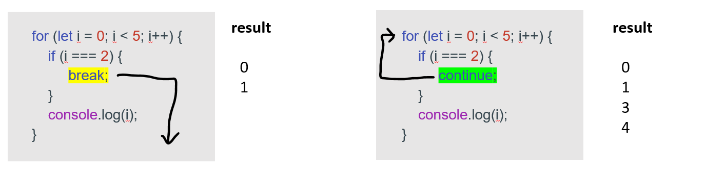
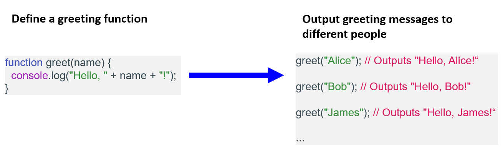

# Day 6: 更多 JavaScript  

## Lecture 6.1: 函数  

### Break 和 Continue  
- `break` 和 `continue` 语句用于控制循环的流程  
    - `break` 跳出循环  
    - `continue` 跳过循环中的一次迭代  
    -   

### 集合  
- 集合（set）是数字、字符串或对象等任何类型的唯一值的集合  
- 操作集合的基本方法  
    - `Set()` 构造函数（constructor）- 创建网络集合（net set）  
      ```js
      const mySet = new Set();
      ```
    - `add()` 和 `delete()` - 添加和移除元素  
      ```js
      mySet.add("hello");
      mySet.add("world");
      mySet.delete("world");
      ```
    - `has()` - 检查元素是否在集合中  
      ```js
      mySet.has("hello");       // true
      mySet.has("world");       // false
      ```

### Map  
- Map 是键值对的集合，其中每个键可以是任何类型，值可以是任何类型  
- 操作 Map 的基本方法  
    - `Map()` 构造函数 - 创建 Map  
      ```js
      const myMap = new Map();
      ```
    - `add()` 和 `delete()` - 添加和移除键值对  
      ```js
      myMap.set("key1", "value1");
      myMap.set("key2", "value2");
      myMap.delete("key2");
      ```
    - `get()` - 使用键获取值  
      ```js
      myMap.get("key1");    // value1
      ```
    - `has()` - 检查元素是否在集合中  
      ```js
      myMap.has("key1");    // true
      myMap.has("key2");    // false
      ```
    - 为 Map 中的每个键/值对调用一个函数  
      ```js
      myMap.forEach((value, key) => {
          console.log(key, value);
      });
      ```

### 作用域  
- 作用域（scope）决定变量的可访问性（可见性）  
- 全局作用域（global scope）：在任何函数之外声明的变量和函数都具有全局作用域，可以从程序中的任何地方访问  
  ```js
  const globalVariable = "Hello, world!";

  function globalFunction() {
      console.log(globalValue);     // Hello, world!
  }
  ```
- 局部作用域（local scope）：在函数内部声明的变量和函数具有本地作用域，只能在该函数内部访问  
  ```js
  function localFunction() {
      const localVariable = "Hello, world!";
      console.log(localVariable);   // Hello, world!
  }

  localFunction();
  console.log(localVariable);       // ReferenceError: localVariable is not defined
  ```
- 程序块作用域（block scope）：在程序块（如 for 循环或 if 语句）内声明的变量具有程序块作用域，只能在该程序块内访问  
  ```js
  if (true) {
      const blockVariable = "Hello, world!";
      console.log(blockVariable);   // Hello, world!
  }

  console.log(blockVariable);       // ReferenceError: localVariable is not defined
  ```
- 提示 - 函数作用域与程序块作用域：用 `var` 声明的变量具有函数作用域，可以在其声明的函数中的任何地方访问。用 `let` 和 `const` 声明的变量具有程序块作用域，只能在声明的块中访问  

### 函数  
- 函数（function）是执行特定任务的代码块。它可以接收参数形式的输入，也可以返回值作为输出。函数允许我们封装代码块并多次重复使用  
-   
- 要在 JavaScript 中创建一个函数，可以使用函数关键字，后面跟函数名和大括号中的代码块  
  ```js
  // 创建函数的关键字声明
  // |    函数名 参数
  // ↓       ↓    ↓
  function greet(name) {
      console.log("Hello, " + name + "!");  // <- 函数体
  }
  ```

#### 创建函数的方法  
- **函数声明（function declaration）**：函数声明是定义函数最常用的方法  
  ```js
  function functionName(parameter1, parameter2, ...) {
      // function body
      return value;
  }
  ```
    - 使用关键字 `function` 定义  
    - `functionName` 是函数的名字  
    - `parameter1`、`parameter2` 等是函数接受的可选参数  
    - 函数体用大括号 `{}` 括起来  
- **函数表达式（function expression）**：JavaScript 函数也可以使用表达式来定义  
  ```js
  let varName = function(parameter1, parameter2, ...) {
      // function body
      return value;
  };
  ```
    - 函数表达式可以存储在一个变量中  
    - 上面的函数以分号结束，因为它是可执行语句的一部分  
- **箭头函数（arrow function）**：函数表达式的缩写语法（shorthand syntax）  
  ```js
  let addNumbers = (a, b) => { return a + b; };
  const x = (x, y) => x * y;
  ```
    - 不需要关键字 `function`  
    - 也可以省略关键字 `return` 和大括号 `{}`  

#### 函数提升  
- 函数提升（hoisting）是 JavaScript 中的一种行为，在执行上下文的创建阶段，函数声明会被移动到其包含范围的顶部。这意味着可以在代码中定义函数之前调用该函数，而 JavaScript 仍能找到并执行该函数  
- ```js
  addNumbers(2, 3);     // 5

  function addNumbers(a, b) {
      return a + b;
  }
  ```

#### 自调用函数  
- 自调用函数（self-invoking function）是一个 JavaScript 函数，它在定义后会立即执行。这意味着该函数会自动调用，无需显式函数调用  
    - 自调用函数使用匿名函数表达式定义  
    - 必须在函数周围加上括号，以表明这是一个函数表达式  
    - 使用括号立即调用函数  
    - 函数可接受参数输入  
- 语法  
  ```js
  (function() {
      // code here
  })();
  ```
- 例子  
  ```js
  (function(name) {
      console.log(`Hello, ${name}!`);
  })('John');           // I will invoke myself
  ```

#### 参数  
- 函数参数是定义函数时在函数括号中声明的变量。它们代表函数在被调用时希望收到的输入值  
- ```js
  function addNumbers(a, b) {
      return a + b;
  }
  ```
  在这个函数中，`a` 和 `b` 是参数，代表函数期望接收的两个数字。调用此函数时，可以将 `a` 和 `b` 的值作为参数传入，如下所示  
  ```js
  let sum = addNumbers(2, 3);
  console.log(sum);     // 5
  ```
- 函数参数可以使函数更加灵活和可重用。通过接受不同的输入值，同一个函数可以在不同的环境下用于不同的目的  
- **参数规则**  
    - 参数是可选的  
    - 参数可以有默认值  
    - 参数可以是任何数据类型，包括字符串、数字、对象、数组甚至函数  
    - 参数的作用域是函数
    - 参数的顺序很重要：调用函数时，除非使用了命名参数，否则传入的参数顺序必须与函数中定义的参数顺序一致  

#### 变量作用域  
- 函数可以访问函数内部定义的所有变量，就像这样  
  ```js
  function myFunction() {
      let x = 5;
      return x * x;
  }
  ```
    - 局部变量只能在定义它的函数中使用，其他函数和其他脚本代码都无法使用它  
    - 局部变量的寿命很短，它们在函数调用时创建，并在函数结束时删除  
- 函数还可以访问在函数之外定义的变量，就像这样  
  ```js
  let y = 5;
  function myFunction() {
      return y * y;
  }
  ```
    - 在第二个示例中，y 是一个全局变量  
    - 在网页中，全局变量属于页面  
    - 全局变量可以被页面中的所有其他脚本使用（和更改）  
    - 全局变量在页面被丢弃之前一直存在，比如当你导航到其他页面或关闭窗口时  

#### 嵌套函数  
- 在 JavaScript 中，可以在其他函数内部定义函数。这些函数被称为嵌套函数（nested function）或内部函数（inner function）  
- 提示：嵌套函数可以访问外层函数中定义的变量和函数，反之则不行。这是因为内部函数可以访问外部函数的作用域链  
- 例子  
  ```js
  function outer() {
      const x = 1;

      function inner() {
          console.log(x);
      }

      inner();      // 1
  }

  outer();
  ```

#### 调用  
- 要调用一个函数，只需在函数名称后加上括号即可  
  ```js
  function greet(name) { 
      console.log(`Hello, ${name}!`); 
  } 

  // 函数名 参数
  // ↓      ↓
  greet("Alice");   // Hello, Alice!
  ```
- 调用函数时，函数内部的代码将被执行，函数可以选择返回一个值  
