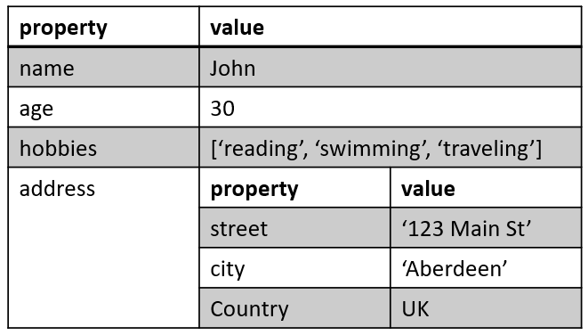

## Lecture 6.2：对象和类  

### 对象  
- 对象（object）是一种数据类型，允许以键值对（key-value pair）的形式存储数据。键通常是字符串，值可以是任何数据类型，包括其他对象、函数和数组  
- JavaScript 中，除了基元（primitive）之外，几乎“一切”都是对象  
    - 布尔值可以是对象（使用关键字 `new` 定义）  
    - 数字可以是对象（使用关键字 `new` 定义）  
    - 字符串可以是对象（使用关键字 `new` 定义）  
    - 日期总是对象  
    - 数字总是对象  
    - 数组总是对象  
    - 对象总是对象  

#### 创建对象  
- 创建对象的最简单方法是使用对象字面形式（object literal），即用大括号括起来的以逗号分隔的键值对列表  
- JavaScript 对象是命名值的集合  
- ```js
  const person = {
      name: 'John',
      age: 30,
      hobbies: ['reading', 'swimming', 'traveling'],
      address: {
          street: '123 Main St',
          city: 'Aberdeen',
          country: 'UK'
      }
  };
  ```

#### 对象属性  
- 属性（properties）是与对象相关联的值  
    
    - 属性是无序的  
    - 属性的键（key）通常是字符串  
    - 属性的值（value）可以是任何数据类型，包括字符串、数字、数组甚至对象（嵌套对象）  

#### 访问属性  
- 可以通过多种方式访问对象属性  
    - 点符号（dot notation）  
      ```js
      console.log(person.name);
      ```
    - 括号符号（bracket notation）  
      ```js
      console.log(person["name"]);
      ```
    - 计算的属性名称（或表达式）  
      ```js
      const propertyName = "name";
      console.log(person[propertyName]);
      ```

#### 循环浏览属性  
- 使用 `for...in` 语句循环查看对象的属性  
  ```js
  const person = {
      firstName: "John",
      lastName: "Doe",
      age: 25
  };

  for (let x in person) {
      txt += person[x];
  }
  ```
    - 循环变量 x 依次接收每个属性名称的值  
    - 在循环内部，我们使用括号符号（`person[x]`）来访问相应的属性值  

#### 添加新属性  
- 使用点符号或括号符号为对象添加新属性  
  ```js
  const myObj = {
      name: "John",
      age: 30
  };

  // 使用点符号添加新属性
  myObj.city = "Edinburgh";

  // 使用括号符号添加新属性
  myObj["occupation"] = "Developer";

  console.log(myObj);
  ```
- 提示：如果使用点符号为对象添加新属性，属性名必须是有效的标识符（即不能包含空格或其他特殊字符）。如果属性名不符合这一要求，则必须使用括号符号添加属性  

#### 删除属性  
- 使用 `delete` 关键字来从对象删除属性  
  ```js
  const myObj = {
      name: "John",
      age: 30,
      city: "Aberdeen"
  };

  // 删除属性
  delete myObj.city;

  console.log(myObj);
  ```
- 提示：如果尝试访问已删除的属性，结果将是 `undefined`  

#### 对象方法  
- 对象的函数属性称为对象方法（object method）  
- 要创建对象方法，可以将函数定义为对象的一个属性  
- ```js
  const person = {
      name: "John",
      age: 30,
      greet: function(greeting) {
          console.log(greeting + ", my name is " + this.name + " and I am " + this.age + " years old.");
      }
  };

  person.greet("Hi");
  ```
- 在对象方法中，可以使用 `this` 关键字访问对象的属性。`this` 关键字指的是方法所属的对象  
- 可以像使用普通函数一样向对象方法传递参数  
- 可以使用调用（`call()`）和应用（`apply()`）方法来调用具有不同值的对象方法  
  ```js
  const person1 = {
      ...
      greet: function() {
          console.log("Hello, my name is " + this.name + " and I am " + this.age + " years old.");
      }
  };

  const person2 = {name: "Jane", age: 25};

  person1.greet.call(person2);
  // Hello, my name is Jane and I am 25 years old.
  ```
    - 对象中的 `call()` 和 `apply()` 方法的主要区别在于它们如何将参数传递给方法  
        - `call()` 方法逐个传递参数，参数之间用逗号隔开  
        - `apply()` 方法以数组形式传递参数  
        - ```js
          const person = {
              firstName: "John",
              lastName: "Doe",
              fullName: function(city, country) {
                  return this.firstName + " " + this.lastName + ", " + city + ", " + country;
              }
          }

          console.log(person.fullName.call(person, "Oslo", "Norway"));
          console.log(person.fullName.apply(person, ["Oslo", "Norway"]));
          ```

#### `this` 关键字  
- 对当前执行上下文的引用，它可能因使用方式和使用地点的不同而不同  
    - 在对象方法中，这指的是对象  
    - 在全局执行中（即在任何函数之外），它指的是全局对象，也就是网络浏览器中的窗口  
    - 在事件处理程序中，通常是指触发事件的元素  
- 注：它是一个关键字，而不是变量。不能更改 `this` 的值  

#### 对象访问器（获取器和设置器）  
- `getter` 和 `setter` 允许定义访问或修改对象属性行为的方法  
- ```js
  const person = {
      firstName: "John",
      lastName: "Doe",
      language: "",

      get lang() {
          return this.language;
      },

      set lang(lang) {
          this.language = lang;
      }
  };

  // 使用 getter 从对象获取数据
  document.getElementById("demo").innerHTML = person.lang;

  // 使用 setter 为对象属性赋值
  person.lang = "en";

  // 从对象展示数据
  document.getElementById("demo").innerHTML = person.language;
  ```
- getter 和 setter 的语法类似  
    - 以函数形式访问 fullName  
      ```js
      const person = {
          firstName: "John",
          lastName: "Doe",
          fullName: function() {
              return this.firstName + " " + this.lastName;
          }
      };

      // 使用方法从对象展示数据
      document.getElementById("demo").innerHTML = person.fullName();
      ```
    - 以属性形式访问 fullName  
      ```js
      const person = {
          ...
          get fullName() {
              return this.firstName + " " + this.lastName;
          }
      };

      // 使用方法从对象展示数据
      document.getElementById("demo").innerHTML = person.fullName;
      ```
- 但获取器和设置器的功能远不止这些  

#### 引用传递  
- 在 JavaScript 中，所有对象（包括数组和函数）都是通过引用传递（pass by reference）的。将对象作为参数传递给函数时，传递的是对象的引用，而不是对象本身的副本  
- 这意味着，如果在函数内部修改了对象，那么在函数外部也会看到修改  
- ```js
  const person = { name: "John", age: 30 };

  function increaseAge(person) {
      person.age++;
  }

  console.log(person.age);      // 30
  increaseAge(person);
  console.log(person.age);      // 31
  ```
- 注意 JavaScript 中的引用传递非常重要，因为有时稍有不慎就会导致意想不到的行为  
    - 例如，如果您将一个对象传递给多个函数，而每个函数都修改了该对象，那么就很难跟踪这些更改，并可能导致代码中出现错误  
    - 为了避免这种情况，可以在将对象传递给函数之前复制一个对象，这样对复制对象所做的任何修改都不会影响到原始对象  
- 使用以下方法之一来复制一个对象  
    - 传播操作符（spread operator）  
      ```js
      const originalObject = { name: "John", age: 30 };
      const copyObject = { ...originalObject };
      ```
    - `Object.assign()` 方法  
      ```js
      const originalObject = { name: "John", age: 30 };
      const copyObject = Object.assign({}, originalObject);
      ```

#### 嵌套对象  
- 嵌套对象是作为其他对象的属性存储的对象  
    - 换句话说，一个对象的属性可以是另一个对象的属性  
    - 这就创建了一个对象层次结构，可以使用点符号或括号符号访问和修改这些对象  
- 要访问嵌套对象，可以使用点符号或括号符号  
    - 如 `person.address.street` 如 `person["address"]["city"]`  
    - 这两种符号的作用相同，但当属性名包含空格或特殊字符时，括号符号就很有用  

### 类  
- 类（Class）是一种定义共享共同属性和方法的对象的方法  
- 它们提供了一种创建可重复使用的模块化代码的方法，并允许定义对象蓝图，用于创建同一对象的多个实例  
- JavaScript 类不是对象，它是 JavaScript 对象的模板  
- 语法  
  ```js
  class ClassName {
      constructor() {...}
  }
  ```

#### 使用类  
- 定义一个名为 Person 的类，该类的构造方法包含两个参数：姓名和年龄  
  ```js
  class Person {
      constructor(name, age) {
          this.name = name;
          this.age = age;
      }

      sayHello() {
          console.log(`Hello, my name is ${this.name} and I am ${this.age} years old.`);
      }
  }
  ```
- 使用 `new` 关键字来创建该类的实例  
  ```js
  const john = new Person("John", 30);
  john.sayHello();
  // Hello, my name is John and I am 30 years old.  
  ``` 

#### 类继承  
- 使用 extends 关键字创建类继承（class inheritance）  
- 使用类继承创建的类将继承另一个类的所有方法  
- ```js
  class Animal {
      constructor(name) { this.name = name; }
      speak() {
          console.log(`${this.name}` makes a noise.);
      }
  }

  class Dog extends Animal {
      constructor(name) {
          super(name);  // 调用 Animal 的构造函数
      }

      speak() {
          console.log(`${this.name} barks.`);
      }
  }

  const fido = new Dog("Fido");
  fido.speak();     // Fido barks.

#### 静态方法  
- 静态方法（static method）是属于类而不是类的实例的方法。它们可以在类本身而非类的实例上调用。在 JavaScript 中，可以使用 `static` 关键字定义静态方法  
- ```js
  class MathOperations {
      static add(a, b) {
          return a + b;
      }

      static subtract(a, b) {
          return a - b;
      }
  }

  console.log(MathOperations.add(5, 3));        // 8
  console.log(MathOperations.subtract(5, 3));   // 2
  ```
- 静态方法非常有用，因为它不依赖于实例的状态，但仍与类相关  
- 在 JavaScript 中，静态方法也可以被派生类继承（derived class）  
    - 这意味着子类可以访问父类中定义的静态方法  
    - 当父类中定义了静态方法时，可以通过调用父类自身的方法来访问该方法。同样，当子类继承自父类时，也可以使用相同的语法访问父类的静态方法  
    - ```js
      class Animal {
          static sleep() { console.log("Animal is sleeping"); }
      }

      class Dog extends Animal {
          static bark() { console.log("Woof!"); }
      }

      class Cat extends Animal {
          static bark() { console.log("Meow!"); }
      }

      Animal.sleep();       // Animal is sleeping.
      Dog.sleep();          // Animal is sleeping.
      Dog.bark();           // Woof!
      Cat.sleep();          // Animal is sleeping.
      Cat.meow();           // Meow!
      ```

#### 获取器和设置器  
- getter 和 setter 用于控制对对象属性的访问  
- 通过它们，可以在访问或修改属性时定义自定义行为，这在很多方面都很有用  
    - 封装（Encapsulation）：getter 和 setter 可用于封装对象的实现细节  
        - 可以使用它们隐藏底层数据，并为访问和修改数据提供公共接口  
        - 这有助于防止对对象状态的意外更改，并促进更好的代码组织和可维护性  
        - ```js
          class Person {
              constructor(name) { this._name = name; }

              get name() { return this._name; }

              set name(value) {
                  if (typeof value !== 'string') {
                      throw new TypeError('Name must be a string');
                  }
                  this._name = value;
              }
          }

          const person = new Person('John');
          console.log(person.name);     // John
          person.name = 'Jane';
          console.log(person.name);     // Jane
          person.name = 123;            // throws TypeError: Name must be a string
          ```
    - 验证（validation）：getter 和 setter 可用于在将输入分配给属性之前对输入进行验证  
        - 例如，您可以使用设置器检查值的类型是否正确或是否在一定范围内，如果不正确，则抛出错误  
        - 这有助于防止错误并提高代码的鲁棒性（robustness）  
        - ```js
          class Temperature {
              constructor(celsius) { this._celsius = celsius; }
              get celsius() { return this._celsius; }
              set celsius(value) {
                  if (value < -273.15) {
                      throw new RangeError('Temperature cannot be below absolute zero');
                  }
                  this._celsius = value;
                  }
              }

          const temp = new Temperature(20);
          console.log(temp.celsius);    // 20
          temp.celsius = -300;          // throws RangeError: Temperature cannot be below absolute zero
          ```
    - 计算属性：getter 可用于根据对象的其他属性计算并返回值  
        - 这样，就可以定义从其他属性派生的属性，并在底层数据发生变化时自动更新  
        - ```js
          class Rectangle {
              constructor(width, height) {
                  this._width = width; this._height = height;
              }
              get area() { return this._width * this._height; }
          }

          const rect = new Rectangle(10, 20);
          rect._width = 5; rect._height = 30;
          console.log(rect.area);       // 150
          ```
    - 控制访问：getter 和 setter 可用于控制对对象属性的访问  
        - 例如，可以使用 getter 将属性设为只读，或使用 setter 只允许将特定值分配给属性。这有助于防止错误和提高代码安全性  
        - ```js
          class Alcohol_buyer {
              constructor(name, age) { this._name = name; this._age = age; }
              get name() { return this._name; }
              set age(value) {
                  if (value < 18 ) {
                      throw new RangeError('You are too young to buy alcohol');
                  }
                  this._age = value;
              }
              get age() { return this._age; }
          }

          const customer = new Alcohol_buyer('John', 15);
          console.log(customer)
          ```