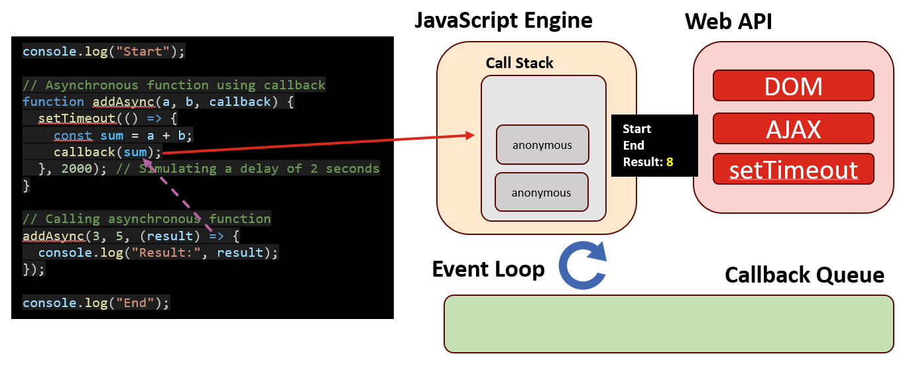

# Day 7: 更多 JavaScript  

## Lecture 7.1: 异步  

### 同步与异步  
- 同步函数（synchronous function）是以阻塞方式执行的函数，这意味着每个函数调用都要等待前一个函数调用完成后才能继续  
- 术语“异步”（async，asynchronous function）是指异步执行操作而不阻塞其他代码执行的能力  
-  

#### 同步函数示例  
- 在同步执行中，每行代码都按顺序执行，程序会等待一个操作完成后再进入下一个操作  
- ```js
  console.log("Start");

  // Synchronous function
  function add(a, b) {
      return a + b;
  }

  // Calling synchronous function
  const result = add(3, 5);
  console.log("Result: ", result);

  console.log("End");
  ```
  ```
  Start
  Result: 8
  End
  ```
- 同步函数工作流（workflow）  
    

#### 异步函数示例  
- 异步函数通常涉及异步操作，如网络请求、文件 I/O 或基于定时器的延迟。在本例中，`setTimeout` 用于模拟异步延迟  
- ```js
  console.log("Start");

  // Asynchronous function using callback
  function addAsync(a, b, callback) {
      setTimeout(() => {
          const sum = a + b;
          callback(sum);
      }, 2000);     // Simulating a delay of 2 secs
  }

  // Calling asynchronous function
  addAsync(3, 5, (result) => {
      console.log("Result:", result)
  });

  console.log("End");
  ```
  ```
  Start
  End
  Result: 8
  ```
- 异步函数工作流  
    

### 浏览器运行时环境（Runtime Environment）  
-   
- **JavaScript 引擎**：负责解析和执行 JavaScript 代码的核心组件  
- **Web API**：由浏览器提供，用于各种用途，包括获取数据（Fetch API）、操作浏览器存储（Web Storage API）、处理异步操作（setTimeout、setInterval）等  
- **事件循环（event loop）**：负责管理异步代码的执行和处理事件  
- **回调队列（callback loop）**：存储准备执行的回调函数  

### 事件循环工作流  
1. **检查调用栈**  
    - 事件循环开始时会检查调用栈是否为空。调用栈是一种数据结构，按调用顺序存储函数调用  
2. **执行调用栈中的任务**  
    - 如果调用栈不空，事件循环将执行调用栈顶部的任务，并在任务完成后删除它们  
3. **检查回调队列**
    - 清理完调用栈后，事件循环会检查回调队列中是否有待处理的任务  
    - 回调队列中存储了准备好执行的回调函数，通常是异步操作（如计时器、AJAX 请求或事件监听器）的结果  
4. **处理回调**
    - 如果回调队列中有任务，事件循环就会将它们逐一移到调用堆栈中执行  
    - 回调函数按照添加到回调队列的顺序执行  
5. **重复**  
    - 事件循环无限循环，反复检查调用栈和回调队列，确保任务及时执行，不阻塞主线程  

#### 异步函数例子  
1. 程序运行前，调用栈和回调队列都是空的  
    
2. 第 1 个函数进入调用栈并被执行；回调队列为空  
    
3. 第 2 个函数进入调用栈并被执行；回调队列为空  
    
4. 第 3 个函数进入调用栈并被执行；回调队列为空  
    
5. 第 4 个函数进入调用栈并被执行；回调队列为空  
    
6. 程序结束，调用栈和回调队列都是空的  
    
- 注：在某些运行时实现中，`console.log()` 不会进入调用栈。这里是为简单起见  

#### 同步函数例子  
1. 程序运行前，调用栈和回调队列都是空的  
    
2. 第 1 个函数进入调用栈并被执行；回调队列为空  
    
3. 第 2 个函数进入调用栈并被执行；回调队列为空  
    
4. 在 `addAsync` 中遇到了一个异步函数 `setTimeout`，它会在 2000 毫秒后调用一个匿名函数；匿名回调函数被推送到回调队列中  
    
5. 第 3 个函数进入调用堆栈并被执行；回调队列有一个任务  
    
6. 调用栈为空；回调队列不为空  
    
7. 回调队列中的任务被移至调用栈；现在回调队列为空  
    
8. 另一个匿名函数被添加到调用栈，因为它在第一个匿名函数中被调用；回调队列为空  
    
9. 从调用栈执行 `callback(sum)`；回调队列为空  
    
10. `setTimeout` 中的匿名函数被执行；回调队列为空  
    
11. 程序结束，调用栈和回调队列都是空的  
    
- 注：在某些运行时实现中，`console.log()` 不会进入调用栈。这里是为简单起见  

#### 在线可视化工具  
- 可以编辑代码，查看程序中的调用栈和回调队列是如何工作的  
    - https://www.jsv9000.app  
    - http://latentflip.com/loupe/  