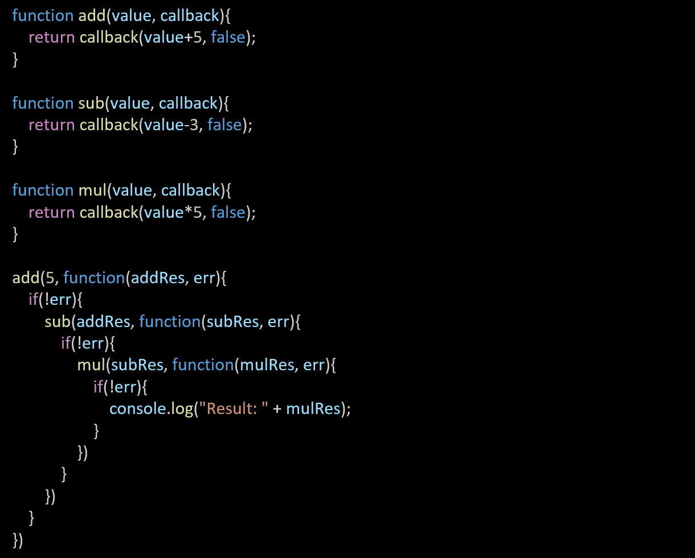
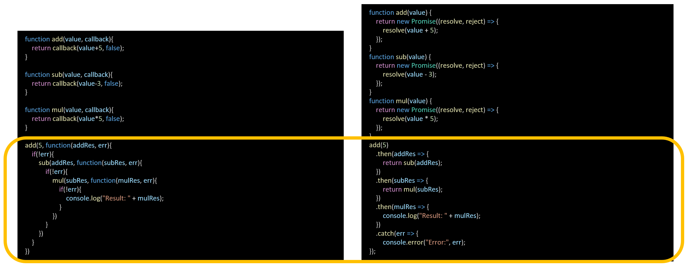
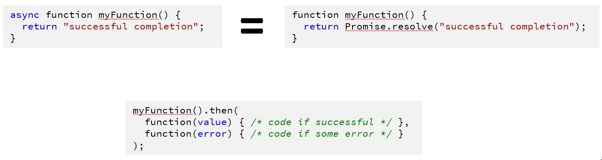
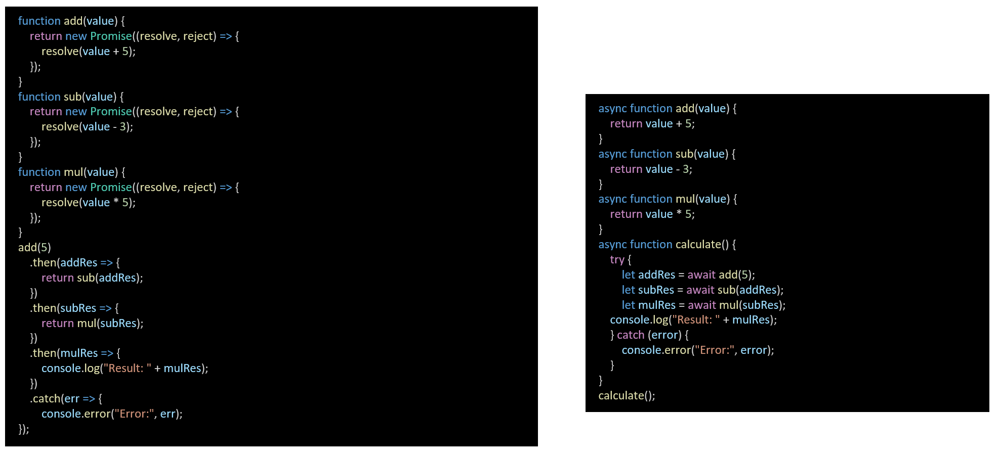

## Lecture 7.2: 异步、模块、错误和 JSON  

### JavaScript 异步  
- JavaScript 中的异步编程通常是通过以下方式实现的  
    - 回调（callback）  
    - Promise  
    - 异步/等待  

#### 回调  
- 回调（callback）是作为参数传递给另一个函数的函数，当另一个函数完成其工作时，回调函数就会被调用  
- 回调在异步编程中被广泛使用，我们可以用它来处理事件或处理可用数据，而不会阻塞主线程的执行  
- ```js
  function func1(para1, para2, para2) {
      // code to be executed
  }

  function func2(para1, callback) {
      // code to be executed
      // e.g. create a, b, c...
      callback(a, b, c);
  }

  x = 15;
  func2(x, func1);  // func1 is a callback function
  ```
- 例子：显示数组计算后的总和结果  
  ```js
  function addNumbers(numbers, callback) {
      var sum = 0;
      for (var i = 0; i < numbers.length; i++) {
          sum += numbers[i];
      }

      callback(sum)
  }

  addNumbers([1, 2, 3, 4, 5], function(sum) {
      console.log("The sum is: " + sum);
  });
  ```

#### 回调地狱  
- 下面是回调地狱（callback hell）的一个例子，即多个嵌套回调导致代码难以阅读和维护  
    
- 要避免回调地狱，可以重组设计或使用其他异步模式（如 promise 和 async/await），使代码更具可读性和可维护性  

### Promise  
- Promise 是一个对象，它代表一个可能尚未可用的值  
- Promise 有三种状态  
    - 等待（pending）：初始状态，既未履行也未拒绝
    - 履行（fulfilled）：表示操作成功完成  
    - 拒绝（rejected）：表示操作失败  
- 创建 Promise 时，它处于“等待”状态。它最终会过渡到“履行”（resolved）状态（表示值可用）或“拒绝”（rejected）状态（表示发生错误）。一旦 Promise 处于“履行”或“拒绝”状态，它就被称为“已解决”（settled）  

#### 创建 Promise  
- Promise 构造函数是 JavaScript 中的一个内置对象，用于创建新的 Promise 对象  
- Promise 代表的值可能还不可用，但会在将来的某个时间点得到解决  
- Promise 构造函数只有一个参数，即一个称为执行器函数的函数  
- 执行器函数有两个参数，分别是 `resolve` 和 `reject`，它们是用于解析或拒绝 Promise 的函数  
- Promise 提供了两种处理异步结果的重要方法：`.then()` 和 `.catch()`  
    - `.then()` 在解析 Promise 时被调用  
    - `.catch()` 在拒绝 Promise 时被调用  
- 解析函数用于发出 Promise 成功完成的信号，并将结果传递给承诺的 `then()` 方法   
而 reject 函数则用于发出发生错误的信号，并将结果传递给 promise 的 catch() 方法。
- ```js
  const myPromise = new Promise((resolve, reject) => {
      // Do some asynchronous operation, such as a network request
      const result = 42;

      if (result) {
          resolve(result);  // the promise is fulfilled
      } else {
          reject(error);    // the promise is rejected
      }
  });

  myPromise.then((result) => {
      console.log(result);  // logs 42
  }).catch((error) => {
      console.log(error);   // logs 'Error'
  });
  ```

### 回调 vs Promise  
  

### 异步  
- 异步（Async）建立在 Promise 之上  
- 它允许你以类似同步的方式编写异步代码，使用 `async` 关键字定义异步函数，并使用 `await` 关键字等待承诺解决后再继续  
-   

### 等待  
- 等待（`await`）关键字只能在异步函数中使用  
- `await` 关键字使函数暂停执行，并在继续执行之前等待已解析的 Promise  
- ```js
  let value = await promise;
  ```

#### 例子：async/await  
- 在本例中，`fetchData()` 是一个异步函数，它使用 `await` 关键字等待 `fetch()` 函数解析响应对象，然后等待响应对象上的 `json()` 方法解析数据  
- 如果在此过程中出现任何错误，`catch` 块将进行处理  
- ```js
  async function fetchData() {
      try {
          const response = await fetch("https://api.example.com/data");
          const data = await response.json();
          console.log(data);
      } catch (error) {
          console.error(error);
      }
  }
  ```

#### Promise vs async/await  
  

### 模块  
- 模块（module）允许将代码和数据分割成不同的文件  
-   

#### 导入和导出  
- 模块是通过 `import` 和 `export` 关键字实现的  
- `export`（导出）关键字用于从一个模块导出变量、函数或类  
  ```js
  // module.js
  export function greet(name) {
      console.log(`Hello, ${name}!`);
  }
  ```
- `import`（导入）关键字用于将它们导入另一个模块  
  ```js
  import { greet } from './module.js';

  greet('John');    // Hello, John!
  ```

#### 语法  
- 导出  
  ```js
  export const name1 = 1, name2 = 2 /* , ... */;  // also var, let
  export function functionName() { /* ... */ }
  export class ClassName { /* ... */ }
  ```
- 导入  
  ```js
  import "module-name";
  import * as name from "module-name";
  import { export1 /* , ... */ } from "module-name";
  import { export1 as alias1 /* , ... */} from "module-name";
  ```

### 错误处理  
- 错误处理（error handling）是指识别、捕获和响应程序执行过程中出现的错误的过程  
- 发生错误的原因有很多，例如无效输入、意外行为或网络问题  
- JavaScript 中有几种处理错误的方式，包括  
    - `try-catch` 块  
    - `throw` 语句  
    - `Error`对象  

#### `try-catch` 块  
- `try-catch` 块（block）用于捕获和处理代码块中出现的错误  
- 如果在 `try` 代码块中出现错误，`catch` 代码块就会执行，从而允许适当地处理错误  
- ```js
  try {
      // code that might throw an exception
      let x = y / z;
  } catch (err) {
      // code to handle the exception
      console.log("An error occurred: " + err.message);
  }
  ```
- 需要注意的是，`try-catch` 块只能捕获代码块内出现的异常。如果异常发生在代码块之外，则不会被捕获  

#### `throw` 语句  
- `throw` 语句用于抛出异常
- 异常是程序执行过程中出现的错误。抛出异常时，程序会中断正常运行，并跳转到最近的异常处理程序  
- ```js
  function divide(x, y) {
      if (y === 0) {
          throw new Error("Cannot divide by 0!");
      }

      return x / y;
  }

  try {
      var result = divide(10, 0);
      console.log(result);
  } catch (err) {
      console.error(err.message);
  }
  ```

#### `Error` 对象  
- JavaScript 中的 `Error` 对象是一个内置对象，用于表示代码执行过程中出现的错误  
- 它有多个属性，如 `name`、`message` 和 `stack`，可提供有关错误的信息  
    - `message`：提供对错误的可读描述的字符串  
    - `stack`：表示错误堆栈跟踪（stack trace）的字符串  
    - `fileName`：表示导致错误的文件名的字符串  
    - `lineNumber`：代表导致错误的行号的数字  
    - `columnNumber`：代表导致错误的列号的数字  
- 错误对象与 `try-catch` 语句配合使用，可处理错误并防止代码崩溃  
- ```js
  function divide(x, y) {
      if (y === 0) {
          throw new Error("Cannot divide by 0!");   // 创建 Error 对象的实例
      }

      return x / y;
  }
  ```

### JSON  
- JSON 是 JavaScript 对象符号（JavaScript Object Notation）的缩写，是一种轻量级数据交换格式，用于在客户端和服务器之间发送数据  
- JSON 格式在语法上类似于 JavaScript 对象。因此，JSON 数据可以很容易地转换成 JavaScript 对象，反之亦然  
    - JSON 数据仅为文本，可在计算机之间轻松发送，并可被任何编程语言使用  
    - JavaScript 有一个将 JSON 字符串转换为 JavaScript 对象的内置函数  
    - JavaScript 还有一个将对象转换为 JSON 字符串的内置函数  

#### JSON 语法  
- JSON 语法源自 JavaScript 对象符号语法  
    - 数据以名称/值对（name/value pair）形式存在  
    - 数据用逗号分隔  
    - 大括号表示对象  
    - 小括号表示数组  
- 有效值数据类型：字符串、数字、对象、数组、布尔值、空（`null`）  
- 无效数据类型：函数、日期、未定义（`undefined`）  
- ```json
  {
      "name": "John",
      "age": 30,
      "city": "Edinburgh"
  }
  ```

#### 解析  
- `JSON.parse()` 是 JavaScript 中的一个内置方法，用于将 JSON 字符串解析为 JavaScript 对象  
- ```js
  const jsonStr = '{"name": "John", "age": 25, "city": "Edinburgh"}';

  const obj = JSON.parse(jsonStr);

  console.log(obj);         // {name: "John", age: 25, city: "Edinburgh"}
  console.log(obj.name);    // John
  ```

#### 字符串化  
- 使用 `JSON.stringify()` 将 JavaScript 对象转换为字符串  
- ```js
  const obj = { name: 'John', age: 25, city: 'Edinburgh' };

  const jsonStr = JSON.stringify(obj);

  console.log(jsonStr);     // {"name": "John", "age": 25, "city": "Edinburgh"}
  ```