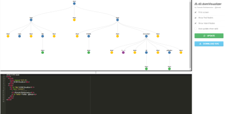
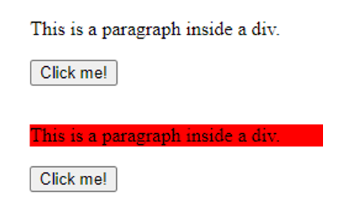
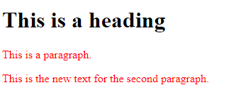
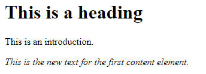
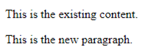
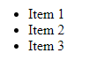
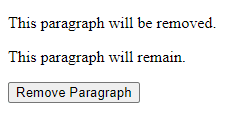
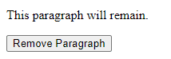
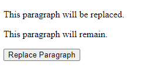
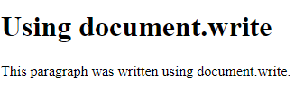

# Day 8: 文档对象模型（DOM）  

## Lecture 8.1: DOM 基础  

### DOM 概述  
- **定义**：文档对象模型（Document Object Model, DOM）是网页文档的编程接口。它将网页结构表示为分层树状结构，允许开发人员使用 JavaScript 动态访问、操作和更新网页的内容、结构和样式  
- **重要性**：DOM 是现代网页开发的基础，是 HTML、CSS 和 JavaScript 之间的桥梁。它使开发人员能够根据用户交互、事件和数据变化动态更新网页的内容和样式，从而创建动态的交互式网络体验  

#### 要点  
- DOM 以 HTML 元素为节点，将网页文档表示为分层树形结构  
- DOM 提供了一个编程接口，用于使用 JavaScript 访问和操作网页的内容、结构和样式  
- DOM 可实现网页的动态更新，使开发人员能够创建交互式和响应式用户体验  
- 了解 DOM 对网络开发人员构建现代网络应用程序和网站至关重要  

#### 为什么需要 DOM  
- **动态内容更新（Dynamic Content Updates）** - DOM 使开发人员能够根据用户交互、数据变化或外部事件动态更新内容  
- **交互式用户界面（Interactive User Interfaces）** - DOM 使开发人员能够响应用户操作（如点击、鼠标移动或键盘输入），从而为创建交互式用户界面提供了便利  
- **异步数据加载（Asynchronous Data Loading）** - 使用 DOM，开发人员可以动态更改网页上元素的样式和外观，从而实现动画、过渡和视觉效果  
- 例如，在登录界面根据输入展示不同内容  
    

### 文档对象模型  
- 通过 DOM，JavaScript 可以访问和修改 HTML 文档中的所有元素，包括添加或删除元素、修改文本和属性以及处理事件  
    - 更改页面中的所有 HTML 元素  
    - 更改页面中的所有 HTML 属性  
    - 更改页面中的所有 CSS 样式  
    - 删除现有的 HTML 元素和属性  
    - 添加新的 HTML 元素和属性  
    - 对页面中现有的所有 HTML 事件做出反应  
    - 在页面中创建新的 HTML 事件  

### HTML DOM 树  
- HTML DOM 树包括三种类型的对象  
    - **文档对象（document object）**：HTML 文档的顶级对象，代表文档本身  
    - **元素对象（element object）**：代表文档中 HTML 元素的对象，如 `<body>`、`<div>`、`<p>` 等  
    - **属性对象（attribute object）**：代表 HTML 元素属性的对象  
-   

#### 可视化工具  
-   
- https://bioub.github.io/dom-visualizer/  
- https://fritscher.ch/dom-css/  
- https://codepen.io/pavlovsk/pen/QKGpQr  

#### DOM 编程接口  
- HTML DOM 可通过 JavaScript 访问。编程接口是操作 HTML 元素（对象）的属性和方法  
    - **属性（Properties）** 是 DOM 中元素的属性，如内容、大小和位置。它们可用于改变元素的外观和行为  
    - **方法（Methods）** 是可以在 DOM 中的元素上调用的函数，用于执行特定操作，如添加或删除元素、更改内容或处理事件。它们可用于动态操作 DOM，并可在响应用户交互或其他事件时调用  
- **DOM 文档对象提供了查找 HTML 元素的方法**  

#### 元素  
- 在文档对象模型（DOM）中，元素代表网页中的单个 HTML 标签。HTML 文档由层层嵌套的元素组成，每个元素都有一组属性和内容。例如，`<div>` 元素用于将其他元素组合在一起，通常具有 `id`、`class` 和 `style` 等属性。`` 元素用于显示图像，具有 `src`、`alt` 和 `width` 等属性  
- 在 DOM 中，每个元素都表示为一个对象，具有可使用 JavaScript 进行操作的属性和方法。这些属性和方法可用于访问和修改元素的属性、内容和样式。例如，可以使用 `getElementById()` 方法检索具有特定 ID 的元素，然后更改其 `innerHTML` 属性以修改其内容  

#### 基本 HTML 标签  
| 标签 | 描述 |
| --- | --- |
| `<h1>` 至 `<h6>` | HTML 标题 |
| `<p>` | 段落 |
| `<form>` | 用于用户输入的 HTML 表单 |
| `<button>` | 可点击的按钮 |
| `` | 图片 |
| `<a>` | 超链接 |
| `<ul>` | 无序列表 |
| `<li>` | 列表元素 |
| `<div>` | 文档中的一个部分 |
| `<table>` | 表格 |

### 文档对象  
- 文档对象（document object）代表整个 HTML 文档，提供了一种访问和操作文档内容的方法  
- 它是 DOM 树的根，可以访问文档中的所有其他元素  
- HTML 元素可以用 ID、标签和名字定位  
    - `document.getElementById(id)`  
    - `document.getElementsByTagName(name)`  
    - `document.getElementsByClassName(name)`  

### 查找元素  
#### `ById`  
- HTML 代码  
  ```html
  <body>
      <div id="myDiv">
          <p>This is a paragraph inside a div.</p>
      </div>
      <button id="myButton">Click me!</button>
      <script src="script.js"></script>
  </body>
  ```
- JavaScript 代码  
  ```js
  // find the div element with ID "myDiv"
  var divElement = document.getElementById("myDiv");

  // add and event listener to the button element inside the div
  var buttonElement = document.getElementById("myButton");
  buttonElement.addEventListener("click", function() {
      divElement.style.backgroundColor = "red";
  });
  ```
-   

#### `ByTagName`  
- HTML 代码  
  ```html
  <body>
      <div>
          <h1>This is a heading</h1>
          <p>This is a paragraph.</p>
          <p>This is another paragraph.</p>
      </div>
      <script src="script.js"></script>
  </body>
  ```
- JavaScript 代码  
  ```js
  // find all the paragraph elements in the document
  var pElements = document.getElementsByTagName("p");

  // change the text content of the second paragraph element
  pElements[1].textContent = "This is the new text for the second paragraph.";

  // loop through all paragraph elements and add a CSS class to them
  for (var i = 0; i < pElements.length; i++) {
      pElements[i].style.color = "red";
  }
  ```
-   

#### `ByClassName`  
- HTML 代码  
  ```html
  <body>
      <div class="container">
          <h1>This is a heading</h1>
          <p class="intro">This is an introduction.</p>
          <p class="content">This is some content.</p>
      </div>
      <script src="script.js"></script>
  </body>
  ```
- JavaScript 代码  
  ```js
  // find all the elements with class "content"
  var contentElements = document.getElementsByClassName("content");

  // change the text content of the first content element
  contentElements[0].textContent = "This is the new text for the first content element.";
  contentElements[0].style.fontStyle = "italic";
  ```
-   

### 添加元素  
#### `createElement`  
- HTML 代码  
  ```html
  <body>
      <div id="myDiv">
          <p>This is the existing content.</p>
      </div>
      <script src="script.js"></script>
  </body>
  ```
- JavaScript 代码  
  ```js
  // create a new paragraph element
  var newParagraph = document.createElement("p");

  // set the text content of the new paragraph
  newParagraph.textContent = "This is the new paragraph.";

  // add the new paragraph element to the page
  var myDiv = document.getElementById("myDiv");
  myDiv.appendChild(newParagraph);
  ```
-   

#### `appendChild`  
- HTML 代码  
  ```html
  <body>
      <ul id="myList">
          <li>Item 1</li>
          <li>Item 2</li>
      </ul>
      <script src="script.js"></script>
  </body>
  ```
- JavaScript 代码  
  ```js
  // create a new list item element
  var newItem = document.createElement("li");

  // set the text element of the new list item element
  newItem.textContent = "Item 3";

  // add the new list item element to the end of the list
  var myList = document.getElementById("myList");
  myList.appendChild(newItem);
  ```
-   

### 移除元素  
#### `removeChild`  
- HTML 代码  
  ```html
  <body>
      <div id="myDiv">
          <p>This paragraph will be removed.</p>
          <p>This paragraph will remain.</p>
      </div>
      <button onclick="removeParagraph()">Remove Paragraph</button>
      <script src="script.js"></script>
  </body>
  ```
- JavaScript 代码  
  ```js
  // function to remove the first paragraph element from the page
  function removeParagraph() {
      var myDiv = document.getElementById("myDiv");
      var firstParagraph = myDiv.getElementsByTagName("p")[0];
      myDiv.removeChild(firstParagraph);
  }
  ```
- <br>  

### 替换元素  
#### `replaceChild`  
- HTML 代码  
  ```html
  <body>
      <div id="myDiv">
          <p>This paragraph will be replaced.</p>
          <p>This paragraph will remain.</p>
      </div>
      <button onclick="replaceParagraph()">Replace Paragraph</button>
      <script src="script7.js"></script>
  </body>
  ```
- JavaScript 代码  
  ```js
  // function to replace the first paragraph element with a new one
  function replaceParagraph() {
      var myDiv = document.getElementById("myDiv");
      var firstParagraph = myDiv.getElementsByTagName("p")[0];

      // create a new paragraph element
      var newParagraph = document.createElement("p");
      newParagraph.textContent = "This is the new paragraph.";

      // replace the first paragraph element with the new one
      myDiv.replaceChild(newParagraph, firstParagraph);
  }
  ```
- <br>  

### 写入 HTML 输出流  
- HTML 代码  
  ```html
  <body>
      <h1>Using document.write</h1>
      <script src="script.js"></script>
  </body>
  ```
- JavaScript 代码  
  ```js
  // write some content directly to the document
  document.write("<p>This paragraph was written using document.write.</p>")
  ```
-   

### 更改样式  
元素样式属性中的一些常用属性  
| 样式名称 | 描述 | JavaScript 代码 |
| --- | --- | --- |
| `backgroundColor` | 设置元素的背景颜色 | `element.style.backgroundColor =` |
| `color` | 设置元素的文本颜色 | `element.style.color =` |
| `fontSize` | 设置元素的字体大小 | `element.style.fontSize =` |
| `fontWeight` | 设置元素的字体权重 | `element.style.fontWeight =` |
| `border` | 设置元素的边框 | `element.style.border =` |
| `borderRadius` | 设置元素的边框半径 | `element.style.borderRadius =` |
| `padding` | 设置元素的填充 | `element.style.padding =` |
| `margin` | 设置元素的边距 | `element.style.margin =` |
| `width` | 设置元素的宽度 | `element.style.width =` |
| `height` | 设置元素的高度 | `element.style.height =` |
| `textAlign` | 设置元素的文本对齐方式 | `element.style.textAlign =` |
| `textDecoration` | 设置元素的文本装饰 | `element.style.textDecoration =` |
| `display` | 设置元素的显示样式 | `element.style.display =` |
| `visibility` | 设置元素的可见性 | `element.style.visibility =` |

### 更改内容  
- `innerHTML` 是 JavaScript 中 DOM 元素的一个属性，可用于访问或修改元素的 HTML 内容  
- `innerHTML` 属性返回一个字符串，表示元素的 HTML 内容，包括任何嵌套元素、文本和属性  
- ```html
  <body>
      <h1>Article Heading</h1>
      <div id="demo"></div>

      <script>
          document.getElementById("demo").innerHTML = "<p>Insert a paragraph</p>";
      </script>
  </body>
  ```