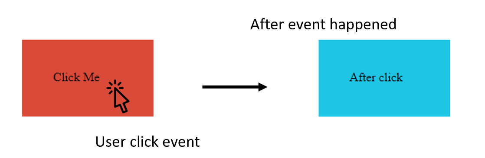
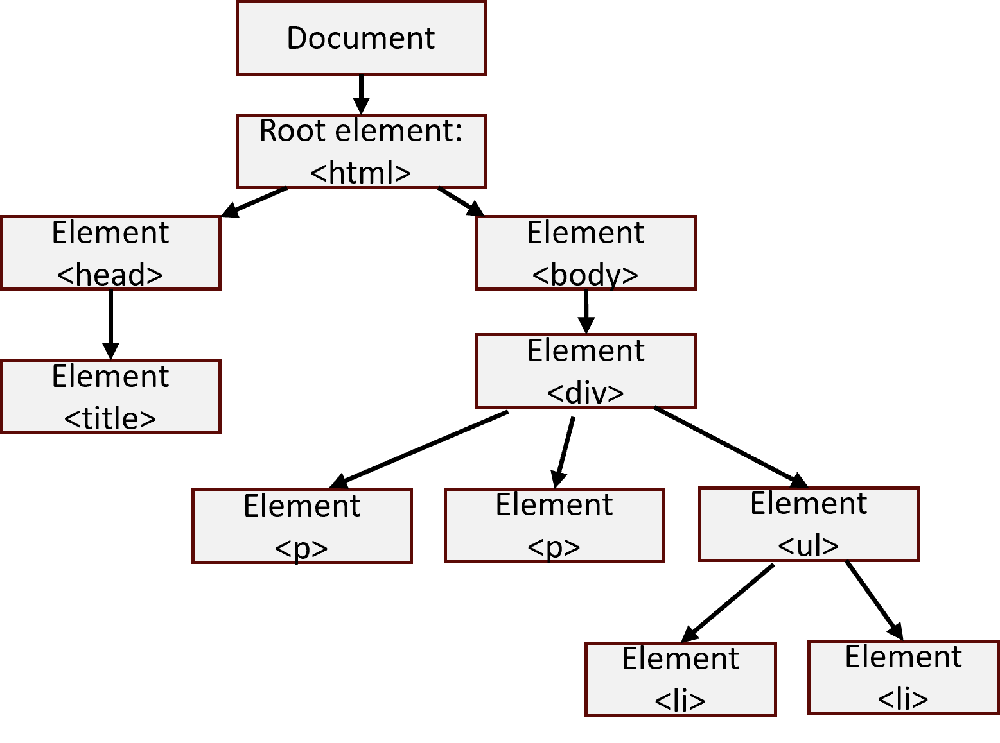
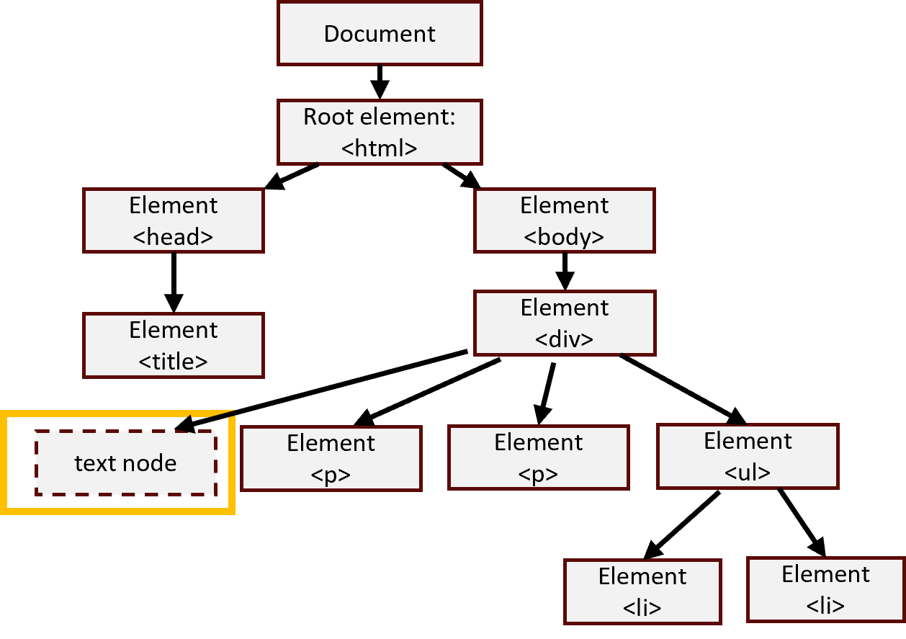
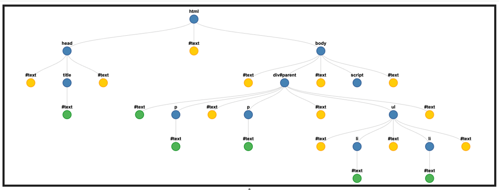

## Lecture 8.2: DOM 和 BOM  

### 基本工作流  
1. **选择元素** - 这一过程通常从选择要操作的元素开始。这需要使用 CSS 选择器或特定标识符（如 ID 或类）来识别目标元素  
2. **访问元素属性** - 一旦选定元素，通常会访问它们的属性（Property 和 Attribute），以收集相关信息或设置初始值  
3. **添加和移除元素** - 如果应用程序需要动态添加或移除元素，这一步应此时进行。可能需要根据用户操作或数据变化向 DOM 添加新元素，也可能需要移除现有元素  
4. **修改元素内容和样式** - 在选择和添加/删除元素后，可以修改其内容或样式，以反映所需的更改。这可能包括更新文本内容、应用 CSS 样式或更改元素尺寸  
5. **事件处理** - 事件处理通常是接下来才实施的，尤其是在应用程序需要用户交互的情况下。事件侦听器被添加到元素中，以响应点击、按键或鼠标移动等用户操作  
6. **异步更新** - 如果应用程序需要从应用程序接口异步获取数据或执行其他异步操作，下一步可能需要执行此步骤。数据获取后，可在 DOM 中动态更新  
7. **DOM 遍历** - DOM 遍历在整个过程的不同阶段都可能是必要的，尤其是在处理嵌套元素或访问 DOM 树中的相关元素时  
8. **错误处理和调试** - 在整个开发过程中，错误处理和调试是一个持续的过程。开发人员在操作 DOM 时可能会遇到错误或意外行为，需要及时处理  

### DOM 事件  
- DOM 事件（DOM action）是网页中发生的操作或事件，例如用户点击按钮或将鼠标移到元素上  
- 在 JavaScript 中，可以使用事件处理程序来响应这些事件并执行某些操作  
-   

#### 事件处理程序  
- 事件处理程序（event handler）是在特定事件发生时执行的函数  
- 可以使用 `addEventListener()` 方法或通过设置元素的 `on[event]` 属性（其中 `[event]` 是要处理的事件名称）将事件处理程序附加到 HTML 元素上  
- | 事件 | 何时触发 |
  | --- | --- |
  | `onclick` | 用户点击元素时 |
  | `ondblclickk` | 用户双击元素时 |
  | `onmousedown` | 鼠标在元素上方按下时 |
  | `onmouseup` | 鼠标在元素上方释放时 |
  | `onmousemove` | 鼠标在元素上方移动时 |
  | `onmouseout` | 鼠标移出元素时 |
- 例子
  ```html
  <div onclick="mClick(this)" style="background-color:#D94A38;width:90px;height:20px;padding:40px;">
      Click Me
  </div>

  <script>
      function mClick(obj) {
          obj.style.backgroundColor = "#1EC5E5";
          obj.innerHTML = "After click";
      }
  </script>
  ```

#### 其他事件  
- 网页中可能发生多种类型的事件，包括  
    - 鼠标事件：click、dblclick、mousein、mouseout 等  
    - 键盘事件：keydown、keyup、keypress 等  
    - 拖动事件：drag、dragover、drop 等  
    - 表单事件：submit、reset、change、input 等  
    - 触摸事件：touchstart、touchend、touchmove 等  
    - 窗口事件：load、unload、resize、scroll 等  
- 更多事件：https://www.w3schools.com/jsref/obj_events.asp  

### DOM 导航（navigation）  
- 根据 HTML DOM 标准，HTML 文档中的所有内容都是一个节点（node）  
    
    - `<html>` 是根节点  
    - `<head>` 是 `<html>` 的一个子节点  
    - `<body>` 是 `<html>` 的一个子节点  
    - `<head>` 有一个子节点 `<title>`  
    - `<title>` 有一个子节点：文字节点  
    - `<body>` 有一个子节点 `<div>`  
    - `<div>` 有三个子节点：`<h1>`、`<p>`、``  
    - ……

#### 节点导航  
- 要导航 DOM 中的节点，可以使用以下属性和方法  
    - `parentNode` - 返回当前节点的父节点  
    - `childNodes` - 返回当前节点的子节点集合  
    - `firstChild` - 返回当前节点的第一个子节点  
    - `lastChild` - 返回当前节点的最后一个子节点  
    - `nextSibling` - 返回当前节点的下一个兄弟节点  
    - `previousSibling` - 返回当前节点的上一个兄弟节点  
- 例子  
  ```html
  <html>
      <head>
          <title>DOM Navigation Example</title>
      </head>
      <body>
          <div id="parent">
              <p>First paragraph</p>
              <p>Second paragraph</p>
              <ul>
                  <li>Item 1</li>
                  <li>Item 2</li>
              </ul>
          </div>
          <script src="script.js"></script>
      </body>
  </html>
  ```
  ```js
  // 获取父元素
  var parent = document.getElementById("parent");

  // 获取第一个子节点
  var firstChild = parent.firstChild;

  // 获取最后一个子节点  
  var lastChild = parent.lastChild;

  // 获取第二个段落（<p>）元素  
  var secondParagraph = parent.childNodes[3];

  // 获取第一个列表（<li>）元素  
  var firstListItem = parent.childNodes[5].childNodes[1];

  // 获取第一个段落元素的下一个兄弟元素
  var nextSibling = firstChild.nextSibling;

  // 获取第二个段落元素的前一个兄弟元素
  var previousSibling = secondParagraph.previousSibling;
  ```
    
- HTML 解析器将 HTML 标记之间的空白（空格、制表符、换行符）视为文本节点。因此，尽管在浏览器中可能看不到，但在开头的 `<div>` 标记和 `<p>` 之间实际上有一个包含空白的文本节点  
    

### DOM 可视化工具  
- 可以使用 DOM 可视化器（如 https://bioub.github.io/dom-visualizer/）来检查元素和文本节点  
    

### BOM  
- BOM 是浏览器对象模型（Browser Object Model）的缩写  
    - 它是一种浏览器专用接口，允许 JavaScript 与浏览器窗口进行交互  
    - BOM 由对象和方法组成，用于访问特定于浏览器的功能，如浏览器历史记录、浏览器窗口位置和用户系统  
- BOM 并非 JavaScript 的标准化部分，不同浏览器的实现方式也不尽相同  
    - 不过，它是网络开发的重要组成部分，因为它允许开发人员创建适合用户浏览器和系统的网页  

#### BOM 对象和功能  
- BOM 提供的部分对象和功能包括  
    - **窗口对象**：它代表浏览器窗口，可访问浏览器的许多功能和属性，如当前页面的历史记录和位置、窗口的大小和位置，以及打开和关闭新窗口的功能  
    - **位置对象**：它提供有关当前 URL 的信息，并允许更改当前页面的位置，这对于创建动态和交互式网页非常有用  
    - **导航器对象**：该对象提供有关用户浏览器和系统的信息，如浏览器类型和版本、操作系统和屏幕尺寸  
    - **屏幕对象**：它提供有关用户屏幕的信息，如尺寸和分辨率，可用于创建适应不同屏幕尺寸的响应式设计  
    - **历史记录对象**：它提供了对浏览器历史记录的访问，允许你在以前访问过的页面之间来回浏览  

#### 窗口对象  
- 窗口（window）对象表示网页加载到的浏览器窗口或标签页  
- 它是 BOM 中的顶级对象，是网页中运行的所有 JavaScript 代码的全局范围  
- 窗口对象提供了一系列与浏览器和网页交互的属性和方法  
    - `window.innerHeight` - 浏览器窗口的内高度（单位：像素）  
    - `window.innerWidth` - 浏览器窗口的内宽度（单位：像素）  
    - `window.open()` - 打开新窗口  
    - `window.close()` - 关闭当前窗口  
    - `window.moveTo()` - 移动当前窗口  
    - `window.resizeTo()` - 调整当前窗口大小  

#### 位置对象  
- 位置（location）对象表示浏览器窗口中的当前 URL  
- 它包含当前 URL 的相关信息，如协议（http 或 https）、主机名、端口号、路径名和查询参数  
- 它有几个属性和方法，允许你操作当前页面的 URL  
    - `href` - 获取或设置当前页面的完整 URL  
    - `host` - 获取或设置当前页面的主机名和端口号  
    - `hostname` - 获取或设置当前页面的主机名  
    - `protocol` - 获取或设置当前页面的协议（http 或 https）  
    - `pathname` - 获取或设置当前页面的路径  
    - `search` - 获取或设置当前页面的查询字符串参数  
    - `reload()` - 重新载入当前页面  
    - `assign(url)` - 在当前窗口中加载新的 URL  
    - `replace(url)` - 用新的 URL 替换当前页面  