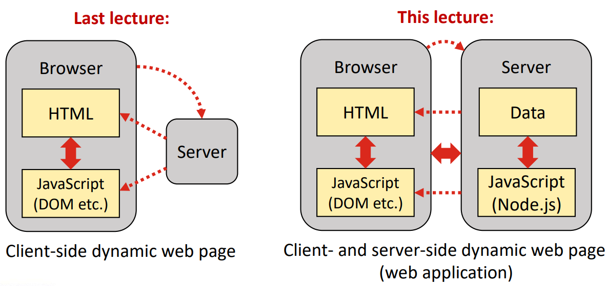
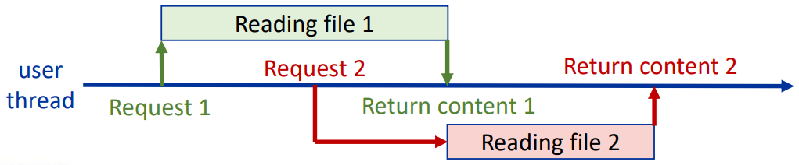

# Day 9: Node.js 基础  

## Lecture 9.1: Node.js 简介  
### 什么是 Node.js？  
- Node.js 是一种在*浏览器外*运行的开源、跨平台 JavaScript 运行时环境  
    - 可在各种平台（Windows、Linux、macOS 等）上运行  
    - 服务器端 JavaScript 可实现高性能  
    - 可扩展的网络应用程序，能够在一台机器上同时处理数千个连接  
- 有了 Node.js，网络应用程序的前端（浏览器）和后端（服务器）都可以用 JavaScript 实现  

### Node.js 能做什么？  
- Node.js 可生成动态页面内容  
- Node.js 可以处理服务器上的文件  
    - 通过打开、读取、写入、删除和关闭文件，在服务器端为用户维护数据  
- Node.js 可以收集表单数据  
    - 用户可使用表单向服务器发送数据  
- Node.js 可以添加、删除和修改数据库中的数据  

### 客户端和服务器端动态网页  
  

### 同步与异步 IO  
- 同步阻塞 IO（Synchronous blocking IO）  
    - 当发出 IO 请求（如访问数据库或文件）时，该函数必须在下一个函数执行之前完成  
    - 对于多个请求（如一个页面的多个访问者），可以并行运行多个进程，但每个进程的执行都是阻塞的  
- 异步非阻塞 IO（Asynchronous non-blocking IO）  
    - 当提出 IO 请求时，它会进入一个事件队列（event queue）  
    - IO 操作委托给线程池（thread pool）中的工作线程（worker thread）执行  
    - 节点继续执行下一个顺序任务（不等待工作线程）  
    - 操作完成后，工作线程返回运行回调的事件循环  

### 用于异步编程的 Node.js  
- Node.js 运行单线程、非阻塞异步程序，非常节省内存  
    - 例如，处理文件请求时，会将任务发送到计算机的文件系统，当任务准备就绪时，会通过回调将内容返回给客户端  
      

### 非密集型计算  
- Node.js 进程是单线程的，单个任务无法并行化  
    - 耗时较长的请求可通过 API 使用工作线程池  
    - 不应在 JavaScript 代码中创建线程  
- 在设计应用程序时，应尽量避免占用大量 CPU！  
    - 避免使用常规的关系数据库  
    - 将繁重的 CPU 处理工作卸载给其他应用程序  

### 开始使用 Node.js  
- 在 Codio 中，已安装 Node 包管理器（Node Package Manager，NPM）  
    - NPM 是 JavaScript 软件包库和注册表，带有安装软件包的命令行工具  
    - NPM 是 Node.js 的标准软件包管理器  
- 扩展名为 `.js` 的文本文件中为 JavaScript 代码  
    - 使用 `node <jsfile.js>` 运行 JavaScript 文件  
    - 使用 `npm install <package>` 安装 NPM 包  
    - 使用 `npm run <task>` 将应用程序/项目作为任务运行  
    - 使用 `npm start` 启动 package.json 中的脚本  

### 使用 NPM  
- 三个组成部分：*注册表（registry）*、用于探索的*网站（website）* 和与注册表交互的*命令行界面 （command line interface，CLI）*  
    - 可用于下载工具、共享 JS 代码、运行软件包和版本管理  
- 软件包可在*本地（locally）* 和*全局（globally）* 安装  
    - **本地**：可在本地 `node_modules/` 中找到的软件包  
    - **全局**：作为 shell 可以解析的命令提供的软件包（使用 `-g` 标志全局安装软件包）  

#### Hello World 例  
- 无需编译，直接使用 `node` 运行 JavaScript 程序  
- ```js
  // helloworld.js
  function printHelloWorld() {
      console.log('Hello World!');
  }

  printHelloWorld();
  ```
  ```
  $ node helloworld.js
  Hello World!
  $ █
  ```

### 用于服务器应用的 Node.js  
- Node.js 有一个支持网络应用程序的标准库  
- `http` 模块可用于创建 HTTP 服务器  
    - 收到 HTTP 请求时，调用回调函数启动所需的操作（如生成网页）  
    - Node.js 会自动处理来自不同用户的请求，无需为所有用户创建单独的线程  
- 创建服务器时，会指定 `requestListener` 回调函数来处理请求  

#### 网页服务器例  
```js
// main.js
// require() 导入一个模块（此处为 http 模块）
const http = require('http');

// 为主机名和端口设置变量
// 注意，在 Codio 中，localhost 地址为 0.0.0.0
const hostname = '127.0.0.1';
const port = 3000;

// 使用 http.createServer() 通过请求监听器创建服务器
const server = http.createServer((req, res) => {
    // 回调函数是服务器收到请求时调用的监听器
    // 将 HTTP 响应状态代码设为 200（OK）
    res.statusCode = 200;
    // 返回纯文本文档，文本为 Hello World!
    res.setHeader('contentType', 'text/plain');
    res.end('Hello World!');
});

// 使用 listen() 开始监听指定的主机名和端口
server.listen(port, hostname () => {
    console.log(`Server running at http://${hostname}:${port}/`);
});
```
```
$ node main.js
Server running at http://127.0.0.1:3000/ 
```

### 使用 package.json  
- 有了 `package.json` 文件，软件包的管理和安装变得更加容易  
    - 包含 JSON 格式的项目元数据  
    - 管理依赖关系  
    - 组织脚本以帮助生成构建、运行测试等  
- 需要 `package.json` 以向注册表发布软件包  
- 在项目目录下使用 `npm init` 并回答数个问题以创建 package.json 文件  

#### package.json 文件例  
```json
{
    "name": "test_server",
    "version": "1.0.0",
    "description": "test server for codio",
    "main": "server.js",
    "scripts": {
        "test": "echo \"Error: no test specified\" && exit 1"
    },
    "author": "john smith",
    "license": "ISC",
    "dependencies": {
        "body-parser": "^1.19.0",
        "express": "^4.17.1"
    }
}
```
完整文档：https://docs.npmjs.com/cli/v6/configuring-npm/package-json  