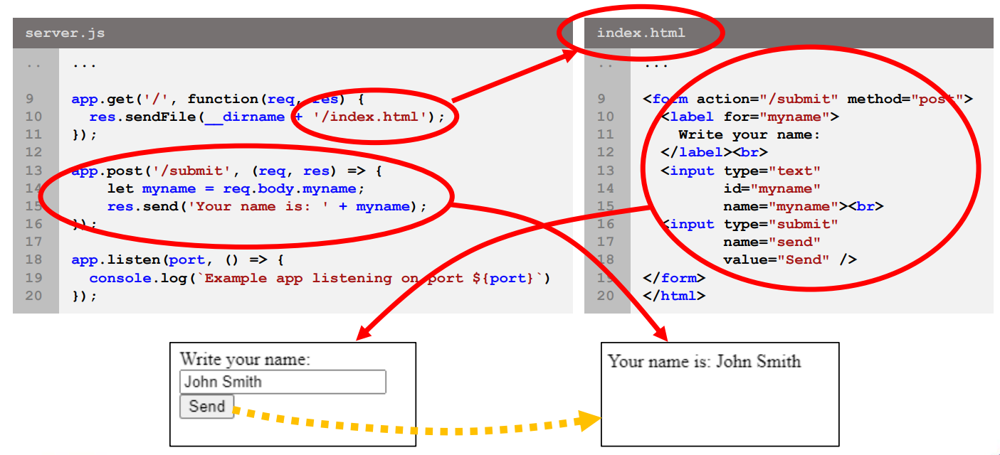

## Lecture 9.2: Express JS  

### 什么是 Express JS  
- Express JS 是一个 Node.js 网络应用程序框架，主要用于路由（routing）和中间件（middleware）  
    - 界面简洁，开发简单  
- 提供一套强大的功能，用于快速开发基于 Node.js 的网络应用程序  
    - 为不同 URL 路径（路由）上的不同 HTTP 请求提供处理程序  
    - 集成视图渲染引擎，通过向模板插入数据生成响应（网页）

### 安装 Express JS  
- 使用 NPM 来安装  
    1. 为项目创建目录  
    2. 使用 npm init 通过 package.json 初始化项目  
        - 按回车键选择默认答案，但入口点（entry point）应是主文件名，我们的例子中是 server.js  
    3. 使用 `npm install express` 安装 Express JS  
        - 选项 `--save` 在依赖列表中保存 Express  
        - 若不将其保存在依赖项列表中，使用 `--no-save`  

### Express JS 中的路由  
- ***路由（routing）*** 决定应用程序如何响应指向特定 URL（路由）的 HTTP 请求  
- 路由处理程序（route handlers）定义了不同请求和 URL 路径的功能  
- ```js
  app.METHOD(PATH, HANDLER)
  ```
    - `app`：使用 `var app = express();` 获取的 express 实例  
    - `METHOD`：特定 HTTP 请求的方法，如 `get`、`post`、`put`  
    - `PATH`：服务器上的 URL 路径，例如，`/` 指的是文件夹的根目录  
    - `HANDLER`：路由匹配时执行的函数  

### Express JS 请求和响应  
- Express JS 请求 (`req`) 和响应 (`res`) 对象是处理程序回调函数的参数  
    - 服务器通过 `req` 对象（如 `req.param`、`req.query`、`req.body`）从客户端接收数据  
    - 服务器通过操作 `res` 对象将数据从服务器发送到客户端  
- `req` 和 `res` 都有许多属性，详见文档  
    - https://expressjs.com/en/4x/api.html#req  
    - https://expressjs.com/en/4x/api.html#res  

#### Express JS Hello Wold 例  
```js
// server.js
// 导入和初始化 Express JS
const express = require("express");
const app = express();
const port = 3000;

// HTTP GET 请求的处理程序
// '/' - 响应对根 URL 的请求，任何其他路径都将响应 404 Not Found
app.get('/', (req, res) => {
    // 使用 res 对象向客户端发送响应
    res.send('Hello World!')
});

// 启动监听器
app.listen(port () => {
    console.log(`Example app listening on port ${port}`)
});
```
```
$ npm start

> test_server@1.0.0 start
> node index.js

Example app listening on port 3000
```

#### HTML 格式
- 甚至可以直接在 JavaScript 中生成 HTML 代码  
    - 尽管有更好的方式来实现，稍后会介绍
- ```js
  app.get('/', (req, res) => {
      let page = '<h1>Hello World</h1>';
      page += '<p style="color:red;">Greetings from the server!</p>';
      page += '<p>It is a good day today.</p>';
      res.send(page);
  });
  ```
    

#### 用户数据 POST 例  
```js
// server.js
// 导入所需模块并初始化服务器
const express = require('express');
const bodyParser = require('body-parser');

const app = express();
const port = 3000;

// 需要用它来解析表单输入的内容
app.use(bodyParser.urlencoded({extended: true}));

// 通过发送 index.html 来响应 GET 请求
app.get('/', function(req, res) {
    res.sendFile(__dirname + '/index.html');
});

// 响应通过按下提交按钮生成的 POST 请求
app.post('submit', (req, res) => {
    let myname = req.body.myname;
    res.send('Your name is: ' + myname);
});

app.listen(port, () => {
    console.log(`Example app listening on port ${port}`)
});
```
```html
<!-- index.html -->

<!DOCTYPE html>
<html lang="en">
    <head>
        <meta charset="utf8">
        <title>Submit your name!</title>
    </head>

    <body>
        <form action="/submit" method="post">
            <label for="myname">
                Write your name:
            </label><br>
            <input type="text" id="myname" name="myname"><br>
            <input type="submit" name="send" value="Send" />
        </form>
    </body>
</html>
```
  

### 小结  
- Node.js 是在浏览器外运行 JavaScript 代码的运行时环境  
    - 允许使用 JavaScript 实现前端（浏览器）和后端（服务器）  
- Express JS 是一个 Node.js 应用程序框架  
    - 为处理 HTTP 请求和底层进程等提供了大量模块和方法  
    - 由于框架负责底层功能，网络应用程序开发变得更快、更简单  