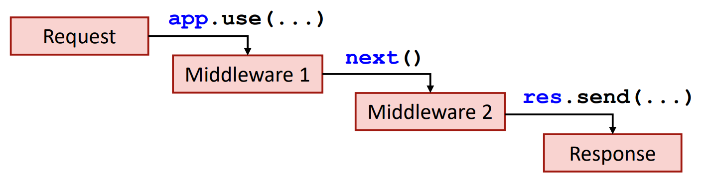
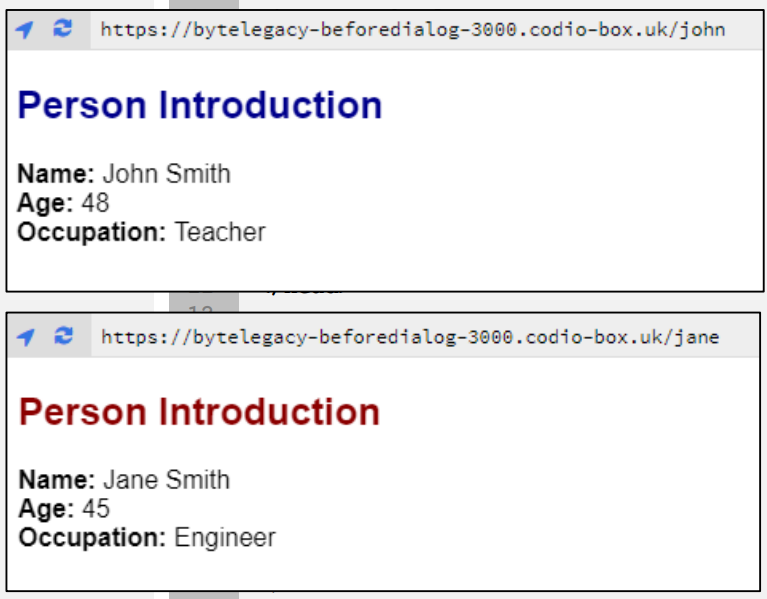

# Day 10: 高级 Node.js  

## Lecture 10.1: 中间件和模板引擎  
### Express JS 中的中间件引擎  
- 中间件函数（middleware function）可访问 `req` 和 `res` 对象以及 `next()` 中间件函数  
    - 中间件函数可以执行不同的任务，如执行任何代码、修改对象、结束请求-响应循环（request-response cycle），以及调用堆栈中的下一个中间件函数  
- 中间件函数必须要么结束请求-响应循环，要么调用 `next()` 将控制权传递给下一个函数  
  ```js
  app.use(function(req, res, next) { next(); });
  ```

### 应用级中间件  
- 应用程序级中间件通过使用 `app.use()` 或 `app.METHOD()` 函数与应用程序对象绑定  
    - 任何请求都会调用 `app.use()` 函数  
    - 只有指定类型的 HTTP 请求（GET、PUT、POST 等）才会调用 `app.METHOD()` 函数  
- 也可以选择在 `app.use()` 中定义挂载路径（mount path）  
  ```js
  app.use('/user', (req, res, next) => { next(); });
  ```

#### 中间件函数链  
- 可使用 `next()` 回调对中间件函数进行链式处理  
    
- 中间件按照列出的顺序运行  
- 必须在调用 `app.get()` 之前调用中间件  

#### 应用级中间件例  
```js
// middleware.js
const express = require('express');
const app = express();
const port = 3000;

app.use((req, res, next) => {
    console.log('First middleware');
    next();
});

app.use((req, res, next) => {
    console.log('Second middleware');
    next();
});

app.get('/', (req, res) => {
    console.log('Sending response!');
    res.send('Hello World!');
});

app.listen(port, () => {
    console.log(`Server is running on port ${port}`);
});
```
```
$ npm start

> week9@1.0.0 start
> node example1.js

Server is listening on port 3000
First middleware
Second middleware
Sending response!
```
- 服务启动后，用户访问网页时，中间件会输出内容  
- 中间件函数也可以通过使用多个函数作为属性来进行连锁，例如 `app.use(func1,func2,...);`  
  ```js
  app.use((req, res, next) => {
      console.log('First middleware');
      next();
  },
  (req, res, next) => {
      console.log('Second middleware');
      next()
  });
  ```

### 错误处理中间件  
- 错误处理中间件函数（error-handling middleware function）有***四个***参数，而不是三个：`err`、`req`、`res` 和 `next`  
- Express JS 有一个内置的默认错误处理程序，但你也可以使用错误处理中间件实现自己的错误处理程序  
    - 在调用其他 `app.use()` 之后（即最后）定义  
- ```js
  app.use((err, req, res, next) => {
      console.error(err.stack);
      res.status(500).send('Something failed!');
  });
  ```

### 内置和第三方中间件  
- 无需重新造轮子：Expres 中有大量内置和第三方中间件功能  
    - 例如：用于提供静态文件（HTML、CSS、图像等）的 `static`  
      ```js
      const express = require('express');
      const app = express();
      const port = 3000;

      // 提供目录 public 中的静态文件
      app.use(express.static('public'));
      app.listen(port, () => {console.log('Server is listening'); });
      ```
    - 可以使用 NPM 安装第三方中间件  
    - 详见 https://expressjs.com/en/resources/middleware.html  

### 模板引擎  
- 模板引擎（template engine）允许你使用静态 HTML 模板  
- 运行时，引擎会用实际值替换模板中的变量，并将最终的 HTML 代码发送给客户端  
-   

#### 嵌入式 JavaScript 模板（Embedded JavaScript Templating，EJS）  
- 有不同的模板引擎，EJS 是最流行的模板引擎之一  
    - 简单的模板语言，让你用纯 JavaScript 生成 HTML 代码  
    - 为特定用户呈现动态 HTML  
    - 有助于代码的一致性和组织性  
    - 不再需要不必要的 `app.get()` 调用  
- 安装 EJS：`npm install ejs`  
    - EJS 文件的默认目录是 `views/`  

#### EJS 例  
```js
// index.js
const express = require('express');
const app = express();

// 将显示引擎（view engine）设为 EJS
app.set('view engine', 'ejs');

// 定义 John 和 Jane 的数据
let john = {
    color: 'darkblue',
    name: 'John Smith',
    age: 48,
    occp: 'Teacher'
}

let jane = {
    color: 'darkred',
    name: 'Jane Smith',
    age: 45,
    occp: 'Engineer'
}

// 为 John 渲染 HTML
app.get('/john', (req, res) => {
    res.render('intro', john);
});

// 为 Jane 渲染 HTML
app.get('/jane', (req, res) => {
    res.render('intro', jane);
});
```
```html
<!-- intro.ejs -->
<!DOCTYPE html>
<html lang="en">
    <head>
        <style>
            body {
                font-family: Arial, sans-serif;
            }
        </style>
        <meta charset="utf8">
        <title>Person Introduction</title>
    </head>

    <body>
        <h2 style="color: <%= color %>">
            Person Introduction
        </h2>
        <b>Name: </b><%= name %><br>
        <b>Age: </b><%= age %><br>
        <b>Occupation: </b><%= occp %><br>
    </body>
</html>
```
  