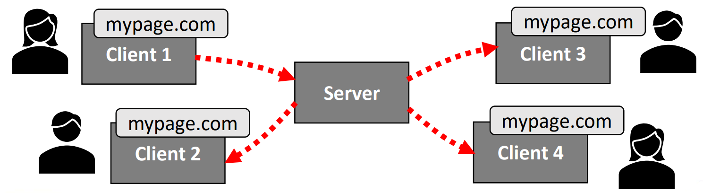

## Lecture 10.2: Socket.IO  
### 什么是 Socket.IO？  
- Socket.IO 是一个 Node.js 库，用于在客户端和服务器之间进行*低延迟（low-latency）*、*双向（bidirectional）* 和*基于事件（event-based）* 的通信  
    - 允许向同一服务器的其他用户广播  
    -   

### 集成 Socket.IO  
- Socket.IO 由两部分组成：服务器端和客户端  
- 服务器和客户端使用类似的编程接口（API）  
    - 在服务器端使用 `npm install socket.io` 来安装  
    - 在客户端，需从服务器加载 Socket.IO  
      ```html
      <script src="/socket.io/socket.io.js"></script>
      ```
    - 客户端也可以从 CDN 加载  
      ```html
      <script src="https://cdn.socket.io/4.5.4/socket.io.min.js"></script>
      ```

#### Socket.IO 连接例  
```js
// socketExample.js
// 初始化 Express JS 和 Socket.IO
const app = require('express')();
const http = require('http').Server(app);
const io = require('socket.io')(http);

// 当用户连接服务器时发送 socket.html
app.get('/', (req, res) => {
    res.sendFile(__dirname + '/socket.html');
});

// 用户连接时运行回调
io.on('connection', (socket) => {
    console.log('A user connected');
    // 用户断开连接时运行嵌套回调
    socket.on('disconnect', () => {
        // 每次用户连接或断开连接时，控制台都会显示通知
        console.log('A user disconnected');
    });
});

http.listen(8080, () => {
    console.log('listening on port 8080');
});
```
```html
<!-- socket.html -->
<!DOCTYPE html>
<html>
    <head>
        <title>Socket example</title>
    </head>

    <!-- 收到 socket.html 后在客户端初始化 Socket.IO -->
    <script src="/socket.io/socket.io.js"></script>

    <!-- 从客户端向服务器建立连接 -->
    <script>
        const socket = io();
    </script>

    <body>Hello!</body>
</html>
```
```
$ node socketExample.js
Listening on port 8080
A user connected
A user disconnected
A user connected
A user disconnected
```

### 在 Socket.IO 中发出事件  
- Socket.IO 的主要理念是，你可以发送和接收包含任何数据（如 JSON 格式的对象）的事件  
- 你可以使用 `io` 和 `socket` 对象来发出事件（emit event），并指定回调来处理接收到的事件  
    - 向所有人（包括发送者）发送：`io.emit(...)`  
    - 向所有人（不包括发送者）发送：`socket.broadcast.emit(...)`  
    - 向指定客户端发送：`socket.emit(...)`  
    - 注意，广播功能只能在服务器上使用，客户端只能使用 `socket.emit(...)` 向服务器发送信息  
#### 发出事件例  
```js
// socketExampleEmit.js
const app = require('express')();
const http = require('http').Server(app);
const io = require('socket.io')(http);

app.get('/', (req, res) => {
    res.sendFile(__dirname + '/socketEmit.html');
});

io.on('connection', (socket) => {
    // 在收到 clicked 时运行嵌套回调，并将其发送给所有客户端
    socket.on('clicked', () => {
        console.log('Button clicked!');
        io.emit('clicked!', 'Button clicked!');
    });
});

http.listen(8080, () => {
    console.log('listening on port 8080');
});
```
```html
<!-- socketEmit.html -->

...
<!-- 显示带有按钮和空列表的初始网页 -->
<button type="button" id="btn">
    Click me!
</button>

<ul id="list"></ul>

<script>
    // 启动客户端到服务器的连接
    var socket = io();
    var list = document.getElementById('list');
    var btn = document.getElementById('btn');

    // 创建事件监听器，在点击按钮时发出 clicked 事件
    btn.addEventListener('click', () => {
        socket.emit('clicked', '');
    });

    // 收到 clicked 事件时，在列表中添加信息
    socket.on('clicked', (msg) => {
        var item = document.createElement('li');
        item.textContent = msg;
        list.appendChild(item);
    });
</script>
...
```

### 小结  
- 中间件功能允许在服务器中分层添加不同的功能  
- 模板引擎可用于生成动态页面  
    - 有助于在服务器端分离数据和页面设计  
- Socket.IO 是一个用于生成交互式网页的库  
    - 允许在服务器和客户端之间发布事件，这对用户之间的通信（如聊天）至关重要  