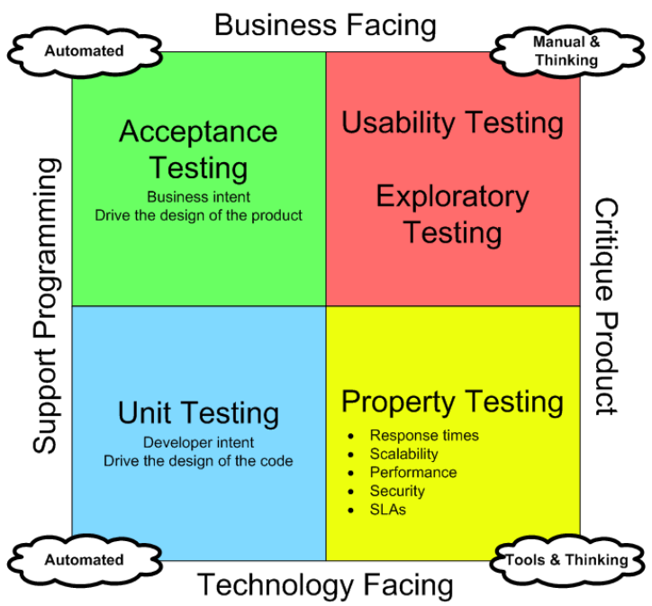
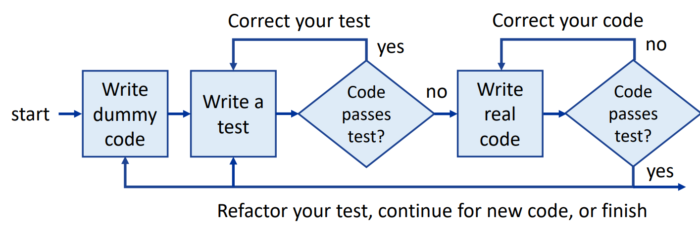
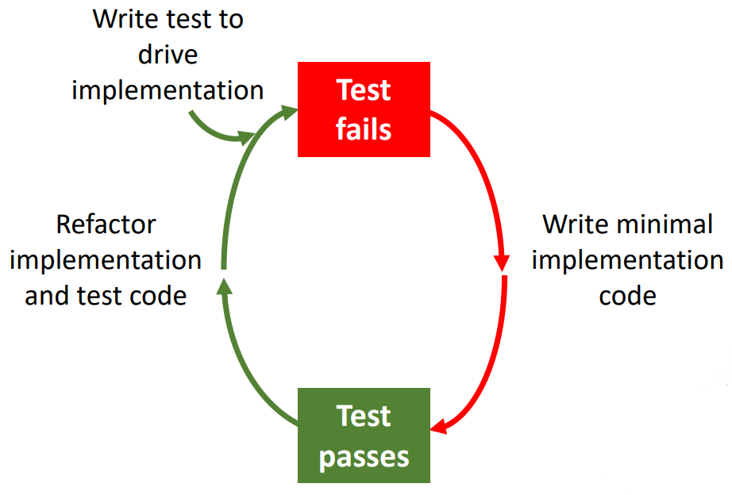

# Day 11: 测试网页应用  
## Lecture 11.1: 测试介绍  

### 什么是测试？  
- JavaScript 测试（testing）是验证代码是否正常运行并产生预期输出的过程  
- 测试是软件开发生命周期的重要组成部分  
    - 有助于在开发过程中尽早发现错误和问题  
    - 减少事后修复的成本和时间  

### 测试为什么重要？  
- 测试是构建稳健可靠的网络应用程序的重要环节  
- 如果不对应用程序进行测试，我们就不知道它们是否按预期运行  
- 测试告诉我们在添加新功能时代码是否会崩溃  
- 测试还能告诉我们代码的哪个具体部分出了问题  
#### **我们必须测试网页应用！**

### 测试的类型  
- 有许多测试级别：  
    - **单元 Unit** - 单独测试类、方法等  
    - **集成 Integration** - 两个或多个单元一起测试  
    - **功能 Functional** - 端到端测试应用程序中的特定功能  
    - **系统 System** - 从最终用户角度和接口测试功能  
    - **系统集成 System Integration** - 两个或多个协作应用程序  
- 可以测试应用程序的特定方面  
    - **性能 Performance** - 如何处理吞吐量（throughput）、负载（load）、内存（memory）等问题  
    - **安全 Security** - 包括测试应用程序是否存在潜在的安全漏洞，并确保敏感数据得到安全处理  
    - **可访问性 Accessibility** - 包括测试应用程序，以确保残疾用户可以无障碍地使用它  

### Marick 的测试矩阵  
- 没有通用的测试工具：我们需要使用各种测试  
    - 通过使用 Marick 的测试矩阵（Marick's matrix of testing），软件开发团队可确保其测试工作全面而有效  
    -   
#### Acceptance Testing 验收测试  
- 验收测试的重点是测试应用程序满足特定需求或标准的能力  
    - 确保应用程序的行为符合预期并满足其用户的需求  
    - 帮助识别由于用户输入、业务规则和外部系统而可能出现的问题  
#### Usability Testing 可用性测试  
- 可用性测试确保应用程序是用户友好的  
    - 用户使用应用程序执行任务，同时观察他们的交互  
    - 有助于识别可用性问题，如令人困惑的导航或说明  
    - 可以通过多种方式实现（如面对面会议、远程测试、A/B 测试）  
#### Property Testing 性能测试  
- 性能测试定义并度量特定的性能指标，例如响应时间和吞吐量  
    - 还包括在不同条件下（例如，使用大量数据）进行测试，以识别潜在的性能问题，并允许优化处理这些条件  
#### Unit Testing 单元测试  
- 单元测试是在单个代码级别执行的一种软件测试  
    - 确保代码的每个单元或组件按预期工作  
    - 有助于在开发周期的早期捕获缺陷  
- **本课程中，我们会关注单元测试！**  

### 如何测试？  
- 遵循**测试驱动开发原则（test-driven development principles）**  
- 使用 **“红、绿、重构”循环（red, green, refactor cycle）** 来编写代码  
- 确保循环较短（通常为 10 分钟）  
- 使用各种测试，确保测试彻底  

#### 测试驱动开发原则  
- 使用测试来驱动代码的实现  
-   

#### 使用红、绿、重构循环  
- **Red 红**：思考想要开发*什么*  
- **Green 绿**：思考*如何*通过测试  
- **Refactor 重构**：思考*如何*优化代码  
-   

### 单元测试  
- 单元测试（unit testing）包括孤立地测试代码的单个单元或组件，而不考虑它们与应用程序的其他部分的交互  
- 它通常由开发人员完成，重点是在受控环境中测试小的、孤立的代码片段  

#### 编写单元测试  
- 开发人员创建涵盖特定代码单元的所有可能输入和输出的测试用例（test cases）  
    - 测试用例包括边缘用例（edge cases）、意外行为（unexpected behaviour）以及错误和异常的处理（handling errors and exceptions）  
- 可能很耗时，并且可能需要开发人员付出大量的努力！  
    - 为了减少工作量，单元测试通常使用测试框架（如 Jest）进行自动化  

#### 单元测试的优点  
- 通过在开发周期的早期捕获问题，开发人员可以避免代价高昂的返工，并确保代码的高质量  
- 单元测试可以帮助改进代码库的可维护性，使更改变得更容易，并确保代码继续按预期运行

### 自动化测试  
- 我们可以手动运行测试……有时这是必需的！  
    - 然而，我们应该尽可能地尝试自动化测试（automated testing）！  
- 自动化测试可能需要一些初始设置时间，但它们应该被视为默认选项  

#### 为什么推荐自动化测试  
- 自动化测试有助于减少测试软件应用程序所需的时间和精力，因为相同的测试可以运行多次而不需要人工干预  
    - 运行更快  
    - 运行更频繁  
    - 解放测试者，让他们将精力集中在更复杂或探索性的测试任务上  
    - 不会忘记还有什么没测  
    - 不会无聊 ☺  