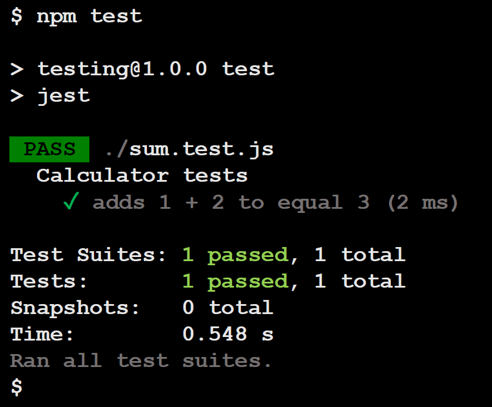
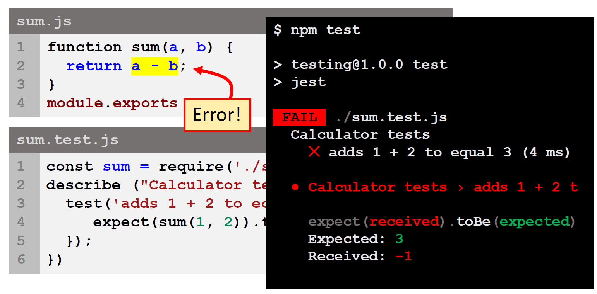

## Lecture 11.2: 使用 Jest 测试  

### 什么是 Jest？  
- Jest 是 Facebook 创建的一个流行的 JavaScript 测试框架  
    - 它提供了一种简单而强大的方法来编写测试，并内置了对常见测试任务（如 mock 和 assertion 断言）的支持  
    - 允许自动化测试  
    - 广受欢迎，许多开发者都在使用  

### Jest 如何运行测试？  
- Jest 使用可用的 CPU 并行运行测试，这使得测试更快  
    - 但是，不能保证测试将以何种顺序运行——测试是独立的！  
- Jest 在 Node 中测试 JavaScript，不需要浏览器  
    - 影响你编写的测试：为函数编写测试很容易，但如果你想通过 JS 操作 HTML DOM，则会花费更多时间  

### Jest 基础  
- Jest 遵循行为驱动开发的惯例  
- 一些最常用的 Jest 元素包括：  
    - **Describe**：测试套件（后续测试的集合）的顶层，设置总体描述  
    - **Test**：将测试名称作为描述，通过字符串描述来了解测试要做什么  
    - **Expect**：作为断言匹配器（matchers for assertions）的语句  
    - **It...should**：作为 Test 的替代，后面仍然是 `expect...`  
    - 以及其他元素，详见 https://jestjs.io/  

### 测试流程  
- 单元测试遵循 ADE/AAA 格式  
    - **操作**（**A**ction，或**排列** **A**rrange）测试对象  
    - **数据**（**D**ata，或**行动** **A**ct）提供测试变量  
    - **期望**（**E**xpect，或**断言** **A**ssert）变量正确  
- 典型的测试流程（testing flow）包括  
    - 导入要测试的函数  
    - 为函数提供输入  
    - 定义预期输出  
    - 检查函数是否产生预期输出  

### 安装 Jest  
- 为项目创建目录  
- 使用 `npm init -y` 初始化项目  
- 使用 `npm install --save-dev jest` 安装 Jest  
- 在 `package.json` 中编辑下面的部分  
  ```json
  "scripts": {
      "test": "jest"
  ...
  ```

### 简易 Jest 单元测试例  
```js
// sum.js

// 计算两数之和的简单函数
function sum(a, b) {
    return a + b;
}

// 该函数必须导出为待测试模块，并在 test.js 文件中导入
module.exports = sum;
```
```js
// sum.test.js
// 测试位于名为 xxx.test.js 的文件中，与要测试的 JS 文件匹配

const sum = require('./sum');

// Jest 函数 describe() 将测试合并为测试套件，测试在回调函数中添加
describe("Calculator tests", () => {
    // Jest 函数 test() 添加了一个单独的测试
    test('adds 1 + 2 to equal 3', () => {
        // 使用 Jest 匹配器（matcher）测试回调函数中定义的传递标准
        expect(sum(1, 2)).toBe(3);
    });
};)
```
使用 `npm test` 运行测试  
  

#### Jest 测试失败例  
  

#### 添加更多函数和测试  
```js
// operations.js
const operations = {
    sum: function(a, b) {
        return a + b;
    },
    diff: function(a, b) {
        return a - b;
    },
    prod: function(a, b) {
        return a * b;
    }
};

module.exports = operations;
```
```js
// operations.test.js
const operations = require('./operations');

// 使用 describe() 创建测试套件
describe("Math operations test", () => {

    // 每个测试都应映射到一个方法（有时甚至更多）
    test('1 plus 2 should be 3', () => {
        expect(operations.sum(1, 2)).toBe(3);
    });

    test('10 minus 2 should be 8', () => {
        expect(operations.diff(10, 2)).toBe(8);
    });

    test('2 times 8 should be 16', () => {
        expect(operations.prod(2, 8)).toBe(16);
    });
});
```

### Jest 匹配器  
- Jest 匹配器（matcher）是 Jest 测试框架的基本组成部分，为测试特定场景（scenario）的结果提供断言（assertion）  
    - 内置匹配器可用于测试字符串、数字和布尔值等值  
    - Jest 使用不同的匹配器，允许以不同的方式测试值  
    - 完整列表详见：https://jestjs.io/  
#### 相等 Equality 和不相等 Inequality  
- 测试数值的最简单方法是精确相等（exact equality），如  
  ```js
  expect(1 + 5).toBe(6);
  expect(4 - 2).not.toBe(1);
  ```
#### 真实性 Truthiness  
- 通过以下匹配器，可以区分未定义（undefined）、空（null）和假（false）  
    - `toBeNull()`：仅匹配 null  
    - `toBeUndefined()`：仅匹配 undefined  
    - `toBeDefined()`：仅匹配 defined（与 `toBeUndefined()` 相反）  
    - `toBeTruthy()`：匹配 if 语句中为真的任意内容  
    - `toBeFalsy()`：匹配 if 语句中为假的任意内容  
#### 小于或大于  
- 这些匹配器可以进行数字比较，如  
  ```js
  expect(age).toBeGreaterThan(18);
  expect(year).toBeLessThan(2500);
  ```
#### 匹配字符串  
- 可以使用 `toMatch()` 对字符串进行正则表达式测试，例如： `expect(string1).toMatch(/test/)`  
  ```js
  test('there is no I in team', () => {
      expect('team').not.toMatch(/I/);
  });

  test('there is a "stop" in Christoph', () => {
      expect('Christoph').toMatch(/stop/);
  });
  ```
#### 数组  
- 使用 `toContain()` 测试数组是否包含特定项目  
  ```js
  const shoppingList = ['apples', 'bread', 'egg', 'milk'];

  test('the shopping list has milk on it', () => {
      expect(shoppingList).toContain('milk');
      expect(new Set(shoppingList).toContain('milk'));
  });
  ```
#### 错误和异常  
- 使用 `toThrow()` 测试调用某个函数时是否会抛出错误  
  ```js
  function compileAndroidCode() {
      throw new Error('You are using the wrong JDK!');
  }

  test('compiling as expected', () => {
      expect(() => compileAndroidCode()).toThrow();
      expect(() => compileAndroidCode()).toThrow(Error);
  });
  ```

### Jest 设置和拆卸 hook  
- 通常在编写测试时，你可能需要在测试前运行一些设置代码（setup code），也可能需要在测试后运行一些最终代码（finalisation code）  
- Jest 为设置（setup）和拆卸（teardown）提供了辅助函数  
    - 它们可用于设置对象和资源  
    - 它们也可用于测试运行后的清理  
    - `beforeEach()` 和 `afterEach()` 在套件中的每个测试之前或之后运行  
    - `beforeAll()` 和 `afterAll()` 仅为整个套件运行一次  

### 小结  
- 测试是软件开发生命周期的重要组成部分：它有助于在开发过程中尽早发现错误和问题，减少后期修复的成本和时间  
    - 测试有多种类型，你应采用各种测试，以确保应用程序稳健、功能强大且可用  
- 自动测试需要初始设置，但可加快重复测试的速度并减少错误数量  
    - Jest 是一种流行的 JavaScript 测试框架，用于执行 Web 应用的自动单元测试  