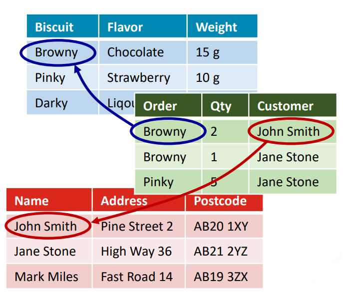
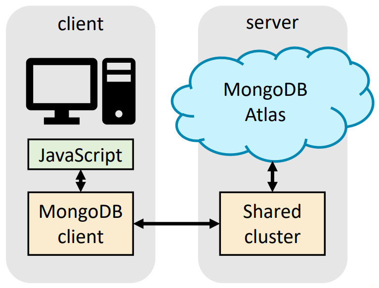

# Day 12: 数据库驱动 Web 应用  

## Lecture 12.1: 关系型和非关系型数据库  

### 为什么我们需要数据库？  
- 我们经常需要在网络应用程序中处理大量数据：有了数据库，管理数据就更容易了  
- 通常有多个用户：我们可以根据登录网络应用程序的用户定制视图  
- 我们经常需要检索数据：从数据库检索比通过文件检索更有效、更快捷  
- 数据库内的数据更易于管理，因为它有助于数据的一致性和冗余性  

### 关系和非关系数据库  
- 关系数据库（relational database）使用 SQL（***S**tructured **Q**uery **L**anguage*，结构化查询语言），使用时计算量大  
- 非关系型 NoSQL （non-relational NoSQL）数据库速度更快，可与 Node 应用程序配合使用  
- 选择关系数据库还是非关系数据库，取决于用户数量、目的以及是否还使用其他应用程序来处理信息  

#### 关系数据库  
- 对象（object）存储在表（table）的行（row）中，表与表之间通过索引键（index key）建立关系（relationship）  
- 添加新数据时，会在现有表格中插入新记录，或添加新表格  
- 这样就可以在两个或多个表之间建立关系  
- SQL 用于与数据库交互  

#### 关系数据库例  
- 我们创建了一个订购不同口味饼干的网络应用程序  
    - 客户详细信息（姓名、地址和邮编）存储在一个表中  
    - 在另一个表格中存储不同类型饼干的信息（口味、成分、重量、可用性）  
    - 最后，客户订单的详细信息存储在第三个表中  
-   

#### 关系数据库特征  
- 关系数据库在所含数据不经常变化时效果最佳  
- 当准确性至关重要时，关系数据库是最佳选择  
    - 例如，金融应用  
- 有不同的关系数据库实现方式  
    - SQLite 适用于轻量级基础数据库  
    - MySQL 和 PostgreSQL 适用于需要更快处理速度的更复杂数据库  

#### SQLite  
- SQLite 是世界上使用最广泛的数据库引擎  
    - 例如，所有 Android 和 iPhone 设备都使用 SQLite，因此全世界有数十亿份 SQLite 在运行  
- SQLite 以文件为基础，因此性能稳定，可跨平台运行  
    - 但是，当有许多用户同时使用时，速度会很慢  
- 它使用 SQL 的一个子集，因此适用于基本用途  
    - 特别适用于开发和实验  
- 更多信息：https://www.sqlite.org/index.html  

#### MySQL 和 PostgreSQL  
- MySQL 和 PostgreSQL 是全面的关系数据库，功能强大、速度快，并支持多种连接  
    - 支持可扩展性（scalability），因为数据库可单独或在多个服务器上运行  
- MySQL 是一种流行的轻量级数据库解决方案，具有良好的跨平台支持（https://www.mysql.com）  
- PostgreSQL 比 MySQL 更复杂，功能更多，但不是常用的解决方案（https://www.postgresql.org）  

### 非关系数据库  
- NoSQL 是一种数据库设计方法，用于在关系数据库的传统数据结构之外存储和查询数据  
    - 数据以非表格形式存储，基于文档、图表或键值对等数据结构  
- 一份文件可以非常详细，同时包含一系列不同格式的不同类型信息  

#### 非关系数据库例  
- 我们为本地全科医生诊所创建一个 Web 应用  
    - 每个病人都有自己的文档，其中包含他们的所有信息，包括姓名、药物、疾病等  
    - 尽管格式不同，但这些信息都可以存储在同一文档中  
-   

#### 非关系数据库特征  
- 非关系数据库比关系数据库更灵活，因此非常适合组织大量复杂多样的数据  
    - 通常比 SQL 数据库更快，因为查询无需遍历多个表来查找答案  
    - 适用于可能经常变化的数据或处理多种不同类型数据的应用程序  
- 可通过增加服务器轻松实现横向（horizontally）扩展  
- 最流行的 NoSQL 数据库之一是 MongoDB  

#### MongoDB  
- MongoDB 使用*集合（collections）*，每个集合中都有*文档*（*document* ，对象）  
    - 我们可以搜索变量  
    - 当新项目添加时，格式可能会改变  
- 数据以 JSON 格式存储  
    - 我们可以创建一个前端，通过 JSON 显示详细信息  
    - 由于无需从/到 JSON 的解析，应用速度得以提高  

#### MongoDB Atlas  
- 提供可加载到数据库部署中的样本数据：非常适合实验！  
    - 要通过共享集群（shared cluster）访问 Atlas，你需要创建一个账户  
    - 更多信息：https://www.mongodb.com/docs/atlas/sample-data/  
-   

#### 使用 MongoDB  
- 可以在本地安装 MongoDB 服务器  
- 但在本课中，我们会在云上使用 MongoDB  
    - 你需要创建一个账户，参见：https://www.mongodb.com/cloud/atlas/register  
    - 要在 Node.js 中使用 MongoDB，需要使用 `npm install mongodb` 安装 MongoDB 驱动程序  
    - 此外，`package.json` 文件中还需要 `"type"："module"` 行（不会自动添加）  