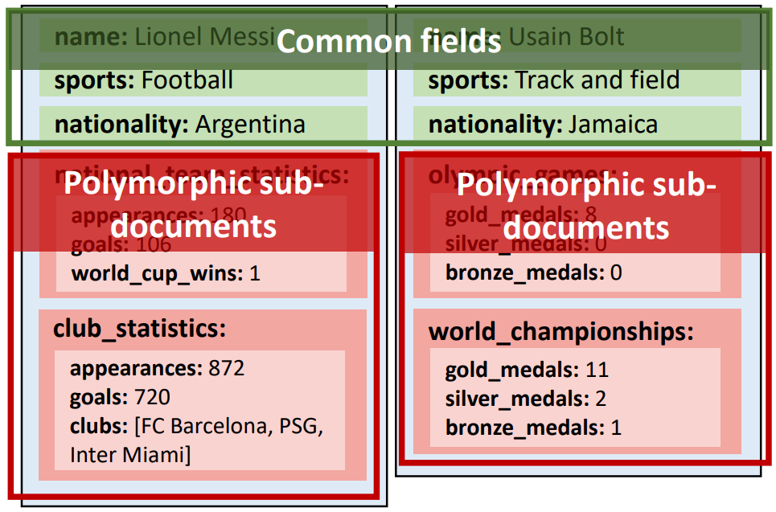

# Day 13: MongoDB 高级功能  

## Lecture 13.1: MongoDB 模式、命令和计数  

### 数据库设计和数据建模  
- NoSQL 数据库不像关系数据库那样使用行和列，但仍需要数据模型  
- 关注查询模式和业务工作流有助于优化数据访问  
    - 目标是规划快速有效的键和索引，以便进行查询并补充工作流程模式  

### 模式设计模式（Schema design patterns）  
- 数据库*模式（schema）* 定义了数据的组织方式  
- NoSQL 数据库模式不像关系数据库那样严格，但它们使用一种底层结构来存储数据  
    - 组织数据的细节非常灵活  
    - 不同的使用情况需要不同的方法  
- 模式*设计模式*（Schema *design patterns*）可帮助我们建立数据模型，并在不同情况下优化性能  

### MongoDB 模式设计模式  
- 不同的模式（pattern）适用于不同类型的应用  
    - 我们需要考虑我们的用例，并根据情况选择合适的模式（pattern）  
- 我们将讨论三种常见模式（pattern）：*多态（polymorphic）模式*、*属性（attribute）模式*和*桶（bucket）模式*  
- https://www.mongodb.com/blog/post/building-with-patterns-a-summary  
    

#### 多态模式  
- 当文件集中的所有文件都具有相似但不完全相同的结构时，就适合使用*多态模式（polymorphic pattern）*  
    - 例如：产品目录、人力资源管理系统、移动应用程序、单一视图应用程序  
- 文件包含存在于所有文件中的共同字段，以及不同的多态子文件  
    - 对常用字段的查询快速而简单  
    - 可轻松扩展新的子文档  

#### 多态模式例  
- 我们想存储运动员的信息，但属性却截然不同  
    - 个人和团队运动、不同的统计数据等  
- 如何适应差异？  
    - 将数据分为通用字段（common field，用于查询）和多态字段（polymorphic field，用于每个运动员的特定数据）  
-   

#### 属性模式  
- 属性模式（attribute pattern）适用于有许多相似字段的大型文档，即具有共同特征的字段子集  
    - 需要排序的字段只出现在一小部分文档中  
    - 例如：日期清单、产品特征等  

#### 属性模式例  
- 在电影集合中，所有文档都有类似的字段，如电影名称、导演、制片人等  
- 假设我们希望根据上映日期进行搜索，但电影在不同国家的上映日期不同  
    - 搜索发布数据需要同时查看多个字段：我们需要在集合上建立多个索引  
    -   
- 使用属性模式可将信息子集移动到键值对数组中，从而减少索引需求  
    - 还允许我们考虑罕见或不可预测的领域（例如，在新电影节上映的电影）  
    - 需要的索引更少，查询更简单快捷  
    -   

#### 桶模式  
- 桶模式（bucket pattern）适用于实时分析、一段时间内的数据流（时间序列数据）  
    - 例如：汽车数据、传感器数据、将交易组合在一起的银行和金融应用  
- 在桶模式中，时间序列数据存储在涵盖特定观测范围（如时间跨度）的文档中  
    - 有助于避免生成大量文件  
    - 适用于组织特定数据组、预测、发现历史趋势和优化数据存储  

#### 桶模式例  
- 传感器测量温度，每分钟将读数保存在新文件中  
    - 文件数量快速增长，给存储系统造成负担  
    - 或者，也可以将每个测量结果添加到同一个文档中，但这样文档的大小会很大  
    -   
- 使用桶模式将数据分组为文档，保存特定时间跨度内的读数  
    - 帮助我们更轻松地获得汇总信息，并将不再需要的信息存档  
    - 文件中还可包括统计信息  
    -   

### 运行命令  
- 在数据库实例上运行命令（running commands）有助于执行诊断和管理任务，如  
    - 获取服务器统计信息  
    - 初始化副本集  
    - 查找构建信息  
    - 了解数据大小  
    - 查找存储统计信息  
    - ……以及许多其他事项  
- 可使用 `db.command()` 方法运行所有数据库操作  
    - 命令在当前数据库的上下文中运行  
    - 可以在第二个参数中传递其他选项  
- 诊断命令的示例包括：`buildInfo`、`collStats`、`dbStats`、`dataSize`、`serverStatus` 等  
    - 详情不在本课程范围内  

#### 运行命令 `dbStats` 例  
```js
import { mongoClient } from "mongodb";

const uri = "mongodb+srv://user:<password>@cluster0.lqnvfse.mon";
const client = new MongoClient(uri);

async function run() {
    try {
        const db = client.db("sample_mflix");
        // 使用 dbStats 命令获取存储统计数据
        const result = await db.command({ dbStats: 1 });
        // 可通过直接打印结果来显示统计数据
        console.log(result);
    }
    finally {
        await client.close();
    }
}

run().catch(console.dir);
```
```
$ node mongocommand.js
{
 db: 'sample_mflix',
 collections: 6,
 views: 0,
 objects: 67641,
 avgObjSize: 1797.2245531556305,
 dataSize: 121566066,
 storageSize: 106700800,
 totalFreeStorageSize: 0,
 numExtents: 0,
 indexes: 10,
 indexSize: 28950528,
 indexFreeStorageSize: 0,
 fileSize: 0,
 nsSizeMB: 0,
 ok: 1
}
$
```

### 文件计数  
- 记录文件集中的文件数量有多种用途，例如  
    - 了解文件集的总大小  
    - 找出与特定查询匹配的条目数量  
    - 估计未来用户数量  
    - 预测欢迎程度  
- 有两种方法可以计算集合中的文件数量  
    - `collection.countDocuments()` - 返回与指定查询匹配的文档数量  
        - 对于空查询，该方法会返回总计数  
        - 提供准确的文档数量，但运行时间可能比 `collection.estimatedDocumentCount()` 更长，因为它会扫描整个集合
    - `collection.estimatedDocumentCount()` - 返回估计的文件数  
        - 不准确，但运行速度快，因为它使用统计数据而不是全面扫描  

#### 文件计数例  
```js
...
async function run() {
    try {
        const db = client.db("sample_mflix");
        const movies = db.collection("movies");

        // 我们想估计集合中的文档数量，但不需要准确的数字，因此可以使用 estimatedDocumentCount() 方法
        const estimate = await movies.estimatedDocumentCount();
        console.log(`Estimated document count: ${estimate}`);

        // 我们还想知道集合中有多少部来自加拿大的电影，因此使用 countDocuments() 方法来获得准确的数字
        const query = { countries: "Canada" };
        const countCanada = await movies.countDocuments(query);
        console.log(`Number of movies from Canada: ${countCanada}`);

        // 程序运行和打印结果的速度相当快，因为数据库不是很大
    }
}
...
```
```
$ node mongocounting.js
Estimated document count: 21329
Number of movies from Canada: 1257
$ 
```