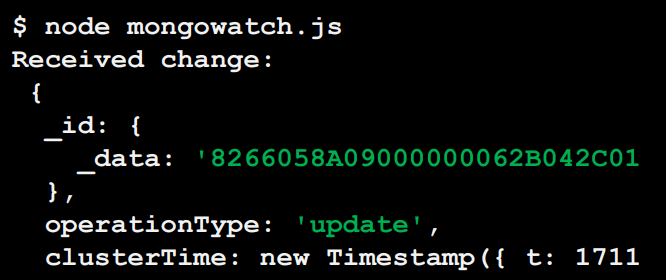

## Lecture 13.2: MongoDB 更改事件和批量操作  

### 关注变化  
- 在许多应用程序中，当数据库中发生变化时通知用户是非常有用的  
    - 例如，插入新文件、删除现有文件或更新信息  
- 我们可以使用 `collection`、`database` 库和 `MongoClient` 对象上的 `watch()` 方法来监视变化  
    - 打开变更流（change stream），以发送变更事件文件  
    - 聚合阶段（aggregation stage，聚合管道 aggregation pipeline）数组可用作参数，用于过滤和转换变化事件  

#### 关注例  
```js
import { mongoClient } from "mongodb";

const uri = "mongodb+srv://user:<password>@cluster0.lqnvfse.mon";
const client = new MongoClient(uri);

async function run() {
    try {
        const database = client.db("insertDB");
        const haikus = database.collection("haiku");
        // 打开更改流，查看集合 haiku 中的更改
        const changeStream = haikus.watch();

        // 异步循环，每当变化流中出现一个新事件，就打印出变化情况
        for await (const change of changeStream) {
            console.log("Received change:\n", change);
        }

        await changeStream.close();
    }
}

run().catch(console.dir);
...
```
要测试代码，可以使用两个终端……  
运行上一讲中的 `mongoexample3.js`，在集合 haiku 中插入文档  
```
$ node mongoexample3.js
A document was inserted with _id: 66056a06
$
```
  

#### 带管道的关注例  
```js
async function run() {
    try {
        const database = client.db("sample_mflix");
        const movies = database.collection("movies");
        // 在本例中，我们只关注运行时间少于 15 分钟的电影中的变化
        const pipeline = [ { $match: { 'fullDocument.runtime': { $lt: 15 } } } ];
        // 要在更改后获取完整文件，必须使用该选项
        const options = { fullDocument: 'updateLookup' };
        // 使用 pipeline 和 options 打开变更流
        const changeStream = movies.watch(pipeline, options);

        for await (const change of changeStream) {
            console.log("Received change:\n", change);
        }
        await changeStream.close();
    }
}
```
下面的例子中，更新事件未被关注，因为影片时长超过 15 分钟  
```js
// mongoexample7.js
...
    const query = { title: "Star Trek" };
...
```
```
$ node mongoexample7.js
1 docs matched, updated 1 docs.
$
```
```
$ node mongowatch.js
█
```
下面的例子中，影片时长少于 15 分钟  
```js
// mongoexample7.js
...
    const query = { title: "Macropolis" };
...
```
```
$ node mongoexample7.js
1 docs matched, updated 1 docs.
$
```
  

#### 使用管道关注删除  
- 注意，前面的示例不适用于删除，因为管道是在更改后应用于文档的  
    - 删除时，更改后没有文档！  
    - 可以定义选项 `fullDocumentBeforeChange: 'whenAvailable'` 来过滤更改前的文档，但这可能需要更改服务器配置  

### 批量写入操作  
- `bulkWrite()` 方法对单个集合执行批量写操作  
    - 减少客户端和服务器之间的网络流量，提高吞吐量和性能  
    - 只有在传给方法的所有操作都完成后，才会返回所有操作的结果  
    - 可以指定以下一个或多个写操作：`insertOne`、`updateOne`、`updateMany`、`deleteOne`、`deleteMany`、`replaceOne`  
- 默认情况下，MongoDB 会按照指定顺序逐个执行批量写操作  
    - 如果在处理某个操作过程中出现错误，则不会处理其余操作  
    - 使用无序操作时，将处理列表中的其余操作  
    - 无序运算速度更快，因为它们可以并行运行  

#### 批量操作例  
```js
...
import fs from "fs";

// 在这个例子中，操作是在一个 JSON 文件中定义的
const data = JSON.parse(fs.readFileSync('./data.json', "utf8"));

async function run() {
    try {
        const db = client.db("sample_mflix");
        const theaters = db.collection("theaters");

        // 执行操作
        const result = await theatres.bulkWrite(data.operations);
        console.log(result);
    }
}
```
-   
```
$ node mongobulk.js
BulkWriteResult {
    insertedCount: 2,
    matchedCount: 1,
    modifiedCount: 1,
    deletedCount: 0,
    upsertedCount: 0,
    upsertedIds: {},
    insertedIds: {
        '0': new ObjectId("6605adacefb97…4b"),
        '1': new ObjectId("6605adacefb97…4c")
    }
}
$
```

### 小结  
- 模式设计模式（schema design patterns）可以帮助我们解决常见情况下的问题  
    - 我们讨论了多态模式、属性模式和桶模式，但其他模式也存在，并适用于不同的用例  
    - 模式的选择取决于数据类型和使用负荷等因素  
- 数据库命令、计数操作和更改事件有助于数据库管理和获取统计数据  
- 在处理大量数据时，批量写入操作比基本操作更快、更高效  