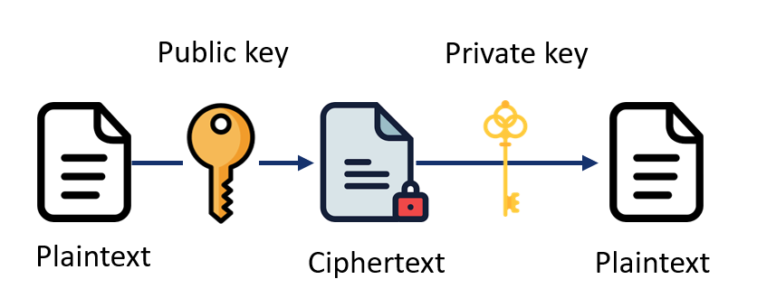

# Lecture 14 - Web 应用安全  

### 什么是 Web 安全？  
- 网络应用程序安全是指为保护网络应用程序免受潜在威胁、漏洞和攻击而实施的实践、措施和技术  
- 由于网络应用程序已成为我们日常生活中不可或缺的一部分，它们也成为恶意行为者利用其弱点达到各种目的的有利可图的目标，这些目的包括
    - 数据盗窃（data theft）  
    - 未经授权的访问（unauthorized access）  
    - 污损（defacement）  
    - 服务中断（disruption of services）  
    - ……  

### Web 应用安全的目标  
- 网络应用程序安全的首要目标是确保应用程序及其数据的保密性（confidentiality）、完整性（integrity）和可用性（availability）  
- 要实现这一目标，需要解决几个关键方面的问题  
    - **身份验证和授权（Authentication and Authorization）**：防止未经授权的访问  
    - **输入验证和输出编码（Input Validation and Output Encoding）**：防止常见的攻击，如 SQL 注入、跨站脚本 (XSS) 和命令注入  
    - **安全通信（Secure Communications）**：保护用户浏览器和网络应用程序之间传输的数据  
    - **会话管理（Session Management）**：防止会话劫持和会话固定攻击  
    - **访问控制和最低权限（Access Control and Least Privilege）**：确保用户只能访问执行任务所需的资源  
    - **安全编码实践（Secure Conding Practices）**：降低在开发过程中引入漏洞的可能性  
    - **安全测试和漏洞评估（Security Testing and Vulnerability）**：帮助识别网络应用程序中的潜在弱点和漏洞  
    - **错误和异常处理（Error and Exception Handling）**：防止敏感信息和潜在漏洞的泄露  
    - **安全更新和补丁管理（Security Updates and Patch Management）**：降低与已知漏洞相关的风险  
    - **安全监控和事件响应（Security Monitoring and Incident Response）**：帮助识别潜在的安全事件、异常活动或未经授权的访问企图  
    - ……  
- 将举例介绍上述一些概念。更多详情，参阅 https://www.w3schools.com/cybersecurity/ 和 https://www.w3.org/Security/  

### 身份验证
#### 用户名和密码  
- 这是最常见的身份验证方法，用户提供一个唯一的用户名和相应的密码来访问自己的账户  
-   

#### 多因素身份验证（Multi-Factor Authentication，MFA）  
- MFA 要求用户提供密码以外的其他认证因素，从而增加了一层额外的安全性。这可以包括发送到移动设备的一次性密码 (One-Time Passwords，OTP)、生物特征认证（指纹或面部识别）或硬件令牌等方法  
-   

#### 基于角色的访问控制（Role-Based Access Control，RBAC）  
- RBAC 根据用户在应用程序中的职责为其分配特定的角色和权限  
- 例如，一个电子商务网站可能有“客户”“管理员”和“支持人员”等角色。每个角色都有一套预定义的权限，规定他们可以执行哪些操作，可以访问哪些数据  
      

#### 基于属性的访问控制（Attribute-Based Access Control，ABAC）  
- ABAC 根据与用户、被访问资源和当前上下文相关的属性组合授予访问权  
- 例如，可以根据用户的部门、职称、地点或任何其他相关属性授予访问权限  
      

### 基础密码学  
所有密码系统，无论多么复杂，都有以下四个基本部分  
- **明文（plaintext）**：这是未做任何处理的信息  
- **密文（ciphertext）**：这是经过某种方式修改后的明文信息，使其模糊不清，无法读取  
- **加密算法（cryptographic algorithm）**：这是用于将明文转换为密文的数学运算，反之亦然  
- **密钥（key）**：用于加密和/或解密信息的密钥  
-   

#### 对称加密  
- 对称加密法（symmetric cryptography）又称秘钥加密法（secret-key cryptography），是一种加密和解密都使用相同密钥的加密方法  
    - **密钥生成（Key generation）**：发送方和接收方商定一个密钥，其他人无法获取该密钥  
    - **加密（Encryption）**：发送方接收明文信息，然后将加密算法与共享密钥一起应用  
    - **传输（Transmission）**：发送方通过通信渠道将密文发送给接收方  
    - **解密（Decryption）**：接收方收到密文后，使用相同的解密算法和共享密钥对密文进行解密  
    -   

#### DES  
- DES（Data Encryption Standard，数据加密标准）是一种对称加密算法，广泛用于安全通信和数据保护
- DES 由 IBM 于 20 世纪 70 年代开发，成为一种广泛采用的加密标准，直到由于计算能力的不断提高和安全问题而逐渐被更先进的算法所取代
- DES 工作流程  
    - **密钥生成**  
        - 56 位秘密密钥  
        - 密钥置换  
    - **加密**  
        - 初始排列对明文的比特进行重新排列  
        - 置换后的数据块被分成两半  
        - 使用从主密钥中提取的 48 位轮次密钥，进行 16 轮系列处理  
    - **解密**  
        - 解密过程基本上与加密过程相反  
    -   

#### DES 例
- 要在 JavaScript 中应用 DES 加密，可以使用提供 DES 功能的 JavaScript 库或加密 API  
    - 用于加密操作的一个常用模块是 Node.JS 的内置模块 `crypto`  
    - ```js
      // 在应用程序中导入加密模块
      const crypto = require('crypto');
      // 选择算法 - 可以通过 crypto.getCiphers() 获取完整的算法列表
      const algorithm = 'des-ecb';
      // 创建密钥 - 这是算法使用的原始密钥
      // use a hex key here
      const key = Buffer.form("d0e276d0144890d3", "hex");

      // 加密过程
      // 使用所述算法创建密码对象
      const cipher = crypto.createCipheriv(algorithm, key, null);
      // 用数据更新密码
      let encrypted = cipher.update("This text has been encrypted", 'utf8', 'hex');
      // 向密码对象发出加密过程已完成的信号
      encrypted += cipher.final('hex');
      // 输出加密文本
      console.log("Encrypted: ", encrypted);

      // 解密过程
      // 创建具有相同算法和密钥的密码对象
      const decipher = crypto.createDecipheriv(algorithm, key, null);
      // 用加密数据更新密码
      let decrypted = decipher.update(encrypted, 'hex', 'utf8');
      // 向密码对象发出解密过程已完成的信号
      decrypted += decipher.final('utf8');
      // 输出明文
      console.log("Decrypted: ", decrypted);
      ```
- 结果  
    
- 可以通过 `getCiphers()` 方法查看 crypto 支持的所有算法列表  
    - ```js
      console.log(crypto.getCiphers());
      ```
    -   

#### DES 优缺点  
- **优点**  
    - **广泛采用**：几十年来，DES 作为标准加密算法被广泛采用和使用  
    - **效率**：DES 是一种相对较快的加密算法，尤其是在专门支持其操作的硬件设备上  
    - **简单**：DES 结构简单明了，相对容易理解和实施  
    - **兼容性**：由于 DES 在过去被广泛使用，许多传统系统和应用程序仍依赖于它  
- **缺点**  
    - **密钥大小**：DES 的主要缺点之一是密钥大小较小，只有 56 比特。随着计算能力的提高，它很容易受到暴力破解（brute-force）攻击  
    - **安全问题**：DES 存在已知漏洞，包括可削弱其安全性的差分和线性密码分析技术  
    - **有限的数据块大小**：DES 在 64 位的固定大小数据块上运行，在处理较大数据集或流式数据时可能会受到限制  
    - **缺乏现代功能**：DES 缺乏最新加密算法中的某些现代功能。例如，它不支持内置验证或完整性检查，因此容易受到某些类型的攻击  
    - **替代标准**：由于 DES 的弱点，在大多数应用中，DES 基本上已被 AES（Advanced Encryption Standard，高级加密标准）等更安全的加密算法所取代。与 DES 相比，AES 提供更大的密钥大小、更强的安全性和更好的性能  

### 基础密码学：公钥密码学  
- 公钥密码学（public key cryptography）又称非对称密码学（asymmetric cryptography），是一种使用一对密钥来确保信息传输安全的密码系统。它广泛应用于现代通信系统，以确保数据的机密性、完整性和真实性  
- 在公钥密码学中，每个参与者都拥有一对数学上相关的密钥：公钥（public key）和私钥（private key）  
    - 公钥可供他人自由获取，而私钥则由其所有者保密  
    - 公钥可用于加密信息，但不能用于解密  
    - 只有相应的私钥才能解密信息  
-   

#### RSA 加密  
- RSA（Rivest-Shamir-Adleman）是应用最广泛的公钥加密算法之一。该算法依赖于将大合成数分解为质因数的难度，这是其安全性的基础  
- 生成密钥  
    1. 选择两个不同的质数 $p$ 和 $q$  
    2. 计算它们的乘积，得到他们的模数 $n = p * q$，  
    3. 计算 $n$ 的欧拉图腾函数 $φ(n) = (p - 1) * (q - 1)$  
    4. 选择一个整数 $e$，使得 $1 < e < φ(n)$，且 $e$ 与 $φ(n)$ 互质（即除 $1$ 外它们没有其他公因数）  
    5. 计算模 $φ(n)$ 的 $e$ 的逆元（Compute the modular multiplicative inverse of e modulo φ(n)），记为 $d$，使得 $(d * e) \mod φ(n) = 1$
    6. 公钥为 $(n，e)$，私钥为 $(n，d)$  
- https://hackernoon.com/how-does-rsa-work-f44918df914b  
    

#### RSA 加密例  
```js
// 导入 crypto 模块
const crypto = require("crypto");

// 生成 RSA 公钥和私钥
const { publicKey, privateKey } = crypto.generateKeyPairSync('rsa', {
    modulusLength: 2048,    // 密钥大小（比特）
});

// 要加密的示例文本
const message = 'Hello, RSA!';

// 加密数据
// 使用收件人的公钥加密信息
const encryptedData = crypto.publicEncrypt(publicKey, Buffer.form(message, 'utf8'));

// 解密数据
// 使用私钥解密信息
const decryptedData = crypto.privateDecrypt(privateKey, encryptedData);

// 将解密的信息转换为字符串
const decryptedMessage = decryptedData.toString('utf8');

// 输出原始和解密后的数据
console.log("Original message: ", message);
console.log("Decrypted message: ", decryptedMessage);
```
  

### 基础密码学：数字信封  
- 虽然公钥加密系统似乎是互联网的理想选择，但它们有一个严重的缺点  
    - 它们比对称系统慢几个数量级，因此不适合传输大型文件  
- 解决方案是将两个系统结合起来  
    - 生成密钥，通常称为会话密钥  
    - 使用会话密钥和对称算法加密信息  
    - 用收件人的公钥加密会话密钥，这被称为数字信封（digital envelope）  
    - 向收件人发送加密信息和数字信封  
-   

### HTTP 与 HTTPS  
- HTTPS 是 HTTP 的安全版本，采用 SSL/TLS 加密协议在客户端和服务器之间建立安全连接  
- HTTPS 增加了一个额外的安全层，以保护通过网络传输的数据  
- https://www.cloudflare.com/en-gb/learning/ssl/why-is-http-not-secure/  
  
- **数据安全**  
    - **HTTP**：通过普通 HTTP 传输的数据未加密，这意味着攻击者可以截获并查看这些数据。这包括密码、个人信息和财务数据等敏感信息  
    - **HTTPS**：HTTPS 使用 SSL/TLS 加密技术对客户端和服务器之间交换的数据进行加密。这可确保数据保密，不会被未经授权的人轻易截获或读取  
- **认证与信任**  
    - **HTTP**：HTTP 没有提供任何机制来验证服务器的真实性或确保数据来自可信来源。这使得 HTTP 容易受到中间人攻击，攻击者可以冒充服务器拦截或修改传输的数据  
    - **HTTPS**：HTTPS 使用 SSL/TLS 证书确定服务器身份并加密通信。这些证书由可信的证书颁发机构（Certificate Authority，CA）颁发，具有一定的可信度和真实性。用户可通过有效的 SSL/TLS 证书验证服务器的身份  

### SSL/TLS  
- SSL/TLS 是一种加密协议，可在网络（最常见的是互联网）上提供安全通信  
- 它在客户端（如网络浏览器）和服务器之间建立安全加密连接，确保传输数据的保密性、完整性和真实性  

#### SSL/TLS 如何工作  
- SSL/TLS 结合使用对称和非对称加密以及数字证书来确保通信通道的安全  
- SSL/TLS 的握手过程在客户端和服务器之间建立安全连接  
- 在握手过程中，客户端和服务器协商加密算法，交换加密密钥，并验证服务器数字证书的真实性  
- 一旦握手完成，就建立了安全通道，客户端和服务器就可以安全地交换数据  

#### SSL/TLS 证书  
- SSL/TLS 证书用于验证服务器的身份，并在客户端和服务器之间建立信任。证书由受信任的证书颁发机构（CA）颁发，该机构负责验证申请证书实体的身份  
- SSL 证书内容  
    - **域名 Domain**：SSL 证书包括签发证书的域名（如 www.example.com）  
    - **公钥 Public Key**：证书包含一个公开密钥，用于在安全通信过程中加密和解密数据  
    - **证书颁发机构 Certificate Authority（CA）**：SSL 证书由受信任的证书颁发机构颁发，该机构负责验证证书持有者的身份  
    - **数字签名 Digital Signature**：证书包含使用 CA 私钥创建的数字签名。该签名可验证证书的真实性和完整性  

### SQL 注入  
- SQL 注入（SQL injection）是一种常见的网络应用程序安全漏洞，允许攻击者操纵或向网络应用程序的数据库查询中注入恶意 SQL 代码  
- 原理  
    - 网络应用程序通常使用用户输入来动态构建 SQL 查询  
    - 如果应用程序没有对用户输入进行正确验证、消毒或参数化，攻击者就可以插入 SQL 命令或有效载荷  
    - 注入的 SQL 代码会成为应用程序查询的一部分并由数据库执行，从而可能导致未经授权的数据访问、修改甚至数据丢失  

#### SQL 注入例  
```js
const mysql = require('mysql');

// 假设使用用户输入的 SQL 查询结构存在漏洞
function getUserData(username) {
    const queryString = `SELECT * FROM users WHERE username = '${username}'`;

    // 执行 SQL 查询
    const connection = mysql.createConnection({
        ...
    });

    connection.query(queryString, (error, results) => {
        if (error) {
            throw error;
        }
        console.log(results);
    });

    connection.end();
}

// 来自不可信来源的用户输入
const userInput = "admin' OR '1'='1";
// 查询语句为：SELECT * FROM users WHERE username = 'admin' OR '1'='1'
// username = 'admin' OR '1'='1' 总是为 True
```

#### 避免 SQL 注入  
- **参数化查询**：使用带占位符的参数化或预处理语句，而不是动态构造 SQL 查询。这可确保用户输入被视为数据而非可执行代码  
- **输入验证和净化**：验证和净化用户输入，拒绝或清除潜在的恶意字符或模式  
- **最小权限原则**：确保应用程序使用的数据库账户具有应用程序功能所需的最低权限  
- **安全编码实践**：遵循安全编码准则，例如输入/输出验证、转义用户输入和采用安全编码框架  
- **定期更新和打补丁**：及时更新网络应用程序、其框架和相关组件的安全补丁，以解决已知漏洞  

### 客户端安全  
- 客户端安全（client-side security）是指在客户端（用户设备）上实施的防止安全威胁和漏洞的措施和做法  
- 重点是确保驻留在客户端设备上运行的软件、应用程序和数据的安全性和完整性  
- 常见的客户端安全威胁  
    - **恶意软件（Malware）**：病毒、蠕虫、木马和勒索软件等恶意软件会感染客户端设备，危及其安全性和功能性  
    - **网络钓鱼攻击（Phishing Attacks）**：网络钓鱼是指通过欺骗性电子邮件、网站或信息，诱骗用户泄露敏感信息，如登录凭证或财务详情  
    - **跨站脚本（Cross-Site Scripting，XSS）**：XSS 攻击以网络应用程序中的漏洞为目标，允许攻击者在客户端浏览器上注入并执行恶意脚本  
    - **跨站请求伪造（Cross-Site Request Forgery，CSRF）**：CSRF 攻击利用客户端与网络应用程序之间的信任关系，代表用户执行未经授权的操作  
    - **中间人攻击（Man-in-the-Middle Attcaks，MitM Attacks）**：在 MitM 攻击中，攻击者拦截并操纵客户端与服务器之间的通信，从而有可能获取敏感信息  

#### 措施  
- **操作系统更新**：保持客户操作系统（如 Windows、macOS、iOS、Android）的最新安全补丁和更新  
- **应用程序更新**：定期更新应用软件，包括网络浏览器、电子邮件客户端和其他软件，确保应用安全补丁并减少漏洞
- **反恶意软件**：安装并定期更新信誉良好的反恶意软件，提供对病毒、蠕虫和其他恶意软件的防护  
- **强密码和身份验证**：强制执行强密码和启用双因素身份验证（2FA）可为保护用户账户增加一层额外的安全保护  
- **安全浏览网页**：养成安全的浏览习惯，如避开可疑网站、不点击未知链接、谨慎下载文件等，可降低恶意软件和网络钓鱼攻击的风险  

### 服务端安全  
- 服务器端安全是指为保护系统或应用程序的服务器端组件而实施的实践和措施。它包括保护服务器基础设施、操作系统、网络和服务器上运行的应用程序  
- 常见的服务器端安全威胁
    - **未经授权的访问（Unauthorized Access）**：攻击者可能会利用弱密码、错误配置的访问控制等漏洞，试图对服务器或其资源进行未经授权的访问  
    - **恶意软件和病毒（Malware and Viruses）**：服务器可能会感染恶意软件，如病毒、蠕虫或勒索软件，从而影响其安全性和性能  
    - **拒绝服务（Denial of Service，DoS）攻击**：攻击者向服务器发出过多请求，导致服务中断，合法用户无法访问服务器  
    - **数据泄露（Data Breaches）**：如果服务器端应用程序或数据库没有适当的安全保护，攻击者就可能窃取敏感数据，包括个人信息、财务详情或知识产权  
    - **服务器配置不当（Server Misconfiguration）**：配置不当的服务器可能存在开放端口、默认凭据或不必要的服务，使其容易受到攻击  

#### 措施  
- **强身份验证**：执行强密码并使用多因素身份验证 (MFA)，防止未经授权访问服务器  
- **定期软件更新**：使用最新的安全补丁和修复程序更新服务器的操作系统、应用程序和软件，以解决已知漏洞  
- **防火墙配置**：设置防火墙，控制入站和出站网络流量，过滤潜在的恶意请求，防止未经授权的访问  
- **安全网络通信**：使用安全协议（如 SSH、SSL/TLS）进行远程访问，并对网络通信进行加密，以防止窃听和未经授权的拦截  
- **访问控制和权限管理**：实施适当的访问控制，限制用户权限和特权，确保用户只能访问所需的资源  
- **日志记录和监控**：实施强大的日志和监控系统，以跟踪服务器活动、检测异常情况并及时应对安全事故  
- **定期备份**：定期备份关键数据并验证其完整性。这有助于从数据丢失、损坏或勒索软件攻击等事件中恢复  

### Web 应用安全关键原则  
1. **安全编码实践 Secure Coding Practices**  
    - 在整个软件开发生命周期中遵循安全编码准则  
2. **用户身份验证和授权 User Authentication and Authorization**  
    - 实施强大而安全的用户身份验证机制  
    - 考虑使用 MFA 等更先进的身份验证方法  
    - 定期审查和更新用户访问权限，以适应不断变化的要求和角色  
3. **数据保护 Data Protection**  
    - 应用加密技术保护敏感数据，防止未经授权的访问  
    - 使用适当的加密算法和安全密钥管理实践  
    - 实施数据验证和消毒，防止数据操纵或注入攻击  
4. **安全测试和漏洞评估 Secure Testing and Vulnerability Assessments**  
    - 定期进行安全测试，包括漏洞扫描、渗透测试和代码审查  
    - 在整个开发过程中执行安全评估  
5. **定期更新和补丁管理 Regular Updates and Patch Management**  
    - 使用最新的安全补丁更新所有软件组件、框架、库和依赖项  
    - 建立补丁管理流程，及时应用安全更新  
6. **安全意识和培训 Security Awareness and Training**  
    - 教育开发人员、管理员和用户有关网络应用程序安全的最佳实践、常见威胁和缓解技术  
    - 在组织内培养安全文化  

### 小结  
- 在以下主题中讨论了网络安全  
    - 对称密码学  
    - 公钥密码学  
    - 数字信封  
    - HTTPs  
    - SSL  
    - SQL 注入  
    - 客户端安全  
    - 服务端安全  
    - 网络应用程序安全的关键原则  