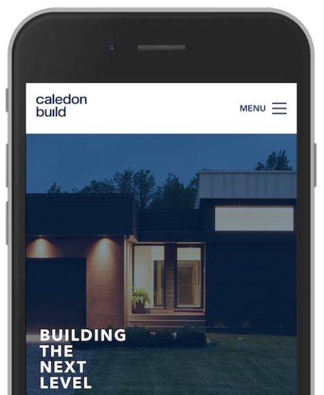
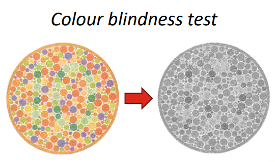
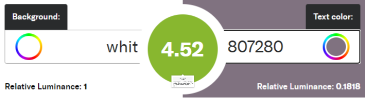
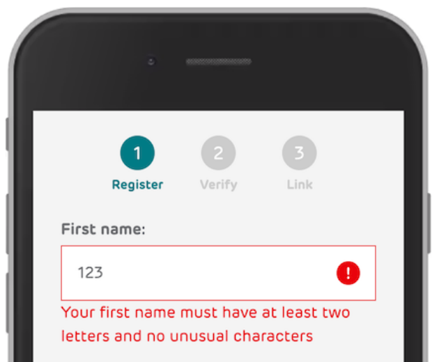

## Lecture 15.2: 无障碍原则和指南  

### 使网络无障碍  
- 网络无障碍取决于几个组成部分的共同作用，包括网络技术、网络浏览器和其他用户代理、创作工具和网站  
- 万维网联盟（W3C）网络无障碍倡议（Web Accessibility Initiative，WAI）制定技术规范、指南、技术和辅助资源，描述无障碍解决方案： https://www.w3.org/WAI/  

### 无障碍原则  
1. 可感知的信息和用户界面  
2. 可操作的用户界面和导航  
3. 可理解的信息和用户界面  
4. 强大的内容和可靠的解释  

#### 可感知的信息和用户界面  
内容应易于从一种形式转换为另一种形式，并为用户提供通过多种感官感知内容的选项  

- **为非文本内容提供文本替代**  
    - 对非文本内容使用文本替代，可达到传达内容的目的  
        - 例如，可通过屏幕阅读器朗读替代文本，将其放大为自定义文本尺寸，或在盲文设备上显示  
    - 文本替代示例  
        - 图像（如图标、按钮和图形）的简短描述  
        - 图表和图解中的数据描述  
        - 音频和视频文件的文本描述  
        - 表单控件、输入和其他用户界面组件的标签  

- **区分有意义的图像和装饰性图像**  
    - 有意义的图像传递信息，是网页或网络应用程序的重要组成部分  
        - 如果图片对用户理解功能或内容并不重要，则被视为装饰性图片  
        - 装饰性图片可以被删除而不会产生任何影响  
    - 每幅图像都应被编码为有意义或装饰性的图像  
    - 有意义图像的描述  
        - `alt` 属性可在用户无法查看图片时提供替代文本  
        - 好的描述性文字能说明图像及其意图  
        - 撰写描述性文字的常用技巧是想象你正在通过电话向朋友解释图片的内容  
        - ```html
          
          ```
            
    - 装饰性图像  
        - 将图像设置为装饰效果的最简单方法是使用空 `alt` 属性  
        - 屏幕阅读器将忽略空 `alt` 属性  
        - 如果不给出 `alt` 属性，屏幕阅读器可能会读取文件名，从而给用户造成混淆  
        - ```html
          
          ```

- **为多媒体提供字幕和其他替代**  
    - 文字记录应书写工整，并包含正确的听觉或视觉信息顺序  
    - 音频描述应包括描述视频中重要视觉细节的旁白  
    - 在 HTML 中，`<track>` 标记为 `<audio>` 或 `<video>` 元素指定文本轨道  
        - 该元素用于指定播放媒体时应可见的字幕、标题文件或其他包含文本的文件  

- **确保以不同方式呈现内容**  
    - 应可以通过朗读、放大或以其他方式适应不同人群的需求和偏好来呈现内容  
        - 确保正确标注标题、列表、表格、输入字段和内容结构  
        - 信息或指令的顺序应独立于任何表现形式  

- **使用更易于观看和聆听的内容**  
    - 前景与背景应明确区分，以便更容易获取重要信息  
        - 当用户调整文字大小至 400% 或改变间距时，不应丢失任何信息  
        - 文字应在小窗口中回流（reflow）  
        - 避免水平滚动  
        - 背景音频应较低，并可关闭  
    - 考虑色彩感知（colour perception）  
        - 因为不是每个人都能以同样的方式感知颜色，所以绝不能将颜色作为唯一的含义指标  
        - 无障碍问题最常见的例子是链接样式没有下划线或边框：在灰度版本的网站中，无法看清什么是纯文本，什么是链接！  
        -   
    - 考虑对比  
        - 对比度衡量文字或图形与背景颜色的对比度  
            - 文字和背景颜色相同：对比度为 1  
            - 白底黑字：对比度为 21  
            - 没有完美的对比度，但建议至少为 4.5  
            - 对比度测量工具：https://contrast-ratio.com/  
                

#### 可操作的用户界面和导航  
人们使用不同的策略和设备（台式机、笔记本电脑、平板电脑、智能手机）浏览和查找内容  
我们应确保  

- **用户可以通过键盘使用所有功能**  
    - 有些用户不使用鼠标或触摸屏，而是依靠键盘与网络互动  
    - 所有功能（包括表单控件和输入）都需要键盘输入  
    - 键盘焦点不应停留在内容的任何部分  
        - 当用户可以通过键盘进入网页上的某个组件或元素，但无法通过键盘离开该组件或元素时，就会出现键盘陷阱  
    - 应提供键盘支持和指导  

- **用户有足够的时间阅读和使用内容**  
    - 在某些应用中，信息只在短时间内可见，或者用户需要在给定时限内输入信息  
    - 应确保有足够的时间  
        - 停止、延长和调整时间限制（必要时除外）  
        - 暂停、停止或隐藏移动、闪烁或滚动的内容  
        - 推迟或抑制中断（必要时除外）  
        - 会话到期时，在不丢失数据的情况下重新认证  

- **内容不会导致癫痫发作或身体反应**  
    - 以特定速度或特定模式闪烁的内容会引起身体反应，包括癫痫发作  
    - 尽可能完全避免闪动内容  
    - 在出现闪动内容之前向用户发出警告，并提供替代方案  
    - 允许用户关闭动画，尤其是快速运动或闪动的动画  

- **用户可以轻松导航、查找内容并知道自己所处的位置**  
    - 帮助用户有效定位和导航  
        - 为页面添加清晰的标题，并使用描述性的章节标题对其进行组织  
        - 让用户知道他们在一组相关页面中的当前位置  
        - 允许用户绕过重复内容块  
        - 使键盘焦点可见，并确保焦点顺序遵循有意义的序列  
    - 导航例  
        - 通过地标（landmark），使用屏幕阅读器的用户可以直接跳转到不同的部分  
        - 快速链接（quick links）可以让用户更容易、更快地找到主要内容  
        - 搜索功能是链接导航的替代机制  

- **用户可以使用键盘以外的其他输入方式**  
    - 键盘和鼠标之外的输入模式包括触控激活、语音识别或手势  
        - 让许多人更容易使用内容，但限制其他人使用  
    - 例如，应通过以下方式确保无障碍  
        - 为需要灵巧操作的手势提供替代方案  
        - 组件的设计可避免意外激活，并具有撤消功能  
        - 按钮、链接和其他活动组件足够大  

#### 可理解的信息和用户界面  

- **文本可读、易懂**  
    - 在编写内容时，确保尽可能多的受众都能阅读文本，包括在朗读时  
        - 识别网页的主要语言  
        - 识别网页或应用程序的文本段落、短语和其他部分的语言  
        - 提供不常见词语、习惯用语或缩略语的定义  
        - 尽可能使用最简单的语言，或为复杂内容提供简化的替代版本  

- **内容以可预测的方式出现和运行**  
    - 人们依赖于可预测的用户界面，而不一致的外观或行为会让他们迷失方向；设计应具有可预测性和一致性  
        - 在多个页面上重复出现的导航机制每次都应出现在相同的位置  
        - 用户界面组件在每个子页面上都应有相同的标签  
        - 未经用户同意，不得对网页进行重大更改  
    - 可预测性示例  
        - 创建表格时，使用自动完成属性帮助用户更快地完成字段  
        - 自动完成可用于 `<input>`、`<textarea>`、`<select>` 和 `<form>` 元素  
        - 对于浏览器不太可能保存的信息，请勿使用自动完成功能  

- **帮助用户避免和纠正错误**  
    - 表单和交互可能导致错误  
        - 用户忘记、混淆或不了解功能  
    - 我们可以帮助用户避免和纠正错误  
        - 添加描述性说明  
        - 添加有意义的错误信息和纠正建议  
        - 为复杂功能添加上下文相关帮助  
        - 必要时提供审查、纠正或逆向提交的机会  
    - 无障碍错误信息例  
        - 用文字书写（可以使用颜色和图标，但不能单独使用）  
        - 位置靠近出现故障的元素  
        - 提供信息，帮助用户  
        - 与代码中出现故障的元素相关联  
        - 最好将焦点移到出现故障的表单控件上  
        -   

#### 强大的内容和可靠的解释  
- 内容应兼容当前和未来的用户工具，如不同的浏览器和辅助技术  
    - 确保标记得到可靠解释并有效  
    - 为非标准用户界面组件提供名称、角色（role）和值  

- 强大的内容例  
    - 按钮和链接是特定类型的交互组件：在使用文本到语音转换器等辅助技术时，它们的工作方式各不相同  
    - 正确使用这些组件有助于用户与之互动，即使在引入新的辅助技术时也是如此  
    - `<button>` 元素应用于在当前页面上执行操作的任何交互行为  
    - 任何导航到另一个视图的交互都应使用 `<a>` 元素  

### 小结  
- 不同的残疾会影响使用网络的能力  
    - 永久性残疾、临时性残疾和情境性残疾  
    - 听觉残疾、认知残疾、肢体残疾、语言残疾和视力残疾  
- 无障碍环境意味着不同残疾的人都能使用网页和网络应用程序 
    - 无障碍环境对社会包容和平等至关重要  
    - 通过为用户提供不同的信息替代形式（如图像的文字说明）和输入模式（如语音指令、鼠标和键盘），可提高无障碍环境的可及性  
    - 清晰的演示和信息可提高无障碍环境的可及性  