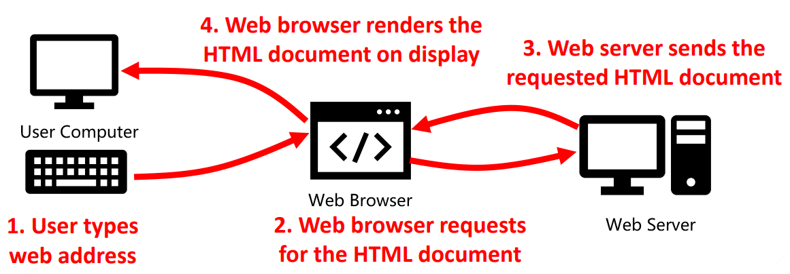
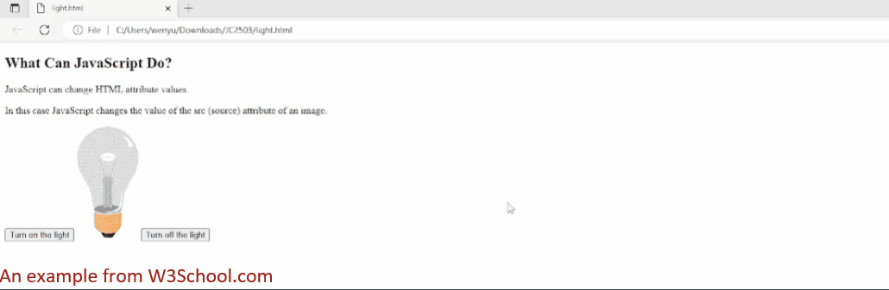
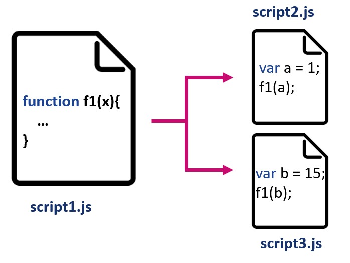
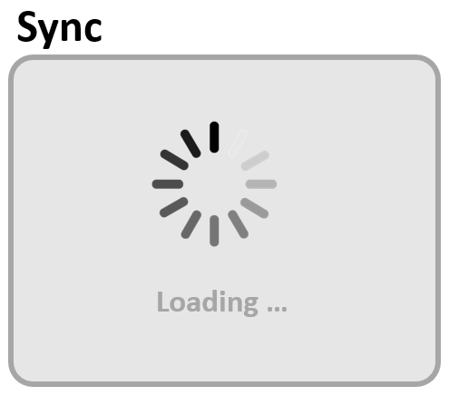
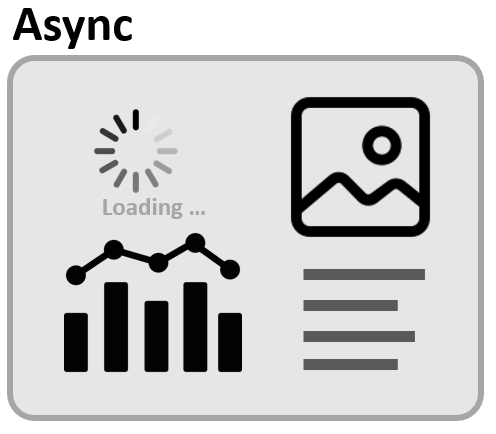
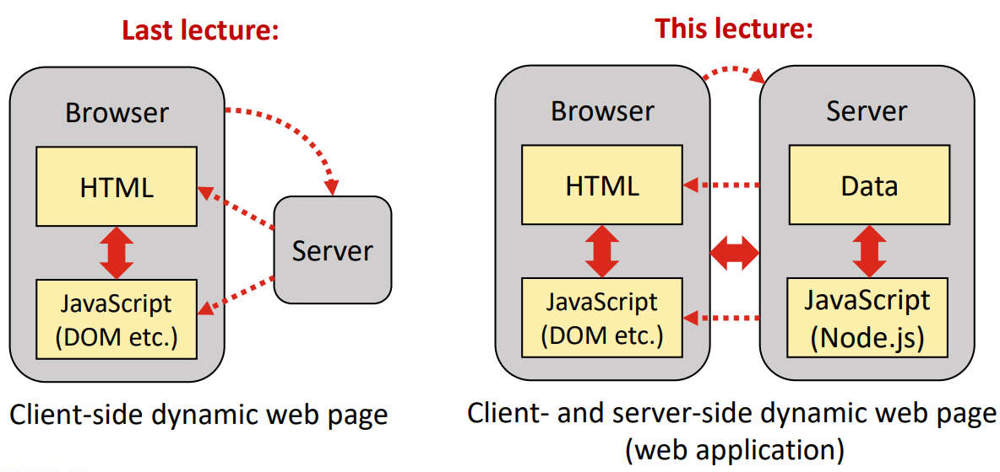
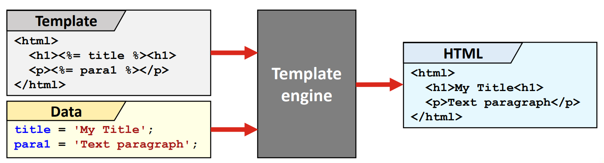

# Day 16：复习  

### 课程大纲  
- **Day 1**：介绍  
- **Day 2**：HTML  
- **Days 3-4**：CSS、Bootstrap  
- **Days 5-8**：JavaScript  
- **Days 9-10**：Node.js 和 Express JS  
- **Day 11**：测试 Web 应用  
- **Days 12-13**：数据库驱动 Web 应用  
- **Day 14**：Web 安全  
- **Day 15**：Web 无障碍  
- **Day 16**：复习、Q&A（本节课！）  

### Day 1：介绍  
- 万维网（WWW）采用客户端-服务器架构，客户端（浏览器）从 HTTP 终端请求 HTML 文档等资源  
    

### Day 2: HTML  
#### 定义
- HTML 即***超文本标记语言（HyperText Markup Language）***  
- **超文本 HyperText**  
    - 可通过相互连接的链接（超链接）与其他文本（文件）相互参照的文本  
- **标记语言 Markup Language**  
    - 定义文本显示方式的标签集  
    - 区分文本内容和文本（及其他内容）的呈现/显示方式  
#### 基础  
- 完成第 2 天的学习后，你应该熟悉常用的 HTML 标记和基本 HTML 文档结构  
    - HTML 文档的主要部分：head、title、body  
    - 显示格式：标题、段落、列表、表格等  
    - 附加资源：链接、图像、嵌入式多媒体  
- 你也应熟悉 HTML 表单  
    - 用于与服务器和 JavaScript 代码交互的输入元素：文本输入、按钮、单选按钮等  

### Day 3：CSS  
- CSS 即***层叠样式表（Cascading Style Sheets）***  
    - CSS 有助于将内容与其表示（样式）分开  
    -   
#### CSS 样式  
- CSS 样式可以  
    - **内联**（**inline**，作为指定 HTML 元素的属性）  
    - **内部**（**internally**，在 HTML 文档中的 `<style>` 标记内）  
    - **外部**（**externally**，在 HTML 文档中引用的单独 CSS 文件中，推荐使用这种方式）  
- 大量不同的 CSS 属性可用于定义元素的颜色、字体、边框和对齐方式等  

### Day 4：Bootstrap  
- Bootstrap 是一个预定义 CSS 样式库：无需重复造轮子！  
    - Bootstrap 网格模型（grid model）：有助于设计适合不同屏幕尺寸的网页  
    - 不同的布局定义，如标签（tab）、卡片（card）、模态（modal）  

### Day 5-8：JavaScript  
- JavaScript 是一种高级编程语言，用于在网页上创建交互效果和动态功能  
    - 处理来自表单、按钮和其他 HTML 元素的用户输入，并对输入做出响应  
    - 对点击、悬停和滚动等用户事件做出响应  
    - 验证表单上的用户输入，确保其符合特定要求  
    - 触发动画，通过文档对象模型（DOM）修改页面内容，或执行其他操作
-   
#### 基础  
- JavaScript 可以写在 `<head>` 或 `<body>` 部分，也可以写在外部文件中  
- JavaScript 包含多种运算符，用于算术、赋值、比较、逻辑和条件操作等  
- JavaScript 对象包括字符串和数组等  
- JavaScript 控制流语句包括 `if-else` 结构、`switch` 和循环（`for`、`while`）等  
#### 作用域  
- 作用域（scope）决定变量的可访问性（可见性）  
    - **全局作用域（Global scope）**：在任何函数之外声明的变量和函数都具有全局作用域，可从程序中的任何位置访问  
    - **局部作用域（Local scope）**：在函数或代码块内用关键字 `let` 声明的变量和函数具有局部作用域，只能在该函数或代码块内访问  
#### 函数  
- 函数是执行特定任务的代码块  
    - 可以接受输入参数，可以返回一个值作为输出  
    - 函数允许我们封装代码块并多次重用它  
- ```js
  // 创建函数的关键字声明
  // |    函数名 参数
  // ↓       ↓    ↓
  function greet(name) {
      console.log("Hello, " + name + "!");  // <- 函数体
  }
  ```
#### 对象  
- JavaScript 对象（object）是键值对的集合  
    - 值*几乎*可以是任何东西，甚至是函数  
- ```js
  const person = {
      name: 'John',
      age: 30,
      hobbies: ['reading', 'swimming', 'traveling'],
      address: {
          street: '123 Main St',
          city: 'Aberdeen',
          country: 'UK'
      }
  };
  ```
#### 类  
- 类（class）定义了共享公共属性和方法的对象  
    - 它们提供了一种创建可重用的模块化代码的方法，并允许定义对象蓝图来创建同一对象的多个实例  
- ```js
  class ClassName {
      constructor() {...}
  }
  ```
- 使用 extends 关键字创建类继承（class inheritance）  
    - ```js
      class Animal {
          constructor(name) { this.name = name; }
          speak() {
              console.log(`${this.name}` makes a noise.);
          }
      }

      class Dog extends Animal {
          constructor(name) {
              super(name);  // 调用 Animal 的构造函数
          }

          speak() {
              console.log(`${this.name} barks.`);
          }
      }

      const fido = new Dog("Fido");
      fido.speak();     // Fido barks.
      ```
#### 模块  
- 模块（module）允许将代码分割成不同的文件  
-   
- Practical 中用到的模块  
    - Express  
    - Socket.IO  
    - Crypto  
    - ……  
#### 异步操作  
- 异步操作允许程序在等待长时间运行的操作完成时继续执行  
    - 例如，等待服务器发送或用户输入数据  
-  
- JavaScript 同步编程通常的实现方法  
    - 回调（callback）  
    - Promise  
    - `async`/`await`  
#### 文档对象模型  
- HTML 文档对象模型（Document Object Model，DOM）是一种编程接口，其中 HTML 文档的元素由对象树表示  
-   
#### DOM 功能  
- JavaScript 可以通过 HTML DOM 访问和更改 HTML 文档的内容和属性，例如  
    - 修改所有 HTML 元素、属性和 CSS 样式  
    - 删除现有 HTML 元素和属性  
    - 添加新的 HTML 元素和属性  
    - 对页面中的 HTML 事件做出反应  
    - 在页面中创建新的 HTML 事件  

### Day 9：Node.js 基础  
- Node.js 是一个在*浏览器外*运行的开源跨平台 JavaScript 运行时环境  
    - 使用 Node.js，Web 应用程序可以在前端（浏览器）和后端（服务器）用 JavaScript 实现  
    -   

### Day 10：Node.js 深入  
#### 中间件和模板引擎  
- Node.js 使用**中间件函数（middleware function）**，这些函数可以串联起来处理服务器接收到的请求  
- Node.js 允许使用**模板引擎（template engines）** 生成动态 HTML  
    
#### Socket.IO  
- **Socket.IO** 是一个 Node.js 库，用于在客户端和服务端之间进行*低延迟（low-latency）*、*双向（bidirectional）* 和*基于事件（event-based）* 的通信  
    

### Day 11：测试 Web 应用程序  
- 测试是软件开发生命周期的重要组成部分  
    - 有助于在开发过程中尽早发现错误和问题，减少后期修复的成本和时间  
- 自动测试有助于减少测试软件应用程序所需的时间和精力  
    - 相同的测试可多次运行，无需人工干预：使测试能够更快、更频繁地运行  
    - 自动测试使测试人员能够专注于更复杂或探索性的测试任务  
    - 自动测试不会遗忘有待测试的内容  、
#### 测试的类型  
- **单元 Unit** - 单独测试类、方法等  
- **集成 Integration** - 两个或多个单元一起测试  
- **功能 Functional** - 端到端测试应用程序中的特定功能  
- **系统 System** - 从最终用户角度和接口测试功能  
- **系统集成 System Integration** - 两个或多个协作应用程序一起测试  
- **性能 Performance** - 吞吐量（throughput）、负载（load）、内存（memory）等  
- **安全 Security** - 测试安全漏洞  
- **可访问性 Accessibility** - 确保无障碍  
#### 使用 Jest 自动化测试  
- Jest 是 JavaScript 自动测试的流行框架  
- Jest 匹配器提供断言，以测试不同情况下的结果  
    - 等价和不等价（toBe）  
    - 真实性（如 toBeTruthy、toBeFalsy）  
    - 数字（如 toBeGreaterThan）  
    - 字符串（toMatch）  
    - 数组（toContain）  
    - 异常（toThrow）  

### Day 12：数据库驱动 Web 程序  
- 许多网络应用程序都要处理大量数据，这些数据应可供不同用户访问  
    - 使用数据库进行数据操作（如搜索、添加和删除）比使用文件更有效率  
- 数据库有两种基本类型：关系型（relational）和非关系型（non-relational）  
    - 关系型数据库以表格格式存储数据，表格行中的元素可与其他表格中的数据相关联  
    - 非关系型数据库的数据格式更灵活  
#### MongoDB  
- MongoDB 是一种流行的非关系型数据库，使用集合中的文档  
    - 每个文档都可以定义为 JavaScript 对象 
- MongoDB 支持几种不同类型的操作，可以使用 JavaScript 中的 MongoDB 方法来执行  
    - 根据特定条件搜索文档  
    - 添加和删除文档  
    - 替换和更新文档  

### Day 13：MongoDB 模式设计模式（Schema Design Patterns）  
- 数据库模式定义了数据的组织方式  
    
    - 不同的模式适用于不同类型的应用程序，这取决于数据类型、使用负载等  
    - 更详细地讨论了多态、属性和桶模式设计模式  

### Day 14：Web 安全  
- 网络应用程序安全是指为保护网络应用程序免受潜在威胁、漏洞和攻击而实施的实践、措施和技术  
    - 主要目标是确保应用程序及其数据的机密性、完整性和可用性  
    - 网络应用程序安全通过几种不同的手段来实现，包括限制只有授权用户才能访问资源的身份验证，以及防止未经授权用户访问机密数据的加密技术等
#### 身份验证  
- 最常见的身份验证（authentication）方法是为用户提供访问资源所需的唯一用户名和密码  
    - 信息泄露或暴力攻击可能会破坏密码  
    - 多因素身份验证（Multi-Factor Authentication，MFA）通过使用额外的身份验证因素，如发送到移动设备的一次性密码、指纹或硬件令牌，增加了一层额外的安全性  
    - 基于角色的访问控制将权限与用户的角色联系在一起  
    - 基于属性的访问控制根据用户、资源和环境属性的组合授予访问权  
#### 加密技术  
- 主要有两种加密技术：对称（秘钥）和非对称（公钥）加密技术  
    - 对称加密对加密和解密使用相同的密钥  
        
    - 公钥加密使用一对密钥来保护信息的传输  
        

### Day 15：Web 无障碍  
- 网络无障碍意味着每个人都能使用网络应用程序，包括残障人士  
    - 无障碍对于平等和社会包容至关重要 
    - 残障可以是永久性的（permanent）、暂时性的（temporary）或情境性的（situational）  
#### 网络无障碍的四项原则（POUR）  
1. Perceivable information and user interface 可感知的信息和用户界面  
    - 通过多种感官以不同方式提供内容（例如，非文本内容的文本替代品）  
2. Operable user interface and navigation 可操作的用户界面和导航  
    - 可使用不同的输入方法（如键盘和语音）  
3. Understandable information and user interface 可理解的信息和用户界面  
    - 内容易于理解，组织方式可预测  
4. Robust content and reliable interpretation 强大的内容和可靠的解释  
    - 内容与标准和辅助技术（如网络阅读器）兼容  